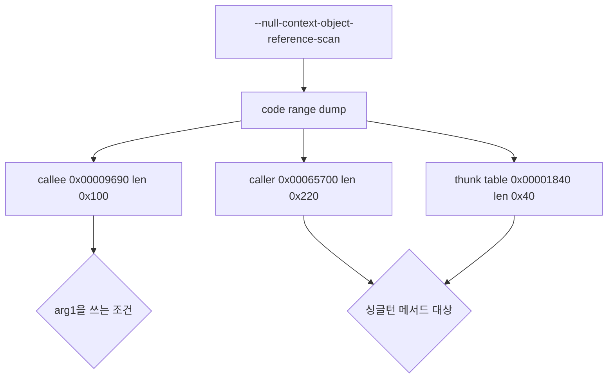

# 20260904-175 EZ2DJ 4th 초기화되지 않은 out 인자 추적 설계
# 20260904-175 EZ2DJ 4th Uninitialized Out-Parameter Tracing Design

## 1. 배경 및 목적 (Background & Objectives)

Task 174에서 실행이 텍스처 적재 단계까지 진행한 뒤 `RVA 0x00009701`에서 읽기 접근 위반으로 종료하는 것을 관측했다. 진단이 남긴 창을 복원하면 다음과 같다.

```
callee (RVA 0x00009696)
0x00009696  push ebp; mov ebp, esp; push ecx
0x0000969a  mov  dword [ebp-0x04], 0xcccccccc   ; 디버그 채움
0x000096a1  mov  [ebp-0x04], ecx                ; this
0x000096a4  cmp  dword [ebp+0x08], 0            ; arg1
0x000096a8  jne  0x000096ac
0x000096aa  jmp  0x00009728                     ; arg1이 0이면 조기 반환
0x000096ac  mov  eax, [ebp-0x04]
0x000096af  mov  ecx, [ebp+0x08]
0x000096b2  mov  [eax], ecx                     ; this->[0] = arg1
...
0x000096f7  mov  edx, [ebp-0x04]
0x000096fa  mov  eax, [edx]                     ; = this->[0] = arg1
0x000096fc  mov  ecx, [ebp-0x04]
0x000096ff  mov  edx, [ecx]
0x00009701  mov  eax, [eax+0x08]                ; ***** 접근 위반 *****
0x00009704  mov  [edx+0x0c], eax
```

`EAX`가 `0xcccccccc`이고 `this->[0]`은 방금 `arg1`에서 온 값이므로, **`arg1` 자체가 `0xcccccccc`**다. `arg1`은 0이 아니어서 조기 반환 분기도 피해 간다.

호출자 쪽 창은 이렇다.

```
0x004658a9  lea  ecx, [ebp-0x114]          ; out 인자 2
0x004658af  push ecx
0x004658b0  lea  edx, [ebp-0x110]          ; out 인자 1
0x004658b6  push edx
0x004658b7  mov  ecx, [0x00ac29b4]         ; 싱글턴 전역
0x004658bd  call ...
0x004658c2  push 1
0x004658c4  mov  eax, [ebp-0x114]
0x004658ca  push eax
0x004658cb  mov  ecx, [ebp-0x220]
0x004658d1  add  ecx, 0xa0
0x004658d7  call 0x004023d8 -> 0x00409696
```

즉 게스트는 싱글턴 메서드에 out 인자 두 개를 넘기고, 그중 `[ebp-0x114]`를 그대로 다음 호출의 `arg1`로 전달한다. 그 지역이 디버그 채움값 그대로라는 것은 **싱글턴 메서드가 그 out 인자를 쓰지 않고 돌아왔다**는 뜻이다.

이 작업의 목적은 그 싱글턴 메서드가 무엇이며 왜 out 인자를 채우지 않았는지 관측하는 것이다.

`EAX` is the debug fill value and `this->[0]` was just assigned from `arg1`, so `arg1` itself is `0xcccccccc`: the caller passed on a local that the preceding singleton method left untouched. This task identifies that method and why it returned without writing its out parameter.

---

## 2. 관측 대상 (What Must Be Observed)

| 질문 | 필요한 관측 |
| - | - |
| 싱글턴 메서드는 어디인가 | `0x004658bd`의 `call rel32` 대상과 그 thunk |
| 그 메서드가 out 인자를 채우는 조건 | 메서드 본문 |
| 호출자가 그 앞에서 무엇을 준비하는가 | 호출자 함수 전체 |
| 실패한 필드 전달의 전체 모양 | callee 본문 |

`0x00ac29b4`는 Task 157이 확인한 싱글턴 전역과 같은 주소다(`RVA 0x006c29b4`). 이 경로는 이전 조사에서 다루던 그 객체를 다시 지난다.

`0x00ac29b4` is the same singleton global Task 157 identified, so this path runs back through the object earlier tasks studied.

---

## 3. 관측 설계 (Observation Design)



Task 172가 추가한 코드 범위 덤프를 그대로 쓴다. `driver_stage` 범위는 목적을 다했으므로 이번 대상 세 구간으로 교체한다. 새 CLI 옵션도, 새 실행 제어도 필요하지 않다.

thunk 구간을 함께 덤프하는 이유는 이 실행 파일이 incremental link로 빌드되어 `call rel32`가 대부분 `jmp rel32` thunk를 거치기 때문이다. `0x004658bd`의 대상이 thunk면 한 번 더 풀어야 실제 함수 주소가 나온다.

The code-range dump Task 172 added is reused, with the spent `driver_stage` range replaced by the three ranges above. The thunk range is included because this executable is incrementally linked, so a `call rel32` usually lands on a `jmp rel32` stub that must be resolved once more.

---

## 4. 판정 기준 (Decision Criteria)

| 관측 | 결론 |
| - | - |
| 싱글턴 메서드가 조건 분기 뒤에서만 out 인자를 쓴다 | 그 조건의 입력이 다음 추적 대상이다 |
| 그 조건이 우리 facade 응답에서 온다 | facade를 고치는 것이 다음 단계다 |
| 메서드가 out 인자를 아예 쓰지 않는다 | 인자 규약 해석이 틀렸다. 호출자 창을 다시 읽는다 |
| callee가 `arg1`을 검사하는 지점이 더 있다 | 게스트가 실패를 흡수할 수 있는 지점이므로 함께 기록한다 |

---

## 5. 비목표 (Non-Goals)

- 관측 전 HLE facade 수정.
- 게스트 코드 patch 또는 지역 값 주입.
- 새 CLI 옵션 추가.
- `direct3d3_com_facade`(DirectX 6 경로) 변경.

No facade change before observation, no guest patching or local injection, no new CLI option, and no DirectX 6 path change.
