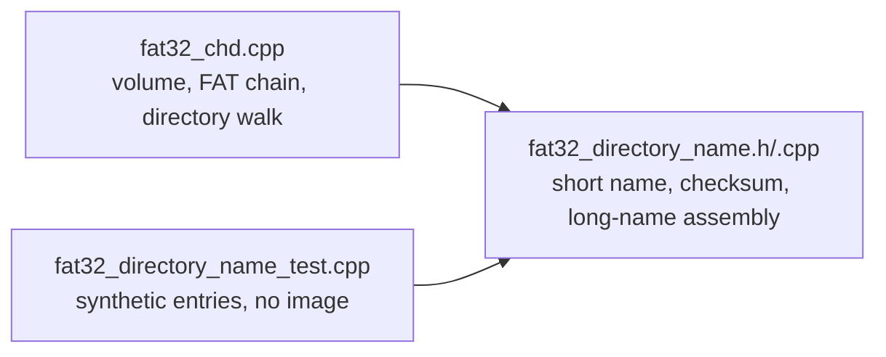

# 20260904-176 FAT32 긴 이름 조립 설계
# 20260904-176 FAT32 Long-Name Assembly Design

## 1. 배경 및 목적 (Background & Objectives)

Task 175에서 CHD 안의 디렉터리를 나열해 보니, 13자를 넘는 모든 긴 이름 뒤에 4바이트가 끼어 있었다.

| 나열된 이름 | 끼어든 바이트 | 정체 |
| - | - | - |
| `logo4th_mask.佌佇abm` | `4c 4f 47 4f` | 같은 항목 짧은 이름의 `LOGO` |
| `INSERTCOIN.st义䕓r` | `49 4e 53 45` | `INSE` |
| `1PLAYERInsert倱䅌Coin.str` | `31 50 4c 41` | `1PLA` |

원인은 한 곳이다. 긴 이름 슬롯에서 문자를 읽는 범위가 `{{1,5},{14,6},{28,4}}`로 되어 있다.

```
LFN 슬롯(32바이트) 배치
0x00 order
0x01..0x0a  5문자
0x0b        attribute 0x0f
0x0c        type
0x0d        short name checksum
0x0e..0x19  6문자
0x1a..0x1b  first cluster (항상 0)
0x1c..0x1f  2문자
```

마지막 범위는 2문자여야 하는데 4문자를 읽는다. 슬롯 하나는 32바이트이므로 `0x1c`에서 8바이트를 읽으면 4바이트가 **다음 항목**으로 넘어간다. 디스크에서 긴 이름 슬롯 바로 뒤에 오는 것은 그 항목의 짧은 이름 항목이므로, 끼어드는 4바이트가 언제나 짧은 이름의 앞 4자인 관측과 정확히 맞는다.

The character ranges used to read a long-name slot take four characters from the final field instead of two. A slot is 32 bytes, so reading eight bytes at `0x1c` runs four bytes into the next directory entry — which on disk is that file's own short-name entry, exactly matching the observed junk.

---

## 2. 영향 (Impact)

- 13자를 넘는 이름은 조립 결과가 실제 이름과 달라진다.
- 정확히 13자인 이름도 종료 문자가 없어 같은 영향을 받는다.
- `Fat32Volume::Find`는 조립된 이름을 비교하므로 그런 파일은 찾지 못한다.
- 클러스터 버퍼의 마지막 항목이 긴 이름 슬롯이면 버퍼 끝을 4바이트 넘겨 읽는다. 실제로는 항상 짧은 이름 항목이 뒤따르므로 관측되지는 않았지만, 범위 자체가 잘못이다.

Names longer than thirteen characters decode wrongly, exactly-thirteen-character names are affected too, `Find` cannot match such files, and a long-name slot at the very end of a cluster buffer would read four bytes past it.

---

## 3. 구조 결정: 이름 해독을 별도 파일로 (Structure: A Dedicated Name-Decoding Unit)

지금 이름 해독은 `src/storage/fat32_chd.cpp`의 익명 namespace 안에 있어 이미지 없이 시험할 수 없다. 이 결함은 실제 CHD를 나열해서야 드러났는데, 그것은 저장소가 원본 자산 없이도 검증되어야 한다는 규칙과 맞지 않는다.

따라서 이름 해독을 독립 단위로 분리한다.



새 단위가 제공하는 것은 세 가지다.

| 이름 | 역할 |
| - | - |
| `DecodeFatShortName` | 8.3 짧은 이름을 문자열로 |
| `FatShortNameChecksum` | 긴 이름 슬롯이 담고 있는 짧은 이름 체크섬 |
| `FatLongNameAssembler` | 앞선 슬롯들을 모아 긴 이름으로 조립 |

`Fat32Volume`은 이 단위를 호출하기만 한다. 이렇게 하면 같은 결함이 원본 이미지 없이 재현되는 단위 시험으로 고정된다.

Name decoding currently lives in an anonymous namespace and cannot be exercised without an image, which is why this defect only surfaced against a real CHD. Splitting it into a dedicated unit lets a synthetic-entry unit test pin the behavior with no original asset present.

---

## 4. 수정 내용 (The Fix)

범위를 `{{1, 5}, {14, 6}, {28, 2}}`로 고쳐 슬롯당 정확히 13문자를 취한다. 종료 처리와 `0xffff` 패딩 처리는 이미 올바르므로 그대로 둔다.

---

## 5. 검증 (Verification)

단위 시험은 합성한 디렉터리 항목만 사용한다.

| 경우 | 기대 |
| - | - |
| 짧은 이름만 있는 항목 | 8.3 이름 |
| 11자 긴 이름(종료 문자 있음) | 그 이름 그대로 |
| 정확히 13자 긴 이름(종료 문자 없음) | 그 이름 그대로. 이번 결함의 회귀 시험이다 |
| 14자 긴 이름(슬롯 2개) | 그 이름 그대로 |
| 체크섬이 어긋난 슬롯 | 긴 이름을 쓰지 않음 |
| 슬롯 순서가 빠진 경우 | 긴 이름을 쓰지 않음 |

실제 CHD가 있으면 `re2dj_chd_probe --list`로 같은 디렉터리를 다시 나열해 끼어든 문자가 사라졌는지 확인한다.

The unit test uses synthetic entries only; with a real image present, the same directories are listed again to confirm the spliced characters are gone.

---

## 6. 비목표 (Non-Goals)

- VFS 현재 디렉터리 추적. 별도 작업으로 다룬다.
- 쓰기 지원이나 FAT 기록 변경.
- 짧은 이름 규칙 변경.

Guest working-directory tracking is a separate task; no write support, and no short-name rule changes.
