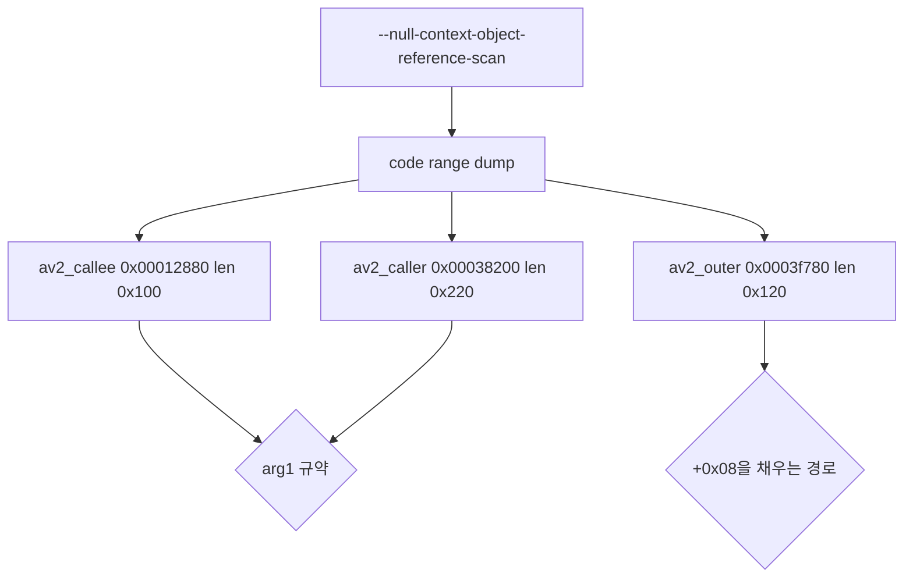

# 20260904-178 EZ2DJ 4th 패널 단계 null 객체 관측 설계
# 20260904-178 EZ2DJ 4th Panel-Stage Null Object Observation Design

## 1. 배경 및 목적 (Background & Objectives)

Task 177 이후 실행은 게임 화면 자원 적재 단계까지 진행한 뒤 `RVA 0x0001290e`에서 읽기 접근 위반으로 멈춘다.

진단이 남긴 창에서 복원한 명령열이다.

```
0x00012905  mov  eax, [edx+0x08]
0x00012908  mov  ecx, [ebp+0x08]      ; arg1
0x0001290b  mov  edx, [ecx+0x08]      ; edx = arg1->[0x08] = 0
0x0001290e  mov  ecx, [edx]           ; ***** 접근 위반 *****
0x00012910  push eax
0x00012911  call [ecx+0x0c]           ; vtable slot 3
```

`EDX`가 0이고 접근 주소가 `0x00000000`이므로, `arg1`의 `+0x08` 포인터가 비어 있다. 그 값을 vtable 있는 객체로 보고 네 번째 슬롯을 부르려던 자리다. Task 175의 실패가 초기화되지 않은 값(`0xcccccccc`)이었던 것과 달리 이번은 **명시적인 null**이다.

Execution now reaches game-screen resource loading and stops at a read access violation where `arg1->[0x08]` is null and the code immediately treats it as an object with a vtable. Unlike Task 175's uninitialized fill, this is an explicit null.

---

## 2. 어디까지 왔는지 (How Far Execution Got)

`.vfs.log`의 마지막 구간은 게임 플레이 패널 자원이다.

```
chd://EZ2DJ/System/StreetMix/Panel/Judgment_Kool.str
chd://EZ2DJ/System/StreetMix/Panel/Judgment_Cool.str
chd://EZ2DJ/System/StreetMix/Panel/Judgment_Good.str
chd://EZ2DJ/System/StreetMix/Panel/Judgment_Miss.str
chd://EZ2DJ/System/StreetMix/Panel/Judgment_Fail.str
chd://EZ2DJ/System/StreetMix/Panel/combo0.str … combo0000.str
```

호스트가 `wdmaud.drv`, `ksuser.dll`, `msacm32.drv`, `midimap.dll`을 적재한 기록도 있어 오디오 경로도 초기화되고 있다. 즉 이 중단은 초기화 실패가 아니라 게임 화면 구성 도중의 상태 문제다.

The last resources loaded are gameplay panel sprites, and the host has loaded the audio driver stack, so this stop happens during game-screen construction rather than during startup.

---

## 3. 관측 대상 (What Must Be Observed)

| 질문 | 필요한 관측 |
| - | - |
| `arg1`은 어떤 객체인가 | faulting 함수 본문과 그 호출자 |
| `+0x08`을 채우는 쪽은 어디인가 | 호출자와 그 위 프레임 |
| 채워지지 않은 이유가 우리 경계인가 | 위 두 가지를 읽은 뒤 판단 |

진단이 이미 프레임을 세 개 남겼다.

| 프레임 | 반환 주소 | RVA |
| - | - | - |
| faulting 함수 | `0x004383fd` | `0x000383fd` |
| 그 호출자 | `0x0043825a` | `0x0003825a` |
| 그 위 | `0x0043f82c` | `0x0003f82c` |

---

## 4. 관측 설계 (Observation Design)



Task 172가 추가한 코드 범위 덤프의 대상만 이번 세 구간으로 바꾼다. 새 CLI 옵션도, 새 실행 제어도 없다. 앵커 목록에는 faulting 명령 `0x0001290e`를 넣어 prologue와 호출자 분기 스캔을 함께 얻는다.

Only the code-range targets change; the faulting instruction is also added as an anchor so the existing prologue search and branch scan report the function start and its callers.

---

## 5. 판정 기준 (Decision Criteria)

| 관측 | 결론 |
| - | - |
| 호출자가 `+0x08`을 조건부로만 채운다 | 그 조건의 입력이 다음 추적 대상이다 |
| `+0x08`이 우리 facade가 돌려준 값에서 온다 | 해당 facade 응답을 고치는 것이 다음 단계다 |
| `+0x08`이 자원 적재 결과에서 온다 | 어떤 자원인지 `.vfs.log`와 대조한다 |
| 게스트가 이 예외를 흡수한다 | 중단 지점이 아니므로 다음 지점을 다시 찾는다 |

---

## 6. 비목표 (Non-Goals)

- 관측 전 HLE facade 수정.
- 게스트 코드 patch 또는 객체 주입.
- 새 CLI 옵션 추가.
- 오디오 경로 HLE 도입 여부 결정. 이 작업은 관측만 한다.

No facade change before observation, no guest patching, no new CLI option, and no decision yet on routing the audio path through HLE.
