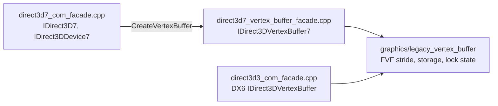

# 20260904-179 Direct3D7 정점 버퍼 facade 설계
# 20260904-179 Direct3D7 Vertex Buffer Facade Design

## 1. 배경 및 목적 (Background & Objectives)

Task 178에서 확정했다. 게스트는 게임 플레이 화면을 구성하면서 `IDirect3D7::CreateVertexBuffer`로 정점 버퍼를 만들고, 반환값을 검사하지 않은 채 그 인터페이스의 `Lock`을 부른다. re2DJ의 `D3d7CreateVertexBuffer`는 `*vb = nullptr`을 쓰고 `D3D_OK`를 돌려주므로 게스트가 null을 역참조해 실행이 멈춘다.

관측된 요청은 `dwSize = 0x10`, `dwCaps = 0`, `dwFVF = 0x112`, `dwNumVertices = 0x79`이고, 곧이어 `Lock(flags = 1, &data, nullptr)`이 온다.

The guest creates a vertex buffer and immediately locks it without checking the result, while re2DJ returns success with a null pointer. The observed request is `{0x10, 0, 0x112, 0x79}` followed by `Lock(1, &data, nullptr)`.

---

## 2. 이미 있는 것을 쓴다 (Reusing What Exists)

두 가지가 이미 있다.

1. **플랫폼 공용 정점 저장소.** `include/re2dj/graphics/legacy_vertex_buffer.h`의 `LegacyVertexBuffer`가 FVF에서 stride를 계산하고 저장소와 lock 상태를 소유한다. 단위 시험도 있다.
2. **같은 모양의 DX6 구현.** `direct3d3_com_facade.cpp`의 `IDirect3DVertexBuffer` facade가 이 저장소를 이미 쓰고 있다.

따라서 이번 작업은 새 저장 모델을 만드는 것이 아니라, DX7 인터페이스를 같은 저장소에 붙이는 어댑터를 추가하는 것이다. `dwFVF = 0x112`는 `XYZ | NORMAL | TEX1`이므로 stride는 `12 + 12 + 8 = 32`, 전체 크기는 `0x79 * 32 = 3,872` 바이트가 된다.

The platform-neutral `LegacyVertexBuffer` already owns FVF stride and storage and is already used by the DX6 facade, so this task adds a DX7 adapter over the same storage rather than a new model.

---

## 3. 구조 결정: 전용 파일 (Structure: A Dedicated File)

`direct3d7_com_facade.cpp`는 `IDirect3D7`과 `IDirect3DDevice7`을 담고 있다. 정점 버퍼는 독립적으로 이름 붙일 수 있는 하위 시스템이므로, Task 166이 DirectDraw7과 Direct3D7을 나눈 것과 같은 방식으로 전용 파일에 둔다.



공개 함수는 하나다.

```cpp
HRESULT CreateDirect3DVertexBuffer7Facade(DirectDrawComContext* context,
                                          const D3DVERTEXBUFFERDESC* descriptor,
                                          IDirect3DVertexBuffer7** out);
```

---

## 4. 메서드 (Methods)

`IDirect3DVertexBuffer7`의 vtable 순서는 `QueryInterface`, `AddRef`, `Release`, `Lock`, `Unlock`, `ProcessVertices`, `GetVertexBufferDesc`, `Optimize`, `ProcessVerticesStrided`다. 게스트가 곧바로 부르는 slot 3이 `Lock`이라는 것은 Task 178의 관측과 일치한다.

| 메서드 | 동작 |
| - | - |
| `QueryInterface` | `IID_IUnknown`과 `IID_IDirect3DVertexBuffer7`만 인정 |
| `AddRef` / `Release` | 참조 계수. 0이 되면 저장소와 함께 해제 |
| `Lock` | 저장소 전체를 돌려준다. `size`가 null이어도 된다. 이미 잠겨 있으면 `D3DERR_VERTEXBUFFERLOCKED` |
| `Unlock` | 잠금 해제. 잠겨 있지 않으면 `DDERR_NOTLOCKED` |
| `GetVertexBufferDesc` | 생성 시 서술자를 그대로 돌려준다 |
| `ProcessVertices`, `ProcessVerticesStrided`, `Optimize` | 기록만 하고 `D3D_OK`. 변환 결과를 소비하는 경로가 아직 없다 |

`ProcessVertices`를 성공으로 돌려주는 것은 관측되지 않은 동작을 지어내지 않기 위한 최소 응답이다. 게스트가 이 경로를 실제로 쓰는지는 아직 확인되지 않았으므로, 쓰는 것이 관측되면 그때 내용을 채운다.

Returning success from the transform entry points is the minimum answer that invents no unobserved behavior; if the guest is seen to use them, they get filled in then.

---

## 5. 실패 응답 (Failure Answers)

`CreateVertexBuffer`는 이제 실패를 실패로 알린다.

| 상황 | 응답 |
| - | - |
| `vb`가 null | `DDERR_INVALIDPARAMS` |
| 서술자가 null이거나 `dwSize`가 작음 | `DDERR_INVALIDPARAMS` |
| FVF에서 stride를 낼 수 없거나 정점 수가 0 | `DDERR_INVALIDPARAMS` |
| 할당 실패 | `DDERR_OUTOFMEMORY` |

성공과 함께 null을 돌려주는 조합은 없앤다. 게스트가 반환값을 검사하지 않는다는 것을 Task 178에서 확인했으므로, 실패를 실패로 알려도 그 지점에서 멈추는 것은 같다. 다만 그때는 원인이 로그에 남는다.

The success-with-null combination is removed. The guest does not check the result, so a real failure still stops there, but with the cause recorded.

---

## 6. 검증 (Verification)

- 단위 시험: FVF stride와 저장소 동작은 `legacy_vertex_buffer` 단위 시험이 이미 덮는다. COM 어댑터는 Windows 타입에 묶여 있어 실행 진단으로 확인한다.
- 실행 진단: 진입 추적을 다시 실행해 `.ddraw.log`에 `CreateVertexBuffer`의 성공과 뒤따르는 `Lock`이 남는지, `RVA 0x0001290e`의 접근 위반이 사라지는지 본다.

---

## 7. 비목표 (Non-Goals)

- 정점 데이터를 실제 렌더링에 연결하는 것. DX7 그리기 경로는 별도 작업이다.
- `ProcessVertices` 변환 구현.
- DX6 경로(`direct3d3_com_facade`) 변경.

Wiring vertex data into rendering, implementing `ProcessVertices`, and changing the DX6 path are all separate.
