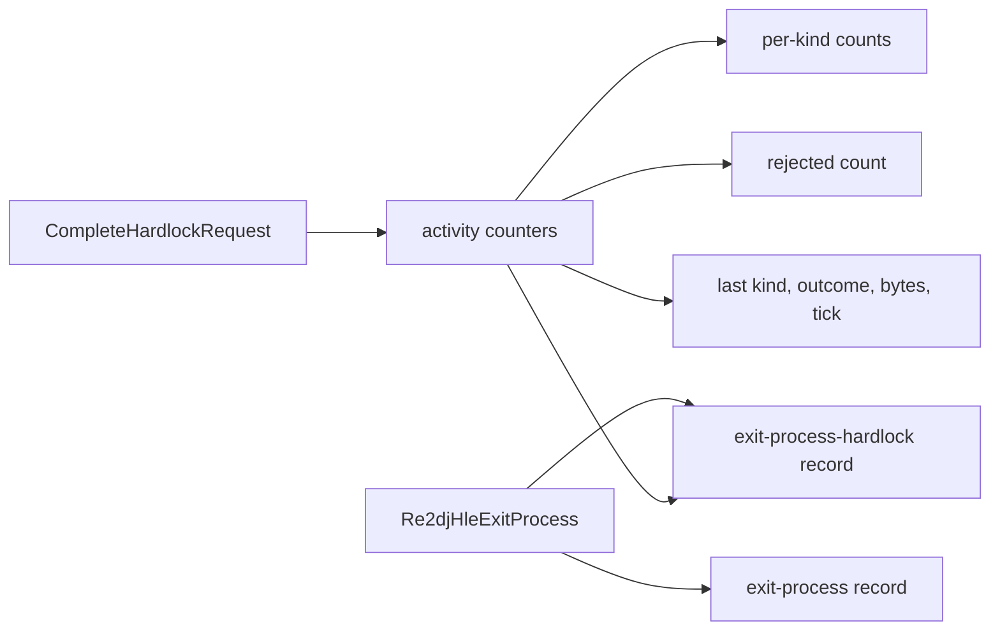

# 20260904-181 Hardlock 종료 귀속 로그 설계
# 20260904-181 Hardlock Exit Attribution Log Design

## 1. 배경 및 목적 (Background & Objectives)

Task 180에서 종료를 부르는 지점이 보호 스텁(`RVA 0x006ed264`)임을 확인했다. 그러나 같은 실행에서 게스트는 Hardlock 요청 144건을 모두 완료 처리 받고도 타이틀·모드 선택 자원까지 진행했다. 즉 **Hardlock 응답이 진행을 막고 있지는 않다.**

Task 180 작업 로그는 `answered=0`을 "응답되지 않음"으로 읽었는데 이는 오독이었다. 그 필드는 `result.handshake_answered`로 handshake 전용이며, descriptor는 `status_cleared`와 `tail`, transform은 `mapped`와 `unmapped`로 결과를 보고한다. 세 요청 모두 `outcome=completed`이고 각각 256, 264바이트를 쓴다.

따라서 지금 Hardlock을 더 파는 것은 근거가 약하다. 이 작업은 Hardlock 검토를 마무리하되, **나중에 실제로 Hardlock 때문에 종료가 일어날 때 그것을 즉시 가릴 수 있는 증거만 남긴다.**

Task 180 found the exit call site inside the protection stub, but the same run completed all 144 Hardlock requests and still reached title and mode-select resources, so Hardlock answers are not gating progress. The `answered` field that log read as "unanswered" is handshake-specific; descriptor and transform requests report through their own flags and all three complete. This task therefore closes the Hardlock investigation while leaving the evidence needed to attribute a future exit to it immediately.

---

## 2. 남겨야 할 증거 (What The Evidence Must Answer)

종료 기록만으로 다음 질문에 답할 수 있어야 한다.

| 질문 | 필요한 값 |
| - | - |
| 종료가 Hardlock 직후인가 | 마지막 Hardlock 완료와 종료 사이 경과 시간 |
| 마지막 요청이 무엇이었나 | 요청 종류와 outcome |
| 거절된 요청이 있었나 | `kRejectedShape` 누적 횟수 |
| 어떤 경로가 얼마나 쓰였나 | 종류별 누적 횟수 |
| 응답이 비어 있었나 | 마지막 요청이 쓴 바이트 수 |

경과 시간이 핵심이다. Task 180의 실행에서 종료 직전 기록이 Hardlock이었던 것은 사실이지만, 그것이 "직후"인지 "한참 뒤"인지는 로그 순서만으로 알 수 없었다. 밀리초 간격이 있으면 그 추정을 사실로 바꾸거나 반증할 수 있다.

The decisive value is the elapsed time between the last Hardlock completion and the exit: log order alone could not tell whether the exit followed the request immediately or long after.

---

## 3. 설계 (Design)

`CompleteHardlockRequest`가 이미 요청마다 한 줄을 남기고 있으므로, 같은 자리에서 누적 상태를 갱신한다. 종료 wrapper는 기존 `re2dj:vfs:exit-process` 줄에 이어 `re2dj:vfs:exit-process-hardlock` 한 줄을 더 남긴다.

기록 항목이다.

| 항목 | 의미 |
| - | - |
| `total` | 완료 처리된 Hardlock 요청 수 |
| `initialize`, `handshake`, `descriptor`, `transform`, `other` | 종류별 누적 |
| `rejected` | 형식이 맞지 않아 거절된 요청 수 |
| `last_kind`, `last_outcome`, `last_bytes` | 마지막 요청의 종류, 결과, 쓴 바이트 |
| `elapsed_ms` | 마지막 요청 완료부터 종료까지 경과 밀리초. 요청이 없었으면 표시하지 않는다 |

경과 시간은 `GetTickCount64`로 잰다. 벽시계 시각이 아니라 간격만 필요하므로 이것으로 충분하고, 시스템 시각 변경에도 영향받지 않는다.

The counters are updated where the per-request line is already written, and the exit wrapper adds one more line beside the record it already writes. Elapsed time uses `GetTickCount64` because only the interval matters.

---

## 3.1 종료 경로가 하나가 아니다 (Two Exit Paths)

검증 중에 드러난 사실이다. Task 180의 wrapper는 **동적으로 해석된 `ExitProcess`만** 덮는다. 종료 코드 `0xffffffff`로 끝난 실행에서는 wrapper가 기록을 남겼지만, 종료 코드 `1`로 끝난 실행에서는 `exit-process` 기록이 아예 없다. 그 경로는 실행 파일 자신의 import를 거치므로 동적 resolver를 지나지 않는다.

귀속 기록이 종료마다 반드시 남아야 하므로 `DLL_PROCESS_DETACH`에서도 남긴다. detach는 모든 종료가 지나는 지점이다. wrapper가 이미 남겼으면 중복하지 않는다.

detach는 loader lock 아래에서 실행되므로 여기서 하는 일은 두 줄 기록으로 제한한다. 그 이상은 종료 경로를 불안정하게 만들 수 있다.

Verification revealed the wrapper covers only the dynamically resolved `ExitProcess`: the `0xffffffff` run produced a record, the code-`1` run produced none. The attribution records are therefore also written from `DLL_PROCESS_DETACH`, skipped when the wrapper already wrote them, and limited to two lines because detach runs under the loader lock.

이어진 검증에서 detach도 그 경로를 덮지 못했다. 종료 코드 `1` 실행은 두 기록 모두 남기지 않았다. `DLL_PROCESS_DETACH`까지 건너뛴다는 것은 `ExitProcess`가 아니라 **자기 프로세스를 강제 종료**한다는 뜻이고, 같은 실행의 동적 resolver 기록에 `TerminateProcess`가 있다.

그래서 `TerminateProcess`에도 같은 wrapper를 단다. 대상이 자기 프로세스일 때만 기록하고 호출은 그대로 넘긴다. 기록에는 `route` 필드를 두어 세 경로를 구분한다.

| `route` | 의미 |
| - | - |
| `exit_process` | 동적으로 해석된 `ExitProcess` |
| `terminate_process` | 자기 프로세스에 대한 `TerminateProcess` |
| `process_detach` | 위 둘을 지나지 않은 종료 |

A further check showed detach does not cover that path either: the code-`1` run wrote neither record, so it skips `DLL_PROCESS_DETACH` and is a self-termination rather than an `ExitProcess`, and the same run's resolver log contains `TerminateProcess`. The same wrapper is therefore attached there, recording only when the target is this process, with a `route` field separating the three paths.

---

## 4. 동작을 바꾸지 않는다 (No Behavior Change)

이 작업은 관측만 추가한다. Hardlock 응답 material, 요청 처리, 종료 자체는 그대로다. 누적 상태는 기록에만 쓰이고 어떤 분기에도 관여하지 않는다.

Nothing about Hardlock answering, request handling, or the exit changes; the counters feed the log only.

---

## 5. Hardlock 검토 종료 (Closing The Hardlock Line)

이 작업으로 Hardlock 방향의 조사를 닫는다. 근거는 두 가지다.

1. 요청 144건이 모두 완료 처리되고 게스트는 그 뒤로도 계속 진행했다.
2. 종료 코드가 실행마다 다르다(`1`, `0xffffffff`). 하나의 결정적 검사가 매번 같은 이유로 끄는 모습이 아니다.

다시 열어야 할 조건은 명확하다. 새 기록의 `elapsed_ms`가 작고 `last_outcome`이 거절이면 그때 다시 본다.

This closes the Hardlock direction: every request completed and the guest kept going, and the exit code differs between runs. The condition to reopen it is explicit — a small `elapsed_ms` together with a rejected last outcome.

---

## 6. 비목표 (Non-Goals)

- Hardlock 응답 material 변경.
- 종료를 막거나 우회.
- 새 CLI 옵션 추가.
- 보호 스텁 내부 분기 해석. 이 작업은 로그만 남긴다.

No Hardlock material change, no blocking the exit, no new CLI option, and no reading of the stub's internal branches.
