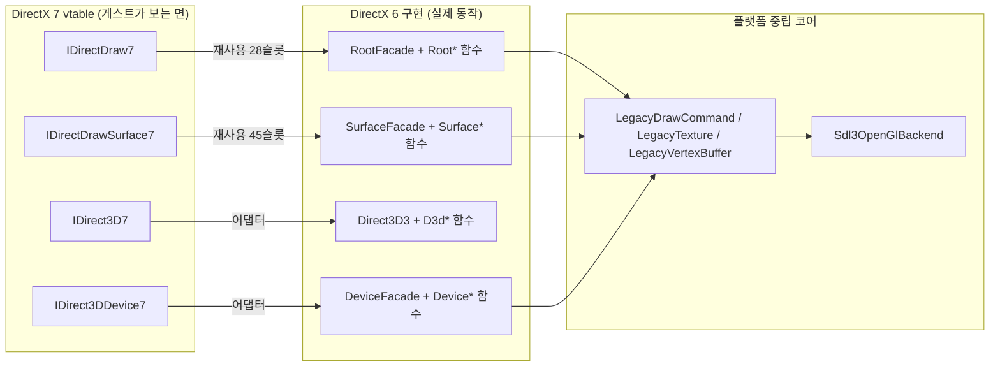
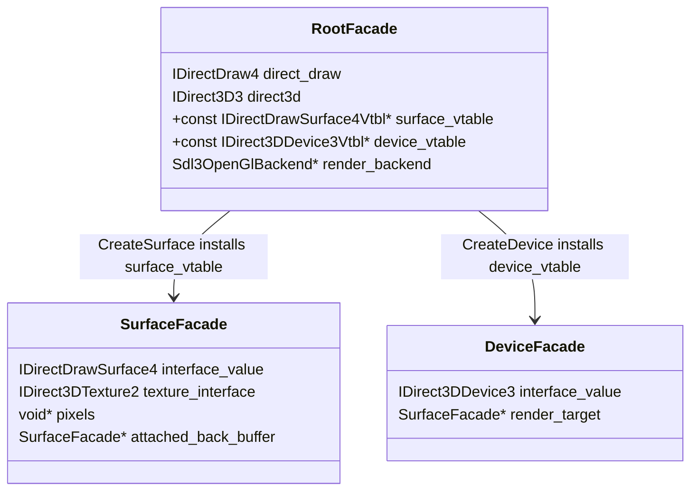

# 20260905-182 DirectX 7 facade의 DirectX 6 구현 위임 설계
# 20260905-182 Delegating The DirectX 7 Facade To The DirectX 6 Implementation

## 1. 배경 및 목적 (Background & Objectives)

Task 181까지의 진단으로 EZ2DJ 4th는 DirectX 7 경로에서 그래픽 초기화, 표면 733개 생성, 정점 버퍼 생성까지 진행하지만 화면이 완전히 검은 상태다. 원인은 게스트의 실패가 아니라 `directdraw7_com_facade.cpp`와 `direct3d7_com_facade.cpp`가 호출을 받아들이기만 하는 수용 스텁이기 때문이다. 표면에 픽셀 메모리가 없고, `Blt`·`Flip`·`DrawPrimitive`가 모두 `DD_OK`만 돌려주며, `DirectDrawComContext::render_backend`가 한 번도 대입되지 않는다.

같은 동작은 DirectX 6 경로(`direct3d3_com_facade.cpp`)에 이미 전부 구현되어 있다. 그 경로는 RGB565 GDI backing으로 실제 픽셀을 들고, `Blt`/`BltFast`로 합성하고, 첫 `DrawPrimitive`에서 `Sdl3OpenGlBackend`를 게스트 창에 붙이고, `Flip`에서 `Present`한다.

따라서 이 작업의 목적은 **DirectX 7 경로를 새로 구현하는 것이 아니라, DirectX가 스스로 가지고 있는 버전 계층 구조를 그대로 이용해 DirectX 6 구현에 위임하는 것**이다.

Diagnostics through Task 181 show that EZ2DJ 4th proceeds through DirectX 7 graphics initialization, 733 surface creations, and vertex-buffer creation, yet the screen stays entirely black. The cause is not a guest failure but that `directdraw7_com_facade.cpp` and `direct3d7_com_facade.cpp` are acceptance stubs: surfaces carry no pixel memory, `Blt`/`Flip`/`DrawPrimitive` return `DD_OK` and nothing else, and `DirectDrawComContext::render_backend` is never assigned. The same behavior already exists in full on the DirectX 6 path, which holds real RGB565 GDI-backed pixels, composites through `Blt`/`BltFast`, attaches `Sdl3OpenGlBackend` to the guest window on the first `DrawPrimitive`, and presents on `Flip`. The objective is therefore not to write a second implementation but to delegate to the DirectX 6 one through the version layering DirectX already defines.

---

## 2. DirectX 버전 계층 구조 (확인됨) (DirectX Version Layering — Confirmed)

Windows SDK `10.0.26100.0`의 `um/ddraw.h`와 `um/d3d.h`를 직접 읽어 확인한 사실이다.

Confirmed by reading `um/ddraw.h` and `um/d3d.h` from Windows SDK `10.0.26100.0` directly.

| 인터페이스 쌍 | 관계 | 확인 내용 |
| --- | --- | --- |
| `IDirectDraw7` : `IDirectDraw4` | **접두 확장** | 앞 28슬롯이 같은 순서·같은 시그니처. `StartModeTest`, `EvaluateMode`가 뒤에 추가. `GetDeviceIdentifier`만 구조체가 `DDDEVICEIDENTIFIER2`로 바뀜 |
| `IDirectDrawSurface7` : `IDirectDrawSurface4` | **접두 확장** | 앞 45슬롯이 같은 순서·같은 시그니처. `SetPriority`, `GetPriority`, `SetLOD`, `GetLOD`가 뒤에 추가 |
| `IDirect3D7` : `IDirect3D3` | **재배열** | `CreateLight`/`CreateMaterial`/`CreateViewport`/`FindDevice` 제거, `CreateDevice`·`CreateVertexBuffer`에서 outer `IUnknown` 인자 제거 |
| `IDirect3DDevice7` : `IDirect3DDevice3` | **재배열** | viewport 객체가 디바이스 상태로 흡수, light/material이 디바이스 메서드가 됨, state block과 `Clear`가 신설 |

접두 확장 관계에서 달라지는 것은 포인터 인자의 **정적 타입뿐**이며 ABI는 동일하다. 즉 같은 함수가 두 vtable을 통해 그대로 동작한다.

Within the prefix-extension pairs only the *static types* of pointer parameters differ; the ABI is identical, so one function serves both vtables unchanged.

추가로 확인한 사실 하나가 이 설계를 가능하게 한다. `d3d.h`의 버전 가드는 전부 `#if (DIRECT3D_VERSION >= ...)` 형태다. 따라서 `DIRECT3D_VERSION 0x0700`으로 컴파일하는 translation unit은 `IDirect3D3`, `IDirect3DDevice3`를 포함한 하위 버전 인터페이스를 **모두** 볼 수 있다. `ddraw.h`는 `DIRECT3D_VERSION`과 무관하게 모든 DirectDraw 버전을 선언한다. 그러므로 DirectX 7 파일에서 DirectX 6 구현 함수를 `void*` 없이 정적 타입 그대로 참조할 수 있다.

One further confirmed fact makes this design possible: every version guard in `d3d.h` has the form `#if (DIRECT3D_VERSION >= ...)`, so a translation unit compiled at `0x0700` sees every earlier interface as well, and `ddraw.h` declares all DirectDraw versions regardless. The DirectX 7 files can therefore reference the DirectX 6 implementation functions with their real static types rather than through `void*`.

---

## 3. 위임 규칙 (Delegation Rules)

모든 DirectX 7 vtable 슬롯은 아래 네 등급 중 하나로 분류하고, 코드에 그 등급이 드러나게 둔다.

Every DirectX 7 vtable slot falls into one of four grades, and the code makes the grade visible.

| 등급 | 조건 | 구현 |
| --- | --- | --- |
| **재사용 (adopt)** | DirectX 6 구현이 있고 의미와 ABI가 같다 | DirectX 6 함수 포인터를 DirectX 7 vtable 슬롯에 그대로 넣는다. 새 코드가 없다 |
| **어댑터 (adapt)** | 의미는 같지만 인자 형식이나 객체 종류가 다르다 | DirectX 7 전용 얇은 함수가 변환한 뒤 DirectX 6 구현을 호출한다 |
| **신규 (implement)** | DirectX 7에서 신설되었거나 동작이 다르다 | 새로 구현한다. 동작이 버전 중립적이면 DirectX 6 계층에 넣어 두 경로가 함께 쓴다 |
| **미구현 (report)** | 게스트가 부르는지 아직 확인되지 않았다 | 조용히 `DD_OK`를 돌려주지 않는다. 이름을 로그로 남기고 안전한 값을 돌려준다 |

네 번째 등급이 이 작업의 진단 장치다. 지금까지 DirectX 7 스텁은 모든 호출을 조용히 성공시켜서, 게스트가 어떤 메서드를 쓰는지 로그로 알 수 없었다. 미구현 슬롯이 스스로를 기록하면 한 번의 실행으로 남은 간극이 열거된다.

The fourth grade is this task's diagnostic instrument. Until now the DirectX 7 stubs succeeded silently on every call, so no log showed which methods the guest actually uses. Once unimplemented slots record themselves, a single run enumerates the remaining gap.

---

## 4. 객체 모델 공유 (Shared Object Model)

DirectDraw는 하나의 드라이버 객체 위에 여러 버전의 인터페이스를 얹는다. 이 설계도 같은 방식을 쓴다. **facade 객체는 하나이고 vtable만 버전마다 다르다.** DirectX 7 경로가 DirectX 6 객체를 감싸는 wrapper를 만들지 않는다.

DirectDraw layers several interface versions over one driver object, and this design does the same: **one facade object, one vtable per version.** The DirectX 7 path does not wrap the DirectX 6 object.

그러려면 객체를 만드는 쪽이 어느 버전의 vtable을 심을지 알아야 한다. `RootFacade`가 자신이 만들 surface와 device의 vtable을 들고 다니게 한다.

For that, whichever code creates an object must know which version's vtable to install, so `RootFacade` carries the vtables it will install on the surfaces and devices it creates.

`surface_vtable`과 `device_vtable`이 null이면 DirectX 6 기본값을 쓴다. DirectX 7 진입점만 자신의 vtable을 넘긴다. 이렇게 하면 DirectX 6 경로의 동작은 한 줄도 바뀌지 않는다.

A null `surface_vtable` or `device_vtable` means the DirectX 6 default; only the DirectX 7 entry point passes its own. The DirectX 6 path's behavior is therefore unchanged.

---

## 5. 파일 구조 (File Structure)

| 파일 | 역할 | 이 작업의 변경 |
| --- | --- | --- |
| `directdraw_legacy_interop.h` | **신규.** DirectX 6 구현을 상위 버전에 노출하는 내부 경계. vtable 접근자, root 생성, 버전 중립 헬퍼 | 신규 작성 |
| `direct3d3_com_facade.cpp` | DirectX 6 인터페이스 구현이자 **공용 구현 계층** | vtable 매개변수화, interop 노출, 버전 중립 기능 추가 |
| `directdraw7_com_facade.cpp` | `IDirectDraw7` / `IDirectDrawSurface7` vtable | 수용 스텁 → 위임 vtable |
| `direct3d7_com_facade.cpp` | `IDirect3D7` / `IDirect3DDevice7` vtable | 수용 스텁 → 위임 vtable |
| `direct3d7_vertex_buffer_facade.cpp` | `IDirect3DVertexBuffer7` | DirectX 6 정점 버퍼 객체와 통합 |

`directdraw_legacy_interop.h`는 공개 ABI가 아니라 두 facade 사이의 내부 경계다. 게스트에게 노출되는 진입점은 지금과 같이 `Re2djHleDirectDrawCreate`와 `Re2djHleDirectDrawCreateEx` 두 개뿐이다.

`directdraw_legacy_interop.h` is an internal boundary between two facades, not a public ABI; the entry points exposed to the guest remain exactly `Re2djHleDirectDrawCreate` and `Re2djHleDirectDrawCreateEx`.

---

## 6. 메서드 위임표 (Method Delegation Table)

### 6.1 `IDirectDraw7`

| 슬롯 | 등급 | 근거 |
| --- | --- | --- |
| `QueryInterface` | 신규 | DirectX 7 IID 집합이 다르고 `IID_IDirect3D7`을 돌려줘야 한다 |
| `AddRef`, `Release` | 재사용 | 같은 객체의 같은 참조 계수 |
| `GetCaps` | 어댑터 | DirectX 6 구현을 부른 뒤 4th의 드라이버 관문이 요구하는 `DDCAPS2_CANRENDERWINDOWED`를 더한다 |
| `CreateSurface` | 재사용 | `DDSURFACEDESC2`가 같고 root가 심을 vtable을 안다 |
| `SetCooperativeLevel`, `SetDisplayMode`, `RestoreDisplayMode`, `RestoreAllSurfaces` | 재사용 | 동작 동일 |
| `GetDisplayMode`, `EnumDisplayModes`, `EnumSurfaces`, `WaitForVerticalBlank`, `GetAvailableVidMem`, `TestCooperativeLevel` | 신규(공용) | DirectX 6 구현이 비어 있다. 버전 중립 동작이므로 DirectX 6 계층에 구현해 두 경로가 함께 쓴다 |
| `GetDeviceIdentifier` | 신규 | `DDDEVICEIDENTIFIER2`로 구조체가 다르다 |
| `StartModeTest`, `EvaluateMode` | 신규 | DirectX 7 신설 |
| 나머지 | 미구현(로깅) | 게스트 사용 여부 미확인 |

### 6.2 `IDirectDrawSurface7`

| 슬롯 | 등급 | 근거 |
| --- | --- | --- |
| `QueryInterface` | 신규 | DirectX 7 IID 집합 |
| `AddRef`, `Release`, `Blt`, `BltFast`, `Flip`, `GetAttachedSurface`, `GetCaps`, `GetDC`, `GetPixelFormat`, `GetSurfaceDesc`, `IsLost`, `ReleaseDC`, `Restore`, `SetColorKey` | 재사용 | 접두 확장 구간이고 DirectX 6 구현이 존재한다 |
| `Lock`, `Unlock` | 신규(공용) | DirectX 6 구현이 비어 있다. 표면 픽셀이 이미 있으므로 버전 중립으로 구현한다 |
| `SetPriority`, `GetPriority`, `SetLOD`, `GetLOD` | 신규 | DirectX 7 신설. 관리 텍스처가 없으므로 상태만 보관한다 |
| 나머지 | 미구현(로깅) | 게스트 사용 여부 미확인 |

### 6.3 `IDirect3D7`

| 슬롯 | 등급 | 근거 |
| --- | --- | --- |
| `EnumDevices` | 신규 | 콜백이 `LPD3DENUMDEVICESCALLBACK7`로 다르다. 현재 구현 유지 |
| `CreateDevice` | 어댑터 | outer 인자만 없다. DirectX 6 `D3dCreateDevice`로 변환 호출 |
| `CreateVertexBuffer` | 어댑터 | outer 인자만 없다 |
| `EnumZBufferFormats`, `EvictManagedTextures` | 재사용 | 시그니처 동일 |

### 6.4 `IDirect3DDevice7`

| 슬롯 | 등급 | 근거 |
| --- | --- | --- |
| `BeginScene`, `EndScene`, `SetRenderState`, `GetRenderState`, `SetTransform`, `GetTransform`, `SetTextureStageState`, `GetTextureStageState`, `DrawPrimitive`, `DrawIndexedPrimitive`, `SetClipStatus`, `GetClipStatus`, `EnumTextureFormats`, `ValidateDevice`, `ComputeSphereVisibility` | 재사용 | 시그니처와 의미가 같다 |
| `SetRenderTarget`, `GetRenderTarget` | 재사용 | surface 포인터가 같은 객체를 가리킨다 |
| `SetTexture`, `GetTexture` | 어댑터 | DirectX 7은 `IDirectDrawSurface7`, DirectX 6은 `IDirect3DTexture2`를 받는다. 같은 객체의 다른 멤버이므로 오프셋 변환 후 호출 |
| `DrawPrimitiveVB`, `DrawIndexedPrimitiveVB` | 어댑터 | 정점 버퍼 객체를 DirectX 6 객체로 통합한 뒤 호출 |
| `GetCaps` | 신규 | `D3DDEVICEDESC7`로 구조체가 다르다 |
| `Clear` | 신규(공용) | DirectX 6은 viewport의 `Clear2`가 담당한다. 버전 중립 구현을 DirectX 6 계층에 둔다 |
| `SetViewport`, `GetViewport` | 신규(공용) | DirectX 6은 viewport 객체를 쓴다. 버전 중립 viewport 상태로 구현 |
| `SetMaterial`, `GetMaterial`, `SetLight`, `GetLight`, `LightEnable`, `GetLightEnable` | 미구현(로깅) | DirectX 6 경로도 조명을 쓰지 않는다. 사용 여부를 먼저 확인한다 |
| `BeginStateBlock`, `EndStateBlock`, `ApplyStateBlock`, `CaptureStateBlock`, `DeleteStateBlock`, `CreateStateBlock`, `PreLoad`, `Load`, `SetClipPlane`, `GetClipPlane`, `GetInfo`, `GetDirect3D` | 미구현(로깅) | DirectX 7 신설. 사용 여부 미확인 |

---

## 7. 미구현 슬롯 보고 정책 (Reporting Policy For Unimplemented Slots)

미구현 슬롯은 `re2dj:hle:<인터페이스>::<메서드>:not-implemented` 한 줄을 남긴다. 메서드마다 작은 예산을 두어 프레임마다 불리는 메서드가 로그를 채우지 못하게 한다. 호출 순서를 알아야 하므로 요약이 아니라 개별 줄로 남긴다.

Unimplemented slots record one `re2dj:hle:<interface>::<method>:not-implemented` line under a small per-method budget, so a per-frame method cannot fill the file. The lines stay individual rather than summarized because the call order is what the next task needs.

반환값은 게스트를 멈추지 않으면서도 거짓을 말하지 않는 값을 고른다. 상태 설정 계열은 `DD_OK`, 출력 인자가 있는 조회 계열은 인자를 0으로 채운 뒤 `DD_OK`, 객체를 돌려줘야 하는 것은 `DDERR_UNSUPPORTED`다.

---

## 8. 검증 방법 (Verification)

1. `scripts/build_win32.bat` 무경고 빌드.
2. `re2dj_unit_tests.exe`, `re2dj_windows_product_loader_probe.exe` 전량 통과.
3. EZ2DJ 1st SE 회귀: DirectX 6 경로가 이전과 동일하게 화면을 출력하는지 확인한다. 이 설계에서 DirectX 6 동작은 바뀌지 않아야 한다.
4. EZ2DJ 4th 실행: `.ddraw.log`에 `IDirectDrawSurface7::Flip`, `IDirect3DDevice7::DrawPrimitive`가 나타나는지, 게스트 창 픽셀이 검정이 아닌지 확인한다.
5. 남은 `not-implemented` 줄을 수집해 다음 작업 범위로 삼는다.

---

## 9. 위험과 미확정 (Risks & Unresolved)

- **미확정 — 4th 텍스처의 픽셀 형식.** DirectX 6 `RootCreateSurface`는 RGB565만 받는다. 4th가 ARGB1555를 쓰면 텍스처 생성이 실패한다. 이번 작업에서 픽셀 형식을 로그로 남겨 확인한다.
- **미확정 — Z 버퍼 표면.** 4th는 `DDSCAPS_ZBUFFER` 표면을 만든다. DirectX 6 구현은 이를 `DDERR_UNSUPPORTED`로 거절한다. 수용이 필요한지 실행으로 확인한다.
- **미확정 — 기본 표면의 back buffer 개수.** DirectX 6 구현은 `dwBackBufferCount == 1`만 받는다.
- **위험 — 접두 확장 가정.** 재사용 슬롯은 SDK 헤더에서 확인한 순서에 의존한다. vtable을 통째로 복사하지 않고 슬롯마다 명시적으로 대입해 컴파일러가 멤버 존재를 검사하게 한다.
- **위험 — DirectX 6 회귀.** 1st SE 경로가 같은 코드를 공유하므로 실행 회귀 확인이 필수다.

---

## 10. 관련 문서 (Related Documents)

- [Task 166 IDirect3D7 / IDirectDraw7 COM Facade 분리 설계](20260904-166-direct3d7-com-facade.md)
- [Task 179 Direct3D7 정점 버퍼 facade](20260904-179-direct3d7-vertex-buffer-facade.md)
- [Task 181 Hardlock 종료 귀속 로그](20260904-181-hardlock-exit-attribution-log.md)
- [Task 182 작업 지시서](../work-orders/20260905-182-directx7-legacy-delegation.md)
- [렌더링 정확성·성능 회복](20260826-072-render-correctness-performance.md)
