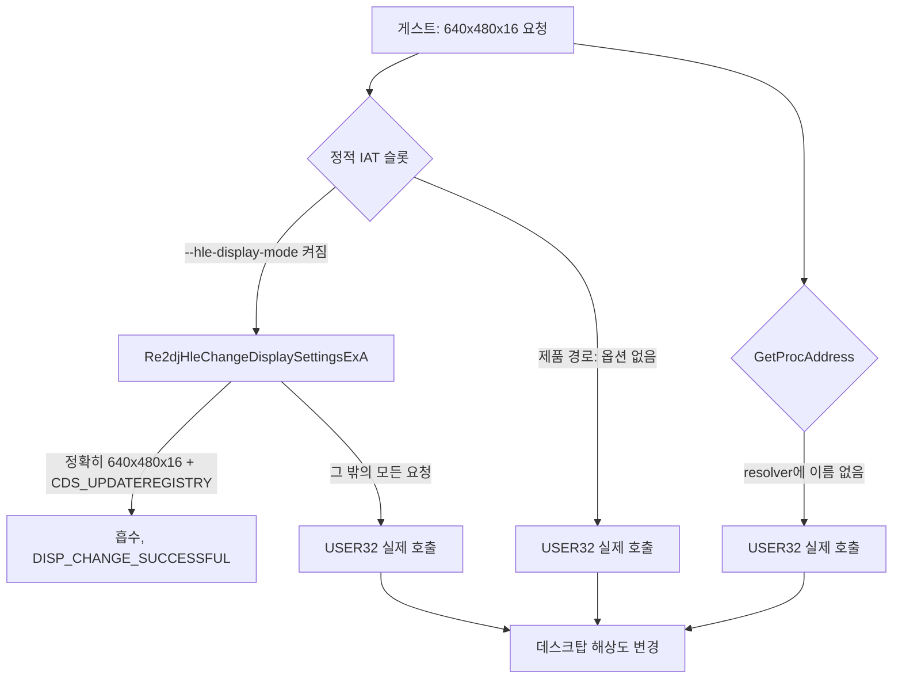

# 20260905-183 호스트 표시 모드 불변 정책 설계
# 20260905-183 Host Display Mode Invariance Policy

## 1. 배경 및 목적 (Background & Objectives)

Task 182의 1st SE 회귀 실행에서 **호스트 데스크탑 해상도가 실제로 바뀌었다.** 원본은 창을 만든 직후 `ChangeDisplaySettingsExA`로 640×480×16을 요구하고, 그 요청이 호스트 API에 그대로 도달했다.

이 프로젝트는 원본 실행 파일을 그대로 실행하되 운영체제 경계만 대체한다. 사용자의 데스크탑 해상도를 바꾸는 것은 게임 로직이 아니라 운영체제 경계의 동작이므로, 대체되어야 할 대상이다. 또한 바뀐 해상도는 프로세스가 비정상 종료하면 복구되지 않고 남는다. 진단이든 제품이든 실행 한 번이 사용자의 데스크탑을 망가뜨려서는 안 된다.

사용자가 정한 지원 범위는 다음과 같다.

* 원본의 **강제 해상도 변경은 무시한다.**
* 원본의 **독점 전체화면 요구도 무시한다.**
* 지원하는 표시 형태는 **강제 창 모드**와 **현재 해상도를 유지하는 창 모드 전체화면** 두 가지뿐이다.

이 설계는 그 범위를 정책으로 고정하고, 정책이 새는 지점을 모두 막는다.

During the 1st SE regression run of Task 182 the host desktop resolution actually changed: the original asks for 640x480x16 through `ChangeDisplaySettingsExA` right after creating its window, and that request reached the host API unaltered. Changing the user's desktop resolution is operating-system boundary behavior rather than game logic, so it belongs to the layer this project replaces, and a mode left changed by an abnormal exit does not come back on its own. The supported presentation is therefore fixed to two forms — a forced window, and a borderless window covering the current monitor at the current desktop resolution — with the original's forced mode change and exclusive-fullscreen request both absorbed at the boundary.

---

## 2. 정책 (The Policy)

> **re2DJ는 호스트의 표시 모드를 바꾸지 않는다.**
>
> 게스트의 표시 모드 변경 요청은 경계에서 흡수하고, 게스트에게는 요청이 이루어진 것으로 답한다. 화면은 언제나 현재 데스크탑 해상도 위의 창이다.

이 문장은 프로파일별 기능(capability)이 아니라 호스트 무결성 보장이다. 따라서 프로파일 설정이나 진단 옵션으로 켜고 끄지 않는다. 켜고 끌 수 있게 두면 그 "끔" 상태가 사용자의 데스크탑을 바꾸는 유일한 경로가 되며, 그것을 남겨 둘 이유가 없다.

*This is a host-integrity guarantee, not a per-profile capability, so it is not switched on or off by a profile setting or a diagnostic option: leaving a way to switch it off would leave exactly one path that changes the user's desktop, and there is no reason to keep one.*

---

## 3. 정책이 새는 지점 (확인됨) (Where The Policy Leaked — Confirmed)

| 지점 | 확인된 상태 |
| --- | --- |
| 제품 실행 경로 | `TargetRunDefaults`에 표시 모드 항목이 없고, `BuildOriginalProcessArguments`가 `--hle-display-mode`를 넘기지 않는다. 제품 실행에서는 훅이 아예 설치되지 않는다 |
| 훅의 범위 | `Re2djHleChangeDisplaySettingsExA`는 device name null, `CDS_UPDATEREGISTRY`, 정확히 640×480×16인 요청만 흡수하고 나머지는 실제 API로 넘긴다 |
| 동적 해석 | `Re2djHleGetProcAddress`의 이름 목록에 표시 관련 이름이 없다. 4th처럼 import를 `GetProcAddress`로 푸는 게스트는 훅을 지나친다 |
| DirectDraw 경로 | `SetCooperativeLevel`과 `SetDisplayMode`는 이미 값을 기록만 하고 호스트를 건드리지 않는다. **이 지점은 이미 정책을 지킨다** |
| 창 모드 | `ApplyRe2djWindowMode`의 전체화면 경로는 이미 `WS_POPUP` + `rcMonitor`이며 모드를 바꾸지 않는다. **이 지점도 이미 정책을 지킨다** |

즉 새는 곳은 Win32 `ChangeDisplaySettings` 계열 하나이고, 세 갈래로 샌다.

---

## 4. 설계 (Design)

### 4.1 경계를 무조건으로 만든다

`ChangeDisplaySettingsExA`와 `ChangeDisplaySettingsA` 두 진입점을 런타임이 주입된 모든 실행에서 우회시킨다. 진단 옵션에 걸지 않는다. 정적 IAT 슬롯이 없으면 해당 게스트가 그 import를 쓰지 않는다는 뜻이므로 그대로 진행한다.

### 4.2 모든 요청을 흡수한다

요청의 모양을 검사해 일부만 흡수하던 방식을 버린다. 어떤 device name, 어떤 flags, 어떤 `DEVMODE`가 와도 호스트를 부르지 않는다.

반환값은 `DISP_CHANGE_SUCCESSFUL`이다. 원본은 이 반환을 성공 0 / 재시작 1 / 실패로 나눠 분기하며, 실패 분기는 [`ez2dj-exe-structures.md`](../analysis/ez2dj-exe-structures.md)가 기록한 대로 `PostQuitMessage(0)`으로 간다. 따라서 성공을 답해야 게스트가 진행한다.

`CDS_TEST`도 같은 값을 답한다. 모드를 바꾸지 않을 것이므로 "그 모드로 바꿀 수 있는가"에 대한 답은 언제나 같다.

### 4.3 요청을 기록한다

흡수한 요청은 폭이 제한된 원장으로 남긴다. 게스트가 무엇을 원했는지는 나중에 화면 배치를 판단할 때 필요한 사실이며, 지금 조용히 버리면 그 사실이 사라진다. 기록 항목은 device name 유무, `dmFields`, 폭·높이·색 깊이·주사율, flags다.

### 4.4 열거는 건드리지 않는다

`EnumDisplaySettingsA`는 읽기 전용이며 호스트를 바꾸지 않으므로 그대로 둔다. 게스트가 실제 모드 목록을 보고 그중 하나를 고르더라도, 고른 결과를 적용하는 경로가 4.2에서 막힌다.

---

## 5. 표시 형태 (Presentation Forms)

정책이 남기는 표시 형태는 두 가지이며 둘 다 이미 구현되어 있다. 이 설계는 그것을 정책으로 확정할 뿐 동작을 바꾸지 않는다.

| 형태 | 선택 방법 | 동작 |
| --- | --- | --- |
| 창 모드 (기본) | 기본값 | 원본 논리 해상도의 2배 client area, `WS_OVERLAPPEDWINDOW`, 작업 영역 중앙 배치 |
| 창 모드 전체화면 | `--fullscreen` | `WS_POPUP`, 현재 모니터의 `rcMonitor` 전체를 덮음. **표시 모드를 바꾸지 않는다** |

게스트가 `DDSCL_EXCLUSIVE | DDSCL_FULLSCREEN`을 요구해도 어느 형태가 될지는 이 선택만이 정한다.

---

## 6. 대안과 기각 사유 (Alternatives Considered)

| 대안 | 기각 사유 |
| --- | --- |
| 요청한 모드로 실제 전환하고 종료 시 복구 | 비정상 종료가 복구를 건너뛴다. 이 게스트는 `.protect` 스텁이 사용자 모드 훅을 지나쳐 종료하는 것이 [Task 181](20260904-181-hardlock-exit-attribution-log.md)에서 확인되었으므로, 복구 코드가 실행된다는 보장이 없다 |
| 프로파일마다 켜고 끄는 설정으로 둔다 | 끄는 설정이 데스크탑을 바꾸는 유일한 경로가 된다. 정책이 아니라 선택지가 되어 버린다 |
| 요청 모양이 알려진 것일 때만 흡수 | 지금 새고 있는 방식 그대로다. 알려지지 않은 요청이 곧 위험한 요청이다 |
| 실패를 답해 게스트가 스스로 포기하게 한다 | 원본이 `PostQuitMessage(0)`으로 종료한다. 게임이 실행되지 않는다 |

---

## 7. 검증 방법 (Verification)

1. 실행 전후로 `EnumDisplaySettings(ENUM_CURRENT_SETTINGS)`의 폭·높이·색 깊이·주사율을 비교해 동일한지 확인한다.
2. 1st SE 제품 실행에서 로그에 흡수 기록이 남고 화면이 그대로 그려지는지 확인한다.
3. `--fullscreen` 실행에서 창이 현재 모니터를 덮고, 종료 뒤 해상도가 그대로인지 확인한다.
4. 4th 진단 실행에서 동적 해석 경로에 표시 이름이 나타나는지 확인한다.

---

## 8. 미확정 (Unresolved)

- **미확정 — 4th가 표시 모드 변경을 요청하는지.** 4th는 `DirectDrawCreateEx`와 `SetDisplayMode`로 모드를 다루는 것이 관측되었고 Win32 표시 API 호출은 아직 관측되지 않았다. 동적 해석 경로를 덮는 것은 관측된 사실이 아니라 정책의 완결성 때문이다.
- **미확정 — 이미 바뀐 데스크탑 해상도의 복구.** 이 변경은 재발을 막을 뿐 과거 실행이 남긴 상태를 되돌리지 않는다. 사용자가 디스플레이 설정에서 되돌린다.
- **미확정 — 창 모드 2배 확대가 화면보다 커지는 경우.** 작은 데스크탑에서는 1,280×960 client area가 화면을 넘는다. 이 설계의 범위 밖이다.

---

## 9. 관련 문서 (Related Documents)

- [Task 182 DirectX 7 facade의 DirectX 6 구현 위임 설계](20260905-182-directx7-legacy-delegation.md)
- [Win32 창 모드와 메시지 pump](20260828-084-window-mode-message-pump.md)
- [Win32 실행 창 제목과 기본 2배 확대](20260829-091-window-title-default-scale.md)
- [원본 실행 파일 구조 분석](../analysis/ez2dj-exe-structures.md)
- [Task 183 작업 지시서](../work-orders/20260905-183-host-display-mode-policy.md)
