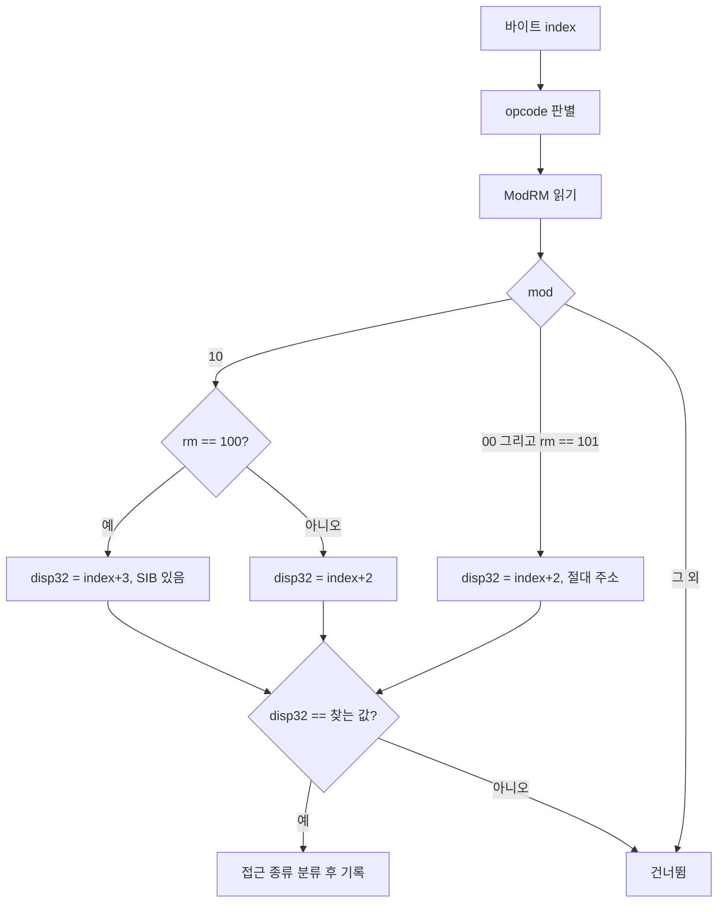

# 20260905-184 게스트 필드 참조 스캐너 설계
# 20260905-184 Guest Field Reference Scanner

## 1. 배경 및 목적 (Background & Objectives)

Task 182 이후 EZ2DJ 4th는 실제 렌더 경로에 들어가지만, 첫 텍스처를 GDI로 업로드한 직후 게스트 자신의 코드에서 null 객체를 역참조하고 종료한다.

```
00422b31  8b 45 f8              mov  eax, [ebp-8]        ; this = 0x00aca5b0 (.data 전역)
00422b34  8b 88 10 0a 00 00     mov  ecx, [eax+0xa10]    ; = 0
00422b3a  8b 01                 mov  eax, [ecx]          ; fault
00422b3d  52                    push edx
00422b3e  ff 50 24              call [eax+0x24]
```

**답해야 할 질문은 "누가 `+0xa10`을 채워야 했는가"다.** 이 필드는 실행 내내 한 번도 쓰이지 않으므로, 쓰기 감시점을 걸어도 아무것도 잡히지 않는다. 필요한 것은 **그 필드를 쓰는 코드가 어디 있는지**를 먼저 찾는 것이고, 그다음에 그 코드가 왜 실행되지 않았는지를 본다.

4th 실행 파일은 패킹되어 있어 `.text`가 실행 중에 복호화된다. 따라서 파일에 대한 정적 스캔은 성립하지 않고, 실행 중인 프로세스 메모리를 스캔해야 한다.

런처에는 이미 같은 종류의 스캐너가 있지만 변위 `0x11c`가 바이트 상수로 박혀 있고, 이전 작업이 추적하던 다른 전역에 묶인 하드웨어 중단점 처리 안에서만 실행된다. 재사용할 수 없다.

After Task 182 the 4th enters the real render path but dereferences a null object in its own code right after uploading its first texture through GDI. The question is which code was supposed to fill `+0xa10`; a write watchpoint answers nothing because the field is never written in the failing run, so the code that writes it has to be located first. The executable is packed, so the scan has to run against the live process rather than the file, and the launcher's existing scanner cannot be reused: its displacement is a hard-coded byte pattern and it only runs inside a hardware-breakpoint handler bound to a different global.

---

## 2. 설계 (Design)

### 2.1 무엇을 만드는가

`.text`에서 **주어진 32비트 상수를 참조하는 명령**을 찾아 접근 종류와 함께 기록하는 스캐너를 만든다. 상수는 명령행으로 받는다. 특정 전역이나 특정 오프셋에 묶이지 않으므로 이번 결함 이후에도 쓸 수 있다.

A scanner that finds instructions referencing a given 32-bit constant in `.text` and records each with its access kind. The constant comes from the command line, so the tool is not bound to one global or one offset.

### 2.2 두 가지 참조 형태

같은 필드가 두 방식으로 주소지정된다. 둘 다 찾아야 한다.

| 형태 | 예 | ModRM |
| --- | --- | --- |
| 베이스 + 변위 | `mov ecx, [eax+0xa10]` | `mod=10`, disp32가 변위 |
| 절대 주소 | `mov ecx, [0x00acafc0]` | `mod=00, rm=101`, disp32가 주소 |

`rm=100`이면 SIB 바이트가 하나 끼므로 변위 위치가 한 바이트 밀린다. 이 경우를 놓치면 인덱스 주소지정으로 쓰는 코드를 통째로 빠뜨린다.



### 2.3 접근 종류 분류

opcode로 읽기·쓰기·주소 취득을 구분한다. 우리가 찾는 것은 **쓰기**이므로 이 구분이 결과의 핵심이다.

| opcode | 의미 | 분류 |
| --- | --- | --- |
| `0x8b` | `mov r32, r/m32` | read |
| `0x89` | `mov r/m32, r32` | **write** |
| `0xc7` | `mov r/m32, imm32` | **write** |
| `0x8d` | `lea r32, m` | address |
| `0x3b`, `0x39` | `cmp` | read |
| `0x01`, `0x03`, `0x29`, `0x2b`, `0x31`, `0x33`, `0x09`, `0x0b`, `0x21`, `0x23` | 산술·논리 | 목적지 방향에 따라 read 또는 modify |
| `0xff` | `inc`/`dec`/`call`/`push` | ModRM `reg` 필드로 구분 |
| 그 외 | | other |

분류가 확실하지 않은 것은 `other`로 남기고 바이트를 함께 기록한다. 추측으로 write라고 적지 않는다.

### 2.4 실행 시점

패킹된 코드가 복호화된 뒤여야 하므로, **첫 접근 위반 시점**에 스캔한다. 이번 결함은 재현성이 있고 그 시점이면 게임이 렌더 경로까지 진행한 상태다. 접근 위반이 없는 실행에서는 자식 종료 경계에서 한 번 더 시도한다.

### 2.5 무엇을 기록하는가

명령마다 RVA, 절대 주소, 접근 종류, opcode, ModRM, 그리고 명령 앞뒤 바이트 창을 남긴다. 앞뒤 창은 그 명령이 속한 함수를 뒤에서 찾을 때 필요하다. 기록 수에 상한을 두고 상한 도달 여부를 남긴다.

---

## 3. 기존 스캐너와의 관계 (Relation To The Existing Scanner)

`ScanRuntimeNullContextFieldReferences`는 그대로 둔다. 이전 작업들의 결론이 그 함수의 출력에 근거하고 있으므로, 지금 일반화하면 그 근거의 재현성이 흔들린다. 새 스캐너는 별도 함수와 별도 옵션으로 추가하고, 기존 함수는 다음 작업에서 새 스캐너 위에 다시 세울지 판단한다.

*The existing scanner is left alone: earlier tasks' conclusions rest on its output, and generalizing it now would disturb the reproducibility of that evidence. The new scanner is a separate function behind a separate option.*

---

## 4. 검증 방법 (Verification)

1. 알려진 값으로 스캐너를 확인한다. 변위 `0x11c`로 스캔한 결과가 기존 `null_context_field_reference` 기록과 같은 RVA 집합을 내야 한다.
2. `0xa10`으로 스캔해 write 후보가 하나 이상 나오는지 확인한다.
3. write 후보가 없으면 절대 주소 `0x00acafc0`으로 다시 스캔한다.
4. 두 스캔 모두 비면 그 사실 자체가 결론이다. 필드가 `.text` 밖에서, 또는 계산된 주소로 쓰인다는 뜻이므로 다음 작업의 방향이 바뀐다.

---

## 5. 위험과 미확정 (Risks & Unresolved)

- **위험 — 오탐.** 32비트 값 하나를 바이트 열로 찾으므로, 명령 경계가 아닌 위치에서도 우연히 일치한다. 기록에 바이트 창을 남겨 사람이 판별할 수 있게 한다. 스캐너가 디스어셈블러가 아님을 결과 해석에서 잊지 않는다.
- **위험 — `.text` 범위 상수.** 현재 `.text` RVA와 크기가 4th 전용 상수로 박혀 있다. 다른 대상에 쓰려면 이미지 정보에서 읽어야 하며, 이번에는 4th만 다루므로 기존 상수를 그대로 쓴다.
- **미확정 — 필드를 쓰는 코드가 존재하는지.** 스캔이 답할 질문이며 미리 가정하지 않는다.
- **미확정 — 전역 `0x00aca5b0`의 정체.** `+0xa10`이 무엇을 가리키는 포인터인지는 이 작업에서 확정하지 않는다.

---

## 6. 관련 문서 (Related Documents)

- [Task 182 작업 로그](../work-logs/20260905-182-directx7-legacy-delegation.md)
- [4th 그래픽 경로 분석](../analysis/ez2dj4th-graphics-path.md)
- [Task 164 실패한 가상 호출 대상](20260903-164-ez2dj4th-failing-virtual-call-target.md)
- [Task 184 작업 지시서](../work-orders/20260905-184-guest-field-reference-scan.md)
