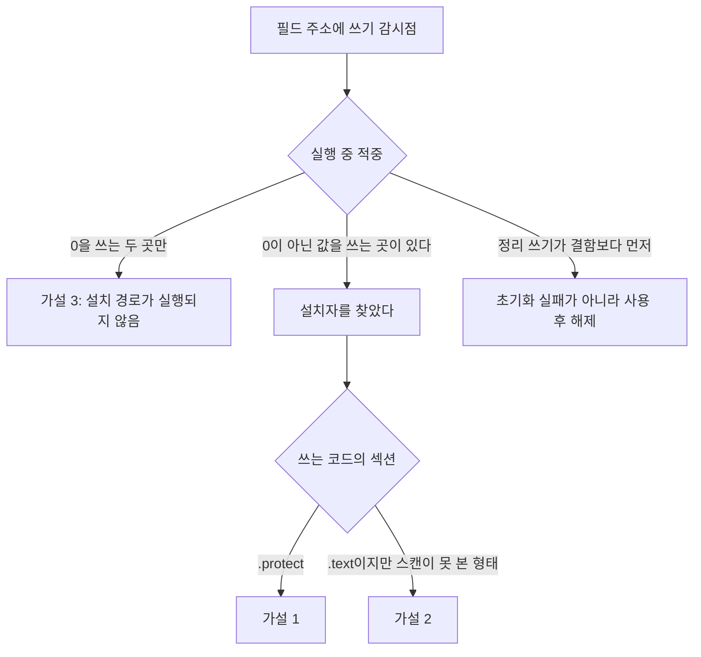

# 20260905-185 게스트 필드 쓰기 감시점 설계
# 20260905-185 Guest Field Write Watchpoint

## 1. 배경 및 목적 (Background & Objectives)

Task 184는 EZ2DJ 4th의 결함 필드 `[0x00aca5b0 + 0xa10]`을 게임 `.text` 전체에서 검색해, 그 필드에 쓰는 명령이 두 개뿐이고 **둘 다 0을 쓴다**는 것을 확인했다. 0이 아닌 값을 넣는 코드는 없었다.

그래서 남은 가설이 세 가지다.

1. 포인터를 설치하는 코드가 `.text` 밖(`.protect`)에 있다.
2. 설치가 리터럴 저장이 아니라 `memcpy`·`memset` 같은 대량 복사나 계산된 주소를 통해 이루어진다.
3. 설치 경로가 이 실행에서 아예 실행되지 않는다.

바이트 검색으로는 1과 2를 구분할 수 없다. **하드웨어 쓰기 감시점은 명령이 어떻게 부호화되었든, 어느 섹션에서 실행되었든 그 주소에 일어난 쓰기를 잡는다.** 세 가설을 한 번에 가른다.

Task 184 confirmed that only two instructions in the game's `.text` write the faulting field and that both store zero, leaving three hypotheses: the installer lives outside `.text`, the install happens through a bulk copy or a computed address, or the install path never runs. A byte search cannot separate the first two. A hardware write watchpoint traps the write whatever its encoding and whichever section executed it, which separates all three at once.

---

## 2. 감시점이 답하는 것 (What The Watchpoint Answers)

특히 마지막 갈래가 중요하다. Task 184는 정리 경로(`0x00022aad`)가 존재한다는 것만 알았고, 그것이 결함보다 **먼저** 실행되는지는 모른다. 먼저라면 이야기가 완전히 달라진다. "한 번도 만들어지지 않았다"가 아니라 "만들어졌다가 치워진 뒤에 쓰였다"가 된다.

---

## 3. 설계 (Design)

### 3.1 옵션

`--field-write-watch <hex-address>`. 게스트의 절대 주소를 받는다. 이 이미지는 `0x00400000`에 고정 적재되므로 절대 주소가 안정적이고, 결함 기록이 이미 절대 주소로 남으므로 사람이 옮겨 적을 값이 그대로 쓰인다.

주소는 4바이트 정렬이어야 한다. x86의 4바이트 데이터 중단점이 정렬을 요구하며, 정렬되지 않은 주소를 조용히 받으면 감시점이 엉뚱한 범위를 보게 된다. 정렬되지 않으면 거절한다.

### 3.2 디버그 레지스터

`Dr1`을 쓴다. `Dr7`의 `L1`, `R/W1 = 01`(쓰기), `LEN1 = 11`(4바이트)을 세운다.

네 레지스터가 모두 다른 진단 모드에 쓰이고 있으므로, `Dr1`을 쓰는 `--slot-writer-trace`와 `--null-context-field-reference-execution-trace`와는 함께 쓸 수 없다. 조용히 서로 덮어쓰면 두 진단 모두 거짓을 말하므로, 조합을 명령행에서 거절한다.

### 3.3 적중 시 기록하는 것

데이터 중단점은 쓰기가 **끝난 뒤** 트랩하므로 `EIP`는 저장 명령의 다음을 가리킨다. 따라서 저장 명령 자체는 `EIP` 앞의 바이트 창에서 사람이 해독한다.

| 항목 | 이유 |
| --- | --- |
| 순번, 스레드 | 같은 필드를 여러 스레드가 다루는지 |
| `EIP`, RVA, 섹션 | 어느 섹션이 썼는지가 가설 1과 2를 가른다 |
| 쓰인 값 | **0인지 아닌지가 이 조사의 답이다** |
| 범용 레지스터 | 값의 출처를 되짚기 위해 |
| `[ebp+4]` 복귀 주소와 RVA | 호출자를 식별하기 위해 |
| `EIP` 앞뒤 바이트 창 | 저장 명령을 해독하기 위해 |

기록 수에 상한을 두고 상한 도달 여부를 남긴다.

### 3.4 언제 무장하는가

프로세스의 첫 스레드와 이후 생성되는 모든 스레드에 무장한다. 디버그 레지스터는 스레드마다 따로이므로, 새 스레드에 무장하지 않으면 그 스레드의 쓰기를 통째로 놓친다.

전역이 `.data`에 있고 주소가 고정이므로 이미지 적재 직후부터 무장할 수 있다. 생성자가 언제 도는지 모르므로 가능한 한 이르게 건다.

---

## 4. 기존 감시 구현과의 관계 (Relation To The Existing Watch)

`SetNullContextFieldAccessBreakpoint`는 대상 RVA가 상수로 박혀 있고, 그 모드의 적중 기록·단일 스텝 상태와 얽혀 있다. Task 184가 스캐너에 대해 내린 것과 같은 판단을 적용한다. 기존 구현은 그대로 두고 새 감시를 별도 함수와 별도 옵션으로 만든다. 이전 작업들의 결론이 기존 출력에 근거하고 있다.

---

## 5. 검증 방법 (Verification)

1. Task 184가 찾은 두 쓰기 지점 RVA `0x000225d1`과 `0x00022aad`가 적중 기록에 나타나야 한다. 나타나지 않으면 감시점이 무장되지 않았거나 주소가 틀린 것이다.
2. 각 적중의 `EIP` 앞 바이트 창이 `c7 80 10 0a 00 00 00 00 00 00`을 담아야 한다. 스캔과 감시가 같은 명령을 가리키는지 대조한다.
3. 적중 순서를 결함 시점과 비교한다.

---

## 6. 위험과 미확정 (Risks & Unresolved)

- **위험 — 성능.** 데이터 중단점은 적중할 때만 트랩하므로 명령 추적과 달리 비용이 낮다. 다만 이 필드가 자주 쓰이면 기록 상한에 먼저 닿는다. 상한 도달을 기록해 구분한다.
- **위험 — 레지스터 충돌.** 다른 진단 모드와의 조합을 거절해 막는다.
- **미확정 — 감시점이 하나도 적중하지 않을 가능성.** 그 경우 생성자조차 실행되지 않았다는 뜻이고, 조사는 "이 객체를 만드는 함수가 왜 호출되지 않는가"로 옮겨간다.
- **미확정 — 값의 출처.** 0이 아닌 쓰기를 잡더라도 그 값이 무엇을 가리키는 포인터인지는 이 작업에서 확정하지 않는다.

---

## 7. 관련 문서 (Related Documents)

- [Task 184 설계](20260905-184-guest-field-reference-scan.md)
- [Task 184 작업 로그](../work-logs/20260905-184-guest-field-reference-scan.md)
- [4th 그래픽 경로 분석](../analysis/ez2dj4th-graphics-path.md)
- [Task 185 작업 지시서](../work-orders/20260905-185-field-write-watch.md)
