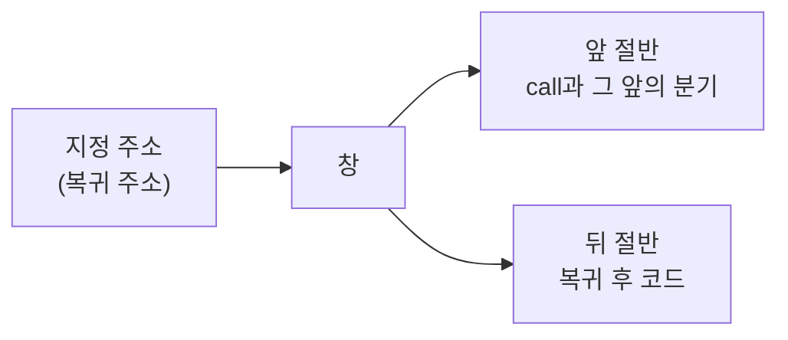

# 20260905-186 게스트 코드 창 기록 설계
# 20260905-186 Guest Code Window Capture

## 1. 배경 및 목적 (Background & Objectives)

Task 185는 EZ2DJ 4th의 결함 필드가 실행 내내 한 번도 채워지지 않으며, 그 포인터를 설치하는 경로가 실행되지 않는다는 것을 확정했다. 그리고 새 단서 하나를 남겼다. 생성자의 호출자 RVA `0x000a5c26`이다.

Task 185는 또 하나를 확정했다. **`.text`는 디스크에서 암호문이고 실행 중에만 복호화된다.** 파일 오프셋 `0x225d1`이 `c5 ce d8 df …`인데 실행 중 같은 위치는 `c7 80 10 0a 00 00 …`이다. 따라서 이 게임의 코드를 읽는 유일한 방법은 실행 중인 프로세스 메모리를 읽는 것이다.

지금 읽어야 할 지점이 여럿이다.

| 주소 | 무엇인가 | 출처 |
| --- | --- | --- |
| RVA `0x000a5c26` | 생성자의 호출자 | Task 185 감시점 적중의 복귀 주소 |
| RVA `0x000235fa` | 결함 함수의 호출자 | Task 182 접근 위반 기록 |
| RVA `0x0003627e` | 그 위 호출자 | 같은 기록 |
| RVA `0x000076ef` | 그 위 호출자 | 같은 기록 |
| RVA `0x00022a50` 부근 | null 검사를 가진 형제 함수 | Task 184 스캔 |

런처는 이미 여러 곳에서 바이트 창을 기록하지만, 모두 각자의 진단에 묶여 있고 주소가 상수이거나 그 진단의 문맥에서만 나온다. 임의의 주소를 지정해 읽는 수단이 없다.

Task 185 established that the field is never filled and that the install path does not run, leaving the constructor's caller as the new lead, and it also established that `.text` is ciphertext on disk and only readable from the live process. Several addresses now need reading, and while the launcher records byte windows in many places, every one of them is bound to its own diagnostic with a fixed address.

---

## 2. 설계 (Design)

### 2.1 무엇을 만드는가

`--code-window <hex-address>[:<hex-length>]`. 반복 지정할 수 있다. 첫 접근 위반 시점에 지정한 주소들의 바이트를 읽어 기록한다.

한 번의 실행으로 여러 지점을 뜬다. 이 실행은 5분 남짓 걸리므로, 주소마다 실행을 반복하는 것은 조사 속도를 그만큼 늦춘다.

A repeatable `--code-window` that reads the named addresses at the first access violation. One run covers every site, which matters because a run takes minutes.

### 2.2 왜 접근 위반 시점인가

Task 184의 스캐너와 같은 이유다. 패킹된 코드는 그때 이미 복호화되어 있고, 결함이 재현성이 있으므로 시점이 안정적이다.

### 2.3 읽기 앞쪽 여유

호출자 주소는 **복귀 주소**다. 즉 `call` 명령의 **다음**을 가리킨다. 호출 자체와 그 앞의 조건 분기를 보려면 지정한 주소보다 앞을 읽어야 한다.

그래서 지정 주소를 창의 시작이 아니라 **기준점**으로 삼고, 기준점 앞 절반과 뒤 절반을 읽는다. 사용자가 복귀 주소를 그대로 옮겨 적어도 그 앞의 `call`이 창 안에 들어온다.

### 2.4 길이

기본 128바이트, 상한 512바이트로 한다. 함수 하나를 통째로 담기에는 모자라지만, 한 판정과 그 주변 호출을 보기에는 충분하고 진단 로그 한 줄이 다루기 어려워지지 않는다. 더 필요하면 인접 주소를 추가로 지정한다.

### 2.5 기록 내용

주소, RVA, 섹션, 창의 시작 주소와 길이, 읽기 성공 여부, 바이트 열이다. 읽지 못하면 그 사실을 남긴다. 조용히 빈 문자열을 남기면 "코드가 없다"와 "읽지 못했다"를 구분할 수 없다.

---

## 3. 원본 자산 취급 (Original Asset Handling)

이 진단은 원본 실행 파일의 복호화된 코드 일부를 로그에 남긴다. 저장소 규칙에 따라 다음을 지킨다.

* 로그는 `logs/` 아래에만 남고 저장소에 commit하지 않는다.
* **분석 문서와 작업 로그에는 바이트 열 전체를 옮기지 않는다.** 해독 결과와 오프셋, 관찰된 동작만 적는다. 판정에 꼭 필요한 최소한의 바이트만 인용한다.

*This diagnostic puts decrypted original code into the run log. The log stays under `logs/` and is never committed, and the analysis documents record decodings, offsets, and observed behavior rather than byte listings.*

---

## 4. 검증 방법 (Verification)

1. 이미 아는 주소로 확인한다. `0x004225db`을 지정하면 창 안에 Task 185가 기록한 `c7 80 10 0a 00 00 00 00 00 00`이 들어 있어야 한다.
2. 읽을 수 없는 주소를 지정하면 실패가 기록되어야 한다.
3. 조사 대상 다섯 지점을 한 실행에서 모두 기록한다.

---

## 5. 위험과 미확정 (Risks & Unresolved)

- **위험 — 손으로 하는 해독.** 디스어셈블러가 없으므로 바이트를 사람이 읽는다. 잘못 읽으면 조사가 어긋난다. 판정에 쓰는 해독은 근거 바이트와 함께 남겨 다시 검증할 수 있게 한다.
- **위험 — 창 경계.** 128바이트 안에 필요한 분기가 들어오지 않을 수 있다. 그때는 인접 주소를 추가한다.
- **미확정 — 이 조사가 설치 경로를 찾아낼지.** 호출자 코드가 조건 분기를 보여줄 수도 있고, 더 위로 올라가야 할 수도 있다.

---

## 6. 관련 문서 (Related Documents)

- [Task 185 작업 로그](../work-logs/20260905-185-field-write-watch.md)
- [Task 184 작업 로그](../work-logs/20260905-184-guest-field-reference-scan.md)
- [4th 그래픽 경로 분석](../analysis/ez2dj4th-graphics-path.md)
- [Task 186 작업 지시서](../work-orders/20260905-186-guest-code-window.md)
