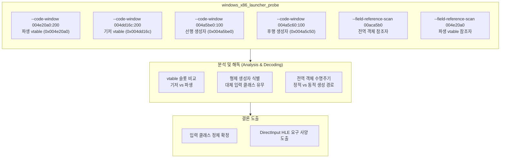

# 20260905-187 파생 입력 vtable 분석과 클래스 계통 식별 설계
# 20260905-187 Derived Input Vtable Analysis And Class Hierarchy Identification

## 1. 배경 및 목적 (Background & Objectives)

Task 186은 결함 함수 `0x00422b00`을 해독하여 결함 필드 `+0xa10`이 `IDirectInputDevice` 키보드 인터페이스이며, 게임이 첫 텍스처를 올린 뒤 256바이트 상태를 읽으려다 null 역참조로 접근 위반을 일으킨다는 사실을 확정했다. 실행 전체에서 `dinput.dll`은 적재조차 되지 않는다.

또한 Task 186에서 기저 클래스 생성자 `0x004225a0`의 기저 vtable이 `0x004dd16c`이고, 전역 인스턴스 `0x00aca5b0`의 파생 생성자 `0x004a5c10`이 파생 vtable `0x004e20a0`을 설치한다는 사실을 확인했다.

여기서 중요한 의문이 발생한다:
1. **객체 선택의 불일치 가능성**: 게임이 다양한 입력 방식(키보드/DirectInput, 아케이드 I/O 보드 등)에 따라 서로 다른 파생 클래스를 두고 있는가? 만약 그렇다면 현재 실행 환경에서 부적절한 파생 클래스가 인스턴스화되었거나, 다른 입력 파생 클래스가 존재하는가?
2. **파생 클래스 vtable 슬롯 구조**: 파생 vtable `0x004e20a0`과 기저 vtable `0x004dd16c`는 어떤 가상 메서드들을 가지며, 어떤 메서드가 오버라이드되었는가?
3. **형제 생성자군 (`0x004a5be0` ~ `0x004a5cb0`)의 실체**: `0x004a5c10` 바로 앞과 뒤에 유사한 형태의 생성자 코드가 관측되었다. 이것들이 다른 입력 클래스의 생성자들인가?
4. **전역 객체 `0x00aca5b0` 참조자**: 게임 코드 전체에서 이 전역 객체를 참조하는 코드는 누구이며, 어떤 경로를 통해 초기화되고 갱신되는가?

본 작업에서는 이 질문들에 답하기 위해 vtable 메모리 창 덤프, 형제 생성자 코드 창 해독, 그리고 전역 객체 참조 스캔을 수행하여 입력 클래스 계통의 정체를 확정한다.

*Task 186 confirmed that the faulting field `+0xa10` is an `IDirectInputDevice` keyboard interface, and the guest dies polling a 256-byte keyboard state right after its first texture upload because `dinput.dll` is never loaded. The base constructor `0x004225a0` sets vtable `0x004dd16c`, and the global object `0x00aca5b0` is constructed by `0x004a5c10` installing derived vtable `0x004e20a0`. This task investigates whether alternative input derived classes exist, dumps and compares the vtable slots, decodes sibling constructors, and scans references to the global instance.*

---

## 2. 조사 설계 (Investigation Design)

### 2.1 대상 주소 및 조사 항목

1. **파생 vtable `0x004e20a0` 및 기저 vtable `0x004dd16c` 덤프**:
   - 각각 512바이트(128 DWORD 포인터) 창으로 캡처.
   - 슬롯별 함수 주소를 추출하여 일치하는 슬롯(상속)과 불일치하는 슬롯(오버라이드)을 목록화.
   - 결함 함수 `0x00422b00`이 vtable에 존재하는지, 아니면 비가상 멤버 함수인지 확인.
2. **형제 생성자군 (`0x004a5be0` ~ `0x004a5cb0`) 해독**:
   - `0x004a5c10` (현재 객체 `0x00aca5b0`의 생성자) 전후에 위치한 함수들의 바이트를 읽고 Capstone으로 해독.
   - 이들 함수가 동일 기저 클래스(`0x004225a0`)를 호출하고 다른 vtable을 설치하는 또 다른 파생 클래스 생성자인지 규명.
3. **전역 객체 `0x00aca5b0` 및 파생 vtable `0x004e20a0` 참조 스캔**:
   - `.text` 전체에서 `0x00aca5b0`을 가리키는 모든 명령(절대 주소, lea, offset-load 등)을 수집.
   - 누가 이 객체를 생성/호출하는지, 호출 사슬 `0x004076ef → 0x0043627e → 0x004235d3`과의 연결고리 확인.

---

## 3. 원본 자산 취급 (Original Asset Handling)

- 진단 로그는 `logs/` 아래에 생성되며 저장소에 커밋하지 않는다.
- 작업 로그 및 분석 문서에는 바이너리 덤프 바이트를 전체 게시하지 않고, 해독된 역어셈블 결과, 슬롯 목록, 관찰된 동작 및 오프셋만을 기록한다.

---

## 4. 검증 방법 (Verification)

1. `re2dj_windows_x86_launcher_probe` 진단 실행을 통해 로그 파일 생성.
2. 기저 및 파생 vtable의 슬롯 0부터 유효 코드 주소가 끝나는 지점까지 전수 테이블 작성.
3. 형제 생성자의 vtable 설치 명령(`mov [eax], imm32`) 존재 여부 확인.
4. `0x00aca5b0` 참조자 목록을 도출하고 주요 호출 지점 해독.

---

## 5. 위험 및 미확정 (Risks & Unresolved)

- **vtable 길이 판별**: vtable 끝에는 일반적으로 다른 데이터(문자열, 다른 vtable 등)가 인접해 있으므로, 함수 포인터가 `.text` 코드 범위를 벗어나는 지점을 찾아 vtable 경계를 정확히 판정해야 한다.
- **클래스 다형성 구조**: 게임이 실행 중 입력 장치를 동적으로 전환하는 구조가 아니라 컴파일 타임에 결정된 전역 객체일 가능성도 존재한다. 두 가능성 모두 이번 조사 결과로 판별 가능하다.

---

## 6. 관련 문서 (Related Documents)

- [Task 186 작업 로그](../work-logs/20260905-186-guest-code-window.md)
- [Task 185 작업 로그](../work-logs/20260905-185-field-write-watch.md)
- [Task 184 작업 로그](../work-logs/20260905-184-guest-field-reference-scan.md)
- [4th 그래픽 경로 분석](../analysis/ez2dj4th-graphics-path.md)
- [Task 187 작업 지시서](../work-orders/20260905-187-derived-input-vtable-analysis.md)
