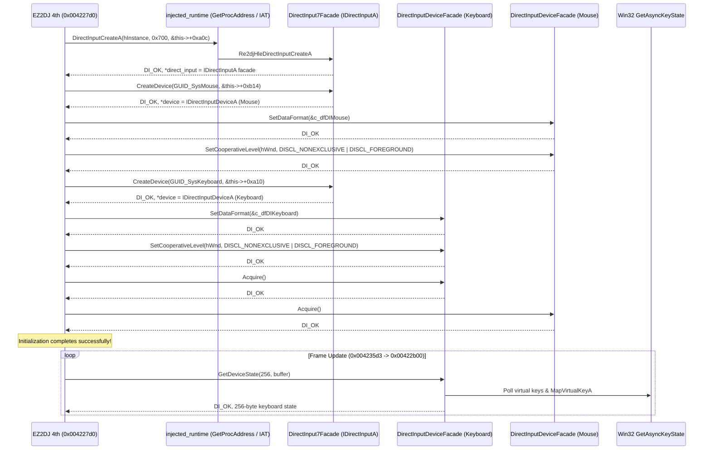

# 20260905-188 DirectInput 7 HLE 경계 구현 설계
# 20260905-188 DirectInput 7 HLE Boundary Implementation

## 1. 배경 및 목적 (Background & Objectives)

Task 187을 통해 EZ2DJ 4th의 크래시 원인이 명확히 확정되었다:
1. 게임 엔진은 `0x004227d0`에서 `DirectInputCreateA(hInstance, 0x700, &this->+0xa0c, NULL)`를 호출하여 키보드(`+0xa10`) 및 마우스(`+0xb14`) 장치를 생성하고 초기화한다.
2. 그러나 현대 호스트 OS(Windows 11)의 `dinput.dll`은 레거시 `DirectInputCreateA(..., 0x700, ...)`에 대해 지원 중단으로 인해 `0x80070057` (`E_INVALIDARG`)을 반환한다.
3. 게스트는 초기화 실패 시 `"DirectInput Initialize Error"` 분기를 타고 장치 포인터를 null로 방치한 채 복귀하며, 이후 프레임 갱신 루프(`0x004235d3`)에서 null 검사 없이 `+0xa10`의 `GetDeviceState`를 호출하여 접근 위반(`0xc0000005`) 크래시가 발생한다.

목표: **DirectInput 7 HLE 경계(`directinput7_com_facade`)를 구축**하여, 게스트의 `DirectInputCreateA` 호출을 가로채고 `IDirectInputA` 및 `IDirectInputDeviceA` (Keyboard, Mouse) 인터페이스의 최소 COM Facade를 제공함으로써 초기화 및 폴링 루프를 통과시키는 것이다.

*Task 187 confirmed that EZ2DJ 4th initializes DirectInput at `0x004227d0` using `DirectInputCreateA(0x700)`, but Windows 11 `dinput.dll` rejects it with `0x80070057` (`E_INVALIDARG`). The guest bails out with `"DirectInput Initialize Error"` leaving device fields null, crashing upon the first frame's input poll. This task designs a DirectInput 7 HLE boundary to intercept `DirectInputCreateA` and provide lightweight `IDirectInputA` and `IDirectInputDeviceA` COM facades.*

---

## 2. 인터페이스 및 호출 구조 (Architecture & Interface Design)

### 2.1 COM vtable 레이아웃

1. **`IDirectInputA` vtable (8 슬롯)**:
   - Slot 0: `QueryInterface` (`IUnknown`, `IDirectInputA`, `IDirectInput7A`)
   - Slot 1: `AddRef`
   - Slot 2: `Release`
   - Slot 3: `CreateDevice` (`GUID_SysKeyboard`, `GUID_SysMouse` 분기)
   - Slot 4: `EnumDevices` (stub, `DI_OK`)
   - Slot 5: `GetDeviceStatus` (stub, `DI_OK`)
   - Slot 6: `RunControlPanel` (stub, `DI_OK`)
   - Slot 7: `Initialize` (stub, `DI_OK`)

2. **`IDirectInputDeviceA` vtable (18 슬롯)**:
   - Slot 0: `QueryInterface`
   - Slot 1: `AddRef`
   - Slot 2: `Release`
   - Slot 3: `GetCapabilities` (stub)
   - Slot 4: `EnumObjects` (stub)
   - Slot 5: `GetProperty` (stub)
   - Slot 6: `SetProperty` (stub)
   - Slot 7: `Acquire` (returns `DI_OK`)
   - Slot 8: `Unacquire` (returns `DI_OK`)
   - Slot 9: `GetDeviceState(DWORD cbData, LPVOID lpvData)`:
     - **Keyboard**: 256바이트 버퍼 채우기 (`GetAsyncKeyState` + `MapVirtualKeyA` DIK 매핑).
     - **Mouse**: `DIMOUSESTATE` (16바이트) 채우기.
   - Slot 10: `GetDeviceData` (stub)
   - Slot 11: `SetDataFormat` (returns `DI_OK`)
   - Slot 12: `SetEventNotification` (stub)
   - Slot 13: `SetCooperativeLevel` (returns `DI_OK`)
   - Slot 14 ~ 17: `GetObjectInfo`, `GetDeviceInfo`, `RunControlPanel`, `Initialize` (stubs)

### 2.2 키보드 상태 매핑 (`GetDeviceState`)

DirectInput 키보드 상태 배열은 256바이트로, 키가 눌렸을 때 최상위 비트(`0x80`)가 설정된다.
- 인덱스는 DirectInput Scan Code (`DIK_*`)이다.
- Win32의 Virtual Key (`VK_*`)는 `MapVirtualKeyA(vk, MAPVK_VK_TO_VSC)`를 통해 8042 Scan Code Set 1 (DIK 코드)로 1:1 변환된다.
- 방향키, 엔터 등 확장 키는 별도 매핑 테이블로 보정한다:
  - `VK_UP` -> `0xC8` (`DIK_UP`)
  - `VK_DOWN` -> `0xD0` (`DIK_DOWN`)
  - `VK_LEFT` -> `0xCB` (`DIK_LEFT`)
  - `VK_RIGHT` -> `0xCD` (`DIK_RIGHT`)
  - `VK_RETURN` -> `0x1C` (`DIK_RETURN`)

---

## 3. 런타임 통합 설계 (Runtime Integration Design)

1. **`injected_runtime`의 `GetProcAddress` 후킹**:
   - `Re2djHookedGetProcAddress`에 `"DirectInputCreateA"` 처리 분기 추가:
     `reinterpret_cast<FARPROC>(&Re2djHleDirectInputCreateA)` 반환.
   - 패커가 언팩 시 동적으로 해석하는 IAT 슬롯(`0x00ad1634`)에 HLE 함수 주소가 자동 주입됨.
2. **`launcher_probe`의 IAT 슬롯 패치 보완**:
   - `entry_restored` (언팩 완료 후 게스트 원래 진입점 도달 시점)에 `main_image_base + 0x006d1634` (`0x00ad1634`)에 `_Re2djHleDirectInputCreateA@16` 주소를 직접 기록하여 이중 안전장치 확보.
3. **`CMakeLists.txt` 업데이트**:
   - `re2dj_windows_injected_runtime` 빌드 목록에 `src/platform/windows/directinput7_com_facade.cpp` 추가.

---

## 4. 원본 자산 취급 (Original Asset Handling)

- HLE Facade 코드는 Microsoft DirectX 사양 및 공개 헤더 정의에 기반하며, 원본 바이너리 코드를 포함하지 않는다.
- 진단 로그는 `logs/` 아래에 남으며 저장소에 커밋하지 않는다.

---

## 5. 검증 방법 (Verification)

1. `scripts/build_win32.bat` 빌드 통과.
2. `re2dj_unit_tests.exe` 및 `re2dj_windows_product_loader_probe.exe` 통과.
3. `re2dj_windows_x86_launcher_probe.exe` 진단 실행:
   - `0x004227d0` 실행 시 `"DirectInput Initialize Error"` 분기를 타지 않고 정상 성공 경로(`0x004229e3`)로 복귀하는지 확인.
   - 전역 객체의 `+0xa0c`, `+0xb14`, `+0xa10`에 유효한 HLE 포인터가 채워지는지 확인.
   - 프레임 갱신 시 `0x00422b3a`의 `GetDeviceState` 호출이 크래시 없이 성공하고, 첫 프레임 렌더링/프레젠트로 진행되는지 확인.

---

## 6. 관련 문서 (Related Documents)

- [Task 187 작업 로그](../work-logs/20260905-187-derived-input-vtable-analysis.md)
- [Task 187 설계](../design/20260905-187-derived-input-vtable-analysis.md)
- [4th 그래픽 경로 분석](../analysis/ez2dj4th-graphics-path.md)
- [Task 188 작업 지시서](../work-orders/20260905-188-directinput7-hle-facade.md)
