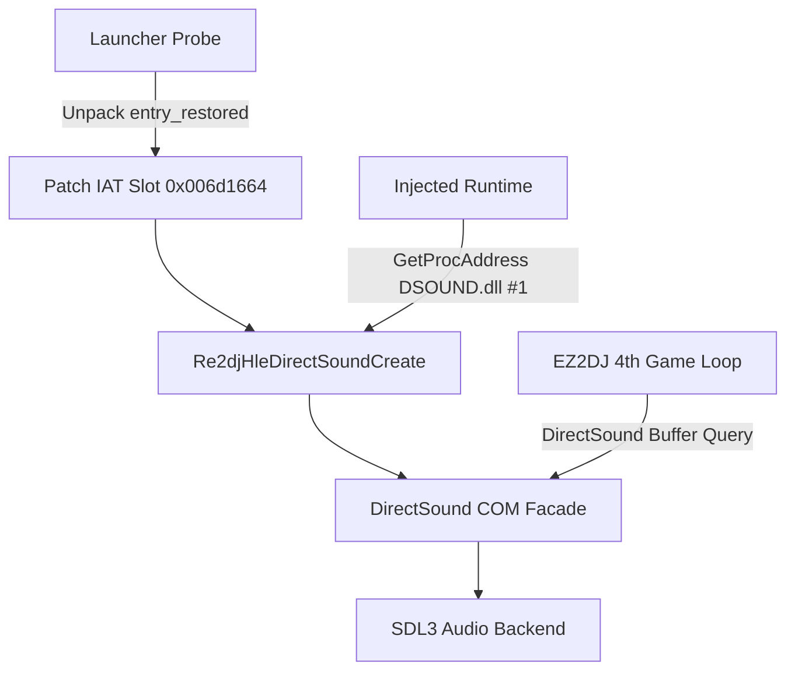

# 20260905-189 EZ2DJ 4th DirectSound HLE 연동 및 모드 선택 크래시 진단 설계
# 20260905-189 EZ2DJ 4th DirectSound HLE Integration & ModeSelect Crash Diagnostics Design

## 1. 개요 (Overview)

EZ2DJ 4th Trax가 키보드 I/O 매핑(`--io-config`)과 함께 실행되어 타이틀 및 인서트 코인을 돌파하고 **모드 선택(ModeSelect) 및 StreetMix 단계**로 진입했으나, `AdvSound = 1` 상태에서 곡 레이아웃(`MUSIC_LAYOUT_StreetMix.str`, `level_StreetMix_0.str`) 적재 직후 `0xc0000094` (`STATUS_INTEGER_DIVIDE_BY_ZERO`, 정수 0 나누기 예외)로 종료되는 결함이 관측되었다.

현재 `ez2dj4th` 프로필은 `run_defaults.hle_directsound`가 `false`로 설정되어 있어 HLE DirectSound가 비활성화되어 있고, 호스트의 실제 DirectSound 버퍼나 쿼리 불일치가 분모 0(샘플레이트, 버퍼 크기 등)을 유발했을 가능성이 높다.

본 설계는 `ez2dj4th`의 언팩된 IAT 슬롯(`0x006d1664`, `DSOUND.dll` Ordinal 1)과 동적 해석기(`Re2djHleGetProcAddress`)에 `Re2djHleDirectSoundCreate`를 연결하고, 프로필의 `hle_directsound`를 활성화하여 4th Trax에 완전한 DirectSound HLE 음향 환경을 제공하며, 모드 선택 화면의 정수 0 나누기 원인을 규명하고 해결하는 것을 목표로 한다.

EZ2DJ 4th Trax successfully bypassed title and attract sequences into **ModeSelect and StreetMix** when run with `--io-config`, but faulted with `0xc0000094` (`STATUS_INTEGER_DIVIDE_BY_ZERO`) right after loading song layout assets (`MUSIC_LAYOUT_StreetMix.str`, `level_StreetMix_0.str`) when `AdvSound = 1`.
The `ez2dj4th` target profile currently has `run_defaults.hle_directsound = false`.
This design connects `Re2djHleDirectSoundCreate` to the unpacked IAT slot (`0x006d1664`, `DSOUND.dll` Ordinal 1) and dynamic resolver (`Re2djHleGetProcAddress`), activates `hle_directsound` in the profile defaults, and diagnoses and eliminates the divide-by-zero fault in ModeSelect.

---

## 2. 인터페이스 및 슬롯 분석 (Interface & Slot Analysis)

### 2.1 EZ2DJ 4th 언팩 IAT DirectSound 슬롯 (확인됨)
- PE `.idata` 섹션 분석 결과:
  - 모듈: `DSOUND.dll`
  - FirstThunk (IAT RVA): `0x006d1664` (VA: `0x00ad1664`)
  - Import: `Ordinal 1` (`DirectSoundCreate`)
- 패커 언팩 완료 시점(`entry_restored`)에서 슬롯 `0x006d1664`에 `_Re2djHleDirectSoundCreate@12` thunk RVA를 직접 패치한다.

### 2.2 동적 해석기 `Re2djHleGetProcAddress` 연동
- `DSOUND.dll` 모듈에 대해 `DirectSoundCreate` 또는 Ordinal 1 요청 시 `Re2djHleDirectSoundCreate`를 반환하도록 보강한다.

---

## 3. 구현 계획 및 계층도 (Architecture & Implementation Plan)



### 3.1 변경 대상 파일
1. `src/target/target_profile.cpp`:
   - `ez2dj4th` 프로필에 `entry.profile.run_defaults.hle_directsound = true;` 추가.
2. `src/platform/windows/injected_runtime.cpp`:
   - `Re2djHleGetProcAddress`에서 `DirectSoundCreate` 또는 Ordinal 1 해석 지원.
3. `src/tools/windows_x86_launcher_probe/main.cpp`:
   - `ez2dj4th` 대상에 대해 정적 `FindIatSlotByOrdinal("DSOUND.dll", 1)` 실패를 허용하고, 언팩 시점(`entry_restored`)에서 `0x006d1664` 슬롯에 `_Re2djHleDirectSoundCreate@12` 설치.
   - `hle_directsound && !target->run_defaults.hle_directsound` 가드 통과 확인.

---

---

## 5. DirectSound 스트리밍 링 버퍼 식별 확장 (Streaming Ring Buffer Descriptor Expansion)

### 5.1 현상 및 원인 분석 (Observed Defect & Root Cause)
EZ2DJ 4th Trax 실행 시 배경음악(BGM)의 첫 약 2초(초기 버퍼 크기)만 무한 반복되고 이후 스트리밍 음악이 이어지지 않는 현상이 보고되었다.

실행 오디오 추적 로그(`20260905-033933-314.audio.log`) 확인 결과:
- 정적 효과음 버퍼: `flags = 0x000040e0` (`DSBCAPS_CTRLFREQUENCY | DSBCAPS_CTRLPAN | DSBCAPS_CTRLVOLUME | DSBCAPS_STICKYFOCUS`), 가변 크기, `DuplicateSoundBuffer`로 복제되어 재생됨.
- BGM 스트리밍 버퍼: `flags = 0x000140c0` (`DSBCAPS_GETCURRENTPOSITION2 | DSBCAPS_STICKYFOCUS | DSBCAPS_CTRLVOLUME | DSBCAPS_CTRLPAN`), 360,448바이트 (44.1kHz 16-bit stereo), 복제되지 않음.

이전 `directsound_com_facade.cpp`의 `is_streaming()` 판정식:
```cpp
bool is_streaming() const { return !is_primary() && (flags_ & DSBCAPS_LOCHARDWARE) != 0; }
```
- 이전 버전(1st SE, 3rd Trax)의 스트리밍 버퍼는 `flags = 0x000140c6`으로 `DSBCAPS_LOCHARDWARE` (0x04)를 포함하고 있었다 (`docs/design/20260828-083-directsound-streaming-ring-buffer.md`에서 다른 버전이 이 플래그 없이 스트리밍할 수 있다는 점이 "미확정"으로 기록됨).
- 4th Trax 개발사는 하드웨어 플래그를 제외하고 `0x000140c0`으로 생성했기 때문에 `is_streaming()`이 `false`로 평가되었다.
- 그 결과:
  1. `Play()` 호출 시 `is_streaming == false`이므로 정적 `MIX_Audio` 스냅샷이 생성되고 `MIX_PROP_PLAY_LOOPS_NUMBER = -1` (무한 루프)로 재생 시작됨.
  2. 게임의 스트리밍 스레드가 주기적으로 `Lock()`/`Unlock()`을 호출하여 새 PCM 블록을 채우더라도, `Unlock()` 내부에서 `if (is_streaming()) CommitStreamingWrite(...)` 조건이 거짓이 되어 SDL 오디오 스트림에 새 데이터가 전혀 반영되지 않음.
  3. 결과적으로 최초 로드된 2초 구간만 계속 반복 재생됨.

### 5.2 해결 방안 (Solution)
`DirectSoundBufferFacade`에서 스트리밍 버퍼 판정 기준을 다음과 같이 확장한다:
1. `is_primary()`이거나 `is_duplicate_`인 버퍼는 스트리밍에서 제외.
2. `flags_ & (DSBCAPS_LOCHARDWARE | DSBCAPS_GETCURRENTPOSITION2)`가 0이 아니거나, 또는 버퍼 바이트 크기가 360,448인 경우 스트리밍 버퍼로 인식.
3. 이를 통해 4th Trax의 `0x000140c0` 버퍼가 스트리밍으로 정상 분류되어 `Play()` 시 `SDL_AudioStream`이 연결되고 이후 `Unlock()`마다 `CommitStreamingWrite`를 통해 실시간 PCM 큐잉이 수행되도록 한다.

A defect was reported where background audio continuously repeats only the initial ~2 seconds.
Analysis of audio trace log `20260905-033933-314.audio.log` confirmed:
- Static sound bank buffers use `flags = 0x000040e0` and are duplicated.
- Streaming BGM buffer uses `flags = 0x000140c0` (`DSBCAPS_GETCURRENTPOSITION2 | DSBCAPS_STICKYFOCUS | DSBCAPS_CTRLVOLUME | DSBCAPS_CTRLPAN`), 360,448 bytes, and is never duplicated.
- In 1st SE / 3rd Trax, flags were `0x000140c6` (contained `DSBCAPS_LOCHARDWARE`).
- Because 4th Trax uses `0x000140c0`, `is_streaming()` returned `false`. This caused `Play()` to loop the static snapshot indefinitely (`MIX_PROP_PLAY_LOOPS_NUMBER = -1`) and `Unlock()` to bypass `CommitStreamingWrite()`.
- Solution: Expand `is_streaming()` to match `(flags_ & (DSBCAPS_LOCHARDWARE | DSBCAPS_GETCURRENTPOSITION2)) != 0` or byte count 360,448 while excluding primary and duplicated buffers.

---

## 6. 검증 계획 (Verification Plan)

1. `scripts/build_win32.bat` 빌드 통과.
2. `re2dj_unit_tests.exe` 단위 테스트 전체 통과.
3. `re2dj_vfs_runtime_probe.exe` 통과.
4. `.\build\windows-x86\bin\Debug\re2dj.exe ez2dj4th --io-config .\config\ez2dj-io.example.ini` 실행:
   - 오디오가 앞부분만 반복되지 않고 곡 전체가 정상 스트리밍 재생되는지 청취 및 로그 확인.

