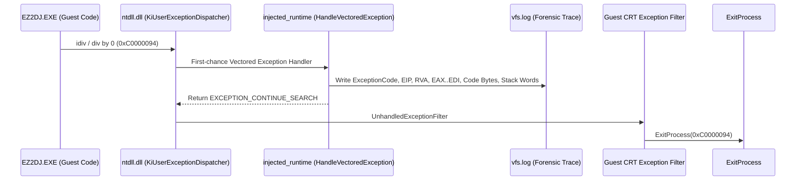

# EZ2DJ 4th Trax StyleSelect 0xC0000094(Divide-by-Zero) 예외 진단 및 해결 설계

## 개요 (Overview)

EZ2DJ 4th Trax 실행 중 DirectSound HLE와 DirectInput HLE가 정상 작동하여 인트로 및 모드 선택(StreetMix)까지 원활하게 진입한 후, `STYLE_SELECT.str` 에셋을 로드하는 시점에서 프로세스가 예외 코드 `3221225620` (`0xC0000094`, `STATUS_INTEGER_DIVIDE_BY_ZERO`)로 인해 비정상 종료되는 현상이 관측되었다.

게스트 프로세스는 기본적으로 `--run-detached` 환경에서 실행되므로 외부 디버거가 분리된 상태이며, 게스트의 CRT unhandled exception filter가 예외를 받아 `ExitProcess(0xC0000094)`를 호출한다. 이로 인해 크래시가 발생한 정확한 명령어 주소(EIP), 당시의 레지스터(EAX, EDX, ECX 등 제수 레지스터), 그리고 호출 스택 정보를 즉시 확인하기 어렵다.

본 설계는 두 단계로 구성된다:
1. **1단계: 인젝션 런타임 VEH(Vectored Exception Handler) 기반의 크래시 포렌식 로깅 구현**
   - 프로세스에 상주하는 `injected_runtime.dll`의 기존 VEH 핸들러를 확장하여, 레거시 I/O 포트 트랩(`0xC0000096`)뿐만 아니라 0으로 나누기(`0xC0000094`) 및 메모리 액세스 위반(`0xC0000005`) 등 치명적 예외 발생 시 예외 주소, RVA, CPU 레지스터 일체, 실행 코드 바이트, 스택 상위 워드를 `vfs.log`에 즉시 기록하도록 한다.
2. **2단계: StyleSelect 크래시의 근본 원인 분석 및 HLE 경계 수정**
   - 포렌식 로그를 통해 0으로 나누기를 유발한 제수(divisor)의 출처(예: 곡 목록 검색 결과 개수 0, DirectDraw/GDI 화면 재생률 0, 타이머 델타 0, 에셋 파싱 실패 등)를 역추적하고, 해당 HLE 에뮬레이션 계층을 수정하여 정상 진입하도록 보장한다.

---

During execution of EZ2DJ 4th Trax, after DirectSound HLE and DirectInput HLE operated successfully allowing seamless navigation through attract and ModeSelect (StreetMix), the process crashed with exception code `3221225620` (`0xC0000094`, `STATUS_INTEGER_DIVIDE_BY_ZERO`) immediately upon loading `STYLE_SELECT.str`.

Because the guest process runs detached (`--run-detached`), the external debugger is detached and the guest's CRT unhandled exception filter intercepts the fault, calling `ExitProcess(0xC0000094)`. Consequently, the precise faulting instruction address (EIP), register states (EAX, EDX, ECX divisor registers), and call stack are masked.

This design consists of two phases:
1. **Phase 1: Crash Forensic Logging via Vectored Exception Handler (VEH) in Injected Runtime**
   - Extend the existing VEH in `injected_runtime.dll` so that, in addition to legacy I/O port traps (`0xC0000096`), fatal exceptions such as integer divide-by-zero (`0xC0000094`) and access violations (`0xC0000005`) immediately log the fault address, module RVA, complete CPU register snapshot, machine code bytes at EIP, and top stack words into `vfs.log`.
2. **Phase 2: Root-Cause Diagnosis and HLE Boundary Fix for StyleSelect Crash**
   - Using the forensic log, reverse-engineer and trace the origin of the zero divisor (e.g. empty song list count, display refresh rate of 0, timer delta of 0, or asset parsing failure), and implement the appropriate fix in the HLE emulation layer to allow smooth progression into StyleSelect.

---

## 예외 포렌식 구조 및 흐름 (Exception Forensic Architecture & Flow)



---

## 세부 설계 (Detailed Design)

### 1. VEH 포렌식 로거 확장 (`injected_runtime.cpp`)
기존 `HandleLegacyIoPortException`을 `HandleVectoredException`으로 명확히 리팩터링하고, 포트 I/O 예외가 아닌 경우 다음 로직을 추가한다:

```cpp
if (code == EXCEPTION_INT_DIVIDE_BY_ZERO || code == EXCEPTION_ACCESS_VIOLATION ||
    code == EXCEPTION_ILLEGAL_INSTRUCTION || code == EXCEPTION_DATATYPE_MISALIGNMENT)
{
    ReportCrashException(exception);
}
```

`ReportCrashException`은 다음 정보를 안전하게 추출한다:
- `ExceptionAddress` 및 프로세스 기본 모듈 기준 `caller_rva`
- 범용 레지스터: `EAX`, `EBX`, `ECX`, `EDX`, `ESI`, `EDI`, `EBP`, `ESP`, `EIP`, `EFLAGS`
- `ExceptionAddress` 위치의 16바이트 머신 코드 (`ReadProcessMemory` 사용으로 안전 보장)
- `ESP` 위치의 상위 8개 DWORD 스택 값
- 형식:
  `re2dj:vfs:crash-exception:code=0x%08x:address=0x%08x:image_base=0x%08x:rva=0x%08x:eax=0x%08x:ebx=0x%08x:ecx=0x%08x:edx=0x%08x:esi=0x%08x:edi=0x%08x:ebp=0x%08x:esp=0x%08x:bytes=%s:stack=%s\r\n`

### 2. 가설 분석 및 원인 규명 계획 (Hypothesis & Root-Cause Analysis)
0xC0000094 예외는 x86 CPU의 `div` 또는 `idiv` 명령어가 0으로 나누려고 하거나 몫이 대상 레지스터 크기를 초과할 때 발생한다.

| 가설 (Hypothesis) | 발생 시나리오 (Scenario) | 점검 항목 (Verification) |
|---|---|---|
| A. 곡/스타일 목록 개수 0 (Item Count Zero) | StyleSelect 화면 진입 시 가용 스타일 또는 곡 목록이 비어 있어 `index % count` 연산 시 count = 0 | VFS 파일 열기 내역, 디렉터리 검색(`FindFirstFile`/`FindNextFile`), 또는 에셋 파싱 |
| B. 디스플레이 화면 재생률 0 (Display Refresh Rate Zero) | DirectDraw 모드 설정 후 화면 재생률을 가져와 프레임 타이밍 계산(`freq / refresh_rate`) 시 `dwRefreshRate == 0` | `ddraw_com_facade.cpp`의 EnumDisplayModes 및 GetDisplayMode 반환 구조체 |
| C. 타이머 델타 0 (Timer Delta Zero) | `QueryPerformanceCounter` 또는 `GetTickCount` 차이가 0인 상태에서 속도/프레임 계산 | 타이머 간격 반환 값 및 최소 델타 보장 |
| D. 윈도우/서피스 크기 0 (Surface Dimension Zero) | 뷰포트나 서피스 가로/세로 비율 계산 시 폭 또는 높이가 0 | DirectDraw 서피스 생성 매개변수 |

포렌식 로그가 확보되면 정확한 EIP 주소를 디스어셈블하여 명령어와 피연산자를 확인하고, 어떤 HLE 계층의 반환값이 0으로 전달되었는지 확정한다.

---

## 검증 계획 (Verification Plan)

1. `re2dj_injected_runtime.dll` 빌드 및 단위 테스트 확인.
2. EZ2DJ 4th Trax를 실행하여 StreetMix -> StyleSelect 진입.
3. `vfs.log`에서 `re2dj:vfs:crash-exception` 라인을 포착하여 EIP 및 제수 레지스터 확인.
4. 원인에 맞는 HLE 수정 적용 후 다시 StyleSelect에 진입하여 크래시 없이 다음 단계(곡 선택 화면)로 정상 진행되는지 검증.
