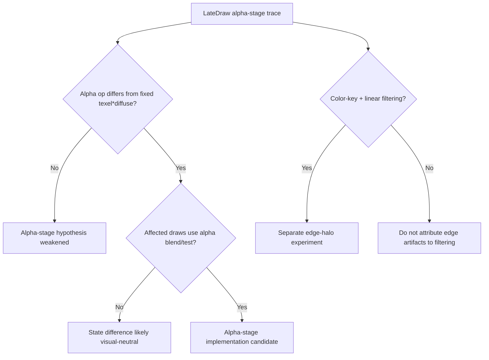

# 20260905-191 Direct3D texture-stage alpha 상태 진단 설계
# 20260905-191 Direct3D Texture-Stage Alpha State Diagnostics Design

## 1. 상태와 목적

**진단 전 설계.** 동일한 `ez2dj4th` Music Select 화면에서 re2DJ 출력이 원본보다 밝거나 반투명 합성이 다르게 보이는 원인을 확인한다. 현재 HLE는 stage 0의 RGB 연산만 `MODULATE(TEXTURE, DIFFUSE)`로 확인하고, alpha 연산은 셰이더에서 `texel * diffuse`로 고정한다. 원본이 실제로 어떤 `D3DTSS_ALPHAOP`/`ALPHAARG*`를 설정하는지 draw 시점의 trace로 확인한다.

**Design before diagnostics.** Determine why the same `ez2dj4th` Music Select scene can appear brighter or composite transparency differently in re2DJ. The HLE currently validates only the stage-0 RGB operation as `MODULATE(TEXTURE, DIFFUSE)` and fixes alpha in the shader as `texel * diffuse`. The diagnostic records the original `D3DTSS_ALPHAOP`/`ALPHAARG*` values at draw time before any semantic change.

## 2. 관찰 범위

- `D3DTSS_ALPHAOP`, `D3DTSS_ALPHAARG1`, `D3DTSS_ALPHAARG2`를 stage-0 `LateDraw`에 기록한다.
- `D3DRENDERSTATE_ALPHABLENDENABLE`, `SRCBLEND`, `DESTBLEND`, `ALPHATESTENABLE`, `ALPHAREF`, `ALPHAFUNC`, `COLORKEYENABLE`, `LIGHTING`을 같은 record에서 확인한다.
- 기존 texture identity, logical bounds, diffuse color, effective blend, color-key marker와 함께 비교한다.
- 진단은 호출 순서를 보존하되 bounded budget을 사용하며 원본 픽셀·자산·비밀값은 기록하지 않는다.
- 이번 단계에서는 shader semantics, blend factor mapping, color-key filtering, 원본 바이너리를 변경하지 않는다.

## 3. 판정 기준

- `ALPHAOP`이 `MODULATE`가 아닌데 해당 draw가 `SRCALPHA` 또는 alpha test를 사용하면, 현재 셰이더의 고정 alpha 계산과 원본 의미가 다를 가능성이 높다.
- alpha stage가 `SELECTARG1/2`이고 인자가 texture/diffuse 중 하나로 고정되면, 다음 수정의 최소 구현 후보로 삼는다.
- alpha stage가 draw마다 변하지 않거나 blending이 꺼져 있으면 이번 화면의 밝기 차이 원인으로 확정하지 않는다.
- `GL_LINEAR`와 color key의 경계 문제는 alpha-stage 결과와 분리해 별도 실험으로 판정한다.

## 4. 검증

1. Windows x86 Debug/Release 빌드와 CTest를 실행한다.
2. 사용자 HDD/CHD를 변경하지 않고 `ez2dj4th` Music Select에 진입한다.
3. 중앙 artwork, 선택 링, 좌우 디스크에 해당하는 `LateDraw`를 추적한다.
4. alpha-stage 값과 blend 상태를 비교해 2번 가설의 유지·기각을 결정한다.
5. 새 사실이 확인되면 이 설계와 `docs/analysis/`의 관련 문서를 갱신한다.

## 5. 미확정 사항

- 원본 4th가 Music Select에서 사용하는 실제 stage-0 alpha operation과 argument.
- `D3DTA_CURRENT`, `D3DTA_TEXTURE`, `D3DTA_DIFFUSE`의 alpha 의미가 장면별로 바뀌는지 여부.
- 원본 Direct3D 드라이버의 color-key 텍스처 필터링 순서.

---

## 1. Status and purpose

**Diagnostics design before implementation.** The same `ez2dj4th` Music Select screen shows re2DJ as brighter or differently composited than the original. The current HLE validates only the stage-0 RGB operation as `MODULATE(TEXTURE, DIFFUSE)` and fixes alpha in the shader as `texel * diffuse`. This task records the original draw-time `D3DTSS_ALPHAOP`/`ALPHAARG*` values before changing semantics.

## 2. Observation scope

- Record `D3DTSS_ALPHAOP`, `D3DTSS_ALPHAARG1`, and `D3DTSS_ALPHAARG2` in the stage-0 `LateDraw` record.
- Record `ALPHABLENDENABLE`, `SRCBLEND`, `DESTBLEND`, `ALPHATESTENABLE`, `ALPHAREF`, `ALPHAFUNC`, `COLORKEYENABLE`, and `LIGHTING` alongside it.
- Compare them with texture identity, logical bounds, diffuse color, effective blend, and the color-key marker.
- Preserve call order with a bounded budget; do not record original pixels, assets, or secret values.
- Do not change shader semantics, blend-factor mapping, color-key filtering, or the original executable in this phase.

## 3. Decision criteria

- If `ALPHAOP` is not `MODULATE` and the draw uses source-alpha blending or alpha testing, the current fixed alpha calculation is likely semantically wrong.
- If alpha selects a stable texture or diffuse argument, use that as the smallest candidate for the next implementation.
- If alpha state is stable or blending is disabled, do not classify it as the cause of this screen's brightness difference.
- Judge the `GL_LINEAR` plus color-key edge behavior separately from alpha-stage semantics.

## 4. Verification

1. Run Windows x86 Debug/Release builds and CTest.
2. Enter Music Select for `ez2dj4th` without changing the user HDD/CHD.
3. Trace `LateDraw` entries corresponding to the center artwork, selection ring, and side discs.
4. Compare alpha-stage values with blend state and decide whether hypothesis 2 remains supported.
5. Update this design and the related `docs/analysis/` topic when a new fact is confirmed.

## 5. Unresolved

- The actual stage-0 alpha operation and arguments used by 4th in Music Select.
- Whether the alpha meaning of `CURRENT`, `TEXTURE`, and `DIFFUSE` changes by scene.
- The original Direct3D driver's filtering order for color-key textures.
