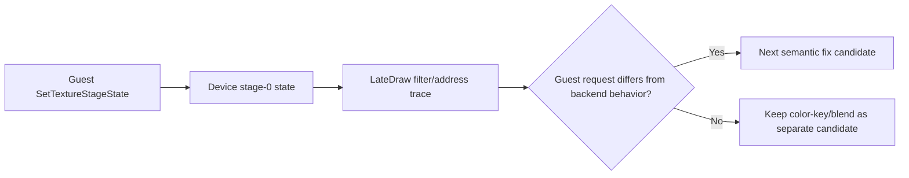

# 20260905-193 텍스처 필터·주소 모드 진단 설계

## 1. 상태와 목적

**진단 전 설계.** 사용자 확인 `ez2dj4th` Music Select 실행에서 alpha stage와 중앙 artwork의 `ONE/ONE` blend는 현재 backend 의미와 일치했다. 다음 후보인 컬러키 텍스처의 선형 필터 경계와 주소 모드 차이를 구분하기 위해, 원본 Direct3D가 draw 시점에 요청한 stage 상태와 현재 OpenGL 변환이 사용하는 상태를 비교할 수 있는 기록을 추가한다.

**Design before diagnostics.** In the user-confirmed `ez2dj4th` Music Select run, the alpha stage and the center artwork's `ONE/ONE` blend matched the current backend semantics. To distinguish the next candidates—linear filtering at color-key boundaries and texture-addressing differences—record the stage state requested by the original Direct3D call at draw time so it can be compared with the OpenGL translation.

## 2. 관찰 범위

- stage 0의 `MINFILTER`, `MAGFILTER`, `ADDRESSU`, `ADDRESSV`를 `LateDraw` 기록에 추가한다.
- 기존 alpha stage, blend, color-key, texture content summary와 같은 draw record에 기록한다.
- 이번 단계에서는 OpenGL sampler 상태, shader color-key discard, blend mapping을 변경하지 않는다.
- 원본 픽셀과 자산은 기록하지 않고 기존 집계값만 유지한다.

## 3. 판정 기준

- 중앙 artwork 또는 선택 링에서 `colorkey=1`과 `MINFILTER/MAGFILTER=LINEAR`가 함께 관찰되면 컬러키 경계 보간을 별도 A/B 대상으로 유지한다.
- `ADDRESSU/V`가 `WRAP`인데 backend가 계속 `CLAMP_TO_EDGE`를 사용하면 sampler 주소 모드 누락을 수정 후보로 올린다.
- draw 요청이 `ONE/ONE`이고 backend 변환도 `GL_ONE/GL_ONE`이면 blend factor 자체는 원인으로 확정하지 않는다.
- raw stage 값만으로 원본 드라이버의 컬러키 필터 순서를 확정하지 않는다. 그 순서는 별도 화면 A/B 또는 원본 관찰이 필요하다.

## 4. 검증

1. Windows x86 Debug 빌드와 단위 테스트를 실행한다.
2. 사용자가 코인 투입 후 동일한 `ez2dj4th` Music Select에 진입한다.
3. 중앙 artwork와 선택 링이 보이는 마지막 frame의 `LateDraw`를 확인한다.
4. 필터·주소 모드와 `key/colorkey`, `srcblend/dstblend`를 함께 비교한다.
5. 새 사실을 `docs/analysis/`와 작업 로그에 반영한다.

## 5. 미확정 사항

- 현재 원본 실행이 실제로 `ADDRESSU/V`를 설정하는지 여부.
- Direct3D 3 컬러키 텍스처에서 선형 필터링과 key discard가 적용되는 정확한 순서.
- OpenGL default framebuffer의 색상 정밀도가 원본 RGB565 backbuffer와 시각 차이를 만드는 정도.

---

# 20260905-193 Texture-Filter and Address-Mode Diagnostics Design

## 1. Status and purpose

**Diagnostics design before implementation.** In the user-confirmed `ez2dj4th` Music Select run, the alpha stage and the center artwork's `ONE/ONE` blend matched the current backend semantics. To distinguish the next candidates—linear filtering at color-key boundaries and texture-addressing differences—record the stage state requested by the original Direct3D call at draw time so it can be compared with the OpenGL translation.

**Design before diagnostics.** This phase adds observability only. It does not change shader behavior, sampler state, color-key discard, or blend-factor mapping.

## 2. Observation scope

- Add stage-0 `MINFILTER`, `MAGFILTER`, `ADDRESSU`, and `ADDRESSV` to the `LateDraw` record.
- Record them beside the existing alpha-stage, blend, color-key, and texture-content summary.
- Do not change OpenGL sampler state, shader color-key discard, or blend mapping in this phase.
- Do not record original pixels or assets; retain only the existing aggregate metrics.

## 3. Decision criteria

- If the center artwork or selection ring uses `colorkey=1` with linear minification/magnification, retain color-key boundary interpolation as a separate A/B target.
- If the guest requests `WRAP` while the backend continues using `CLAMP_TO_EDGE`, treat missing sampler addressing as an implementation candidate.
- If the draw requests `ONE/ONE` and the backend translates it to `GL_ONE/GL_ONE`, do not classify the blend factors themselves as the cause.
- Do not infer the original driver's color-key filtering order from raw stage state alone; that requires a separate A/B observation.

## 4. Verification

1. Run the Windows x86 Debug build and unit tests.
2. Have the user insert a coin and enter the same `ez2dj4th` Music Select screen.
3. Inspect `LateDraw` entries from the last frame where the center artwork and selection ring are visible.
4. Compare filter/address state with `key/colorkey` and `srcblend/dstblend`.
5. Record new facts in `docs/analysis/` and the work log.

## 5. Unresolved

- Whether the current original run actually sets `ADDRESSU/V`.
- The exact order of linear filtering and key discard for Direct3D 3 color-keyed textures.
- How much the OpenGL default framebuffer's color precision differs visually from the original RGB565 backbuffer.
