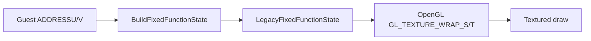

# 20260905-194 텍스처 주소 모드 전달 설계

## 1. 상태와 목적

**구현 전 설계.** 사용자 확인 `ez2dj4th` Music Select 로그에서 중앙 artwork와 선택 링이 `addressu=1`, `addressv=1`을 사용했다. 이는 `D3DTADDRESS_WRAP` 요청이며, 현재 OpenGL backend의 `GL_CLAMP_TO_EDGE` 고정과 실제 의미가 다르다. 이 설계는 게스트 stage-0 주소 모드를 공용 draw state를 거쳐 OpenGL sampler에 전달한다.

**Design before implementation.** In the user-confirmed `ez2dj4th` Music Select log, the center artwork and selection ring used `addressu=1` and `addressv=1`. These are `D3DTADDRESS_WRAP` requests and differ semantically from the current OpenGL backend's fixed `GL_CLAMP_TO_EDGE`. This design forwards guest stage-0 address modes through the common draw state to the OpenGL sampler.

Direct3D documents `D3DTADDRESS_WRAP` as the default texture address mode and assigns it value 1. See [Microsoft Learn: D3DTEXTUREADDRESS](https://learn.microsoft.com/en-us/windows/win32/direct3d9/d3dtextureaddress).

## 2. 설계

- 공용 `LegacyFixedFunctionState`에 U/V 주소 모드를 추가한다.
- Direct3D facade에서 `WRAP`, `MIRROR`, `CLAMP`를 공용 enum으로 변환한다.
- OpenGL backend는 각 textured draw 전에 `GL_TEXTURE_WRAP_S/T`를 현재 state로 설정한다.
- `BORDER`와 `MIRRORONCE`처럼 현재 공용 backend가 정확히 표현할 수 없는 값은 조용히 clamp하지 않고 draw를 실패시킨다.
- 컬러키 discard, 필터, blend, shader 계산은 변경하지 않는다.

## 3. 판정 기준

- `addressu/addressv=1`인 Music Select draw가 `GL_REPEAT`로 실행되어야 한다.
- `CLAMP`와 `MIRROR`는 각각 `GL_CLAMP_TO_EDGE`와 `GL_MIRRORED_REPEAT`로 전달되어야 한다.
- 기존 `minfilter=2`, `magfilter=2`, `colorkey=1`, `ONE/ONE` 상태는 유지되어야 한다.
- 주소 모드 전달만으로 밝기 차이가 사라지는지는 사용자 화면 비교로 별도 판정한다.

## 4. 검증

1. Windows x86 Debug 빌드와 단위 테스트를 실행한다.
2. 새 backend로 동일한 Music Select 화면에 진입한다.
3. 중앙 artwork와 선택 링의 draw 상태 및 화면을 기존 실행과 비교한다.
4. 다른 주소 모드 입력이 들어오면 변환 결과와 unsupported 오류를 확인한다.

## 5. 미확정 사항

- 주소 모드 차이가 중앙 artwork 전체의 밝기 차이에 미치는 실제 영향.
- Direct3D 컬러키 텍스처의 선형 필터 경계가 주소 모드 전달 후 원본과 일치하는지 여부.
- `BORDER`와 `MIRRORONCE`를 향후 멀티플랫폼 backend에서 표현할 정책.

---

# 20260905-194 Texture-Address Forwarding Design

## 1. Status and purpose

**Design before implementation.** In the user-confirmed `ez2dj4th` Music Select log, the center artwork and selection ring used `addressu=1` and `addressv=1`. These are `D3DTADDRESS_WRAP` requests and differ semantically from the current OpenGL backend's fixed `GL_CLAMP_TO_EDGE`. This design forwards guest stage-0 address modes through the common draw state to the OpenGL sampler.

Direct3D documents `D3DTADDRESS_WRAP` as the default texture address mode and assigns it value 1. See [Microsoft Learn: D3DTEXTUREADDRESS](https://learn.microsoft.com/en-us/windows/win32/direct3d9/d3dtextureaddress).

## 2. Design

- Add U/V address modes to `LegacyFixedFunctionState`.
- Convert `WRAP`, `MIRROR`, and `CLAMP` in the Direct3D facade to the common enum.
- Set `GL_TEXTURE_WRAP_S/T` from the current state before each textured draw in the OpenGL backend.
- Do not silently clamp values such as `BORDER` and `MIRRORONCE` that the current common backend cannot represent exactly; fail the draw instead.
- Do not change color-key discard, filtering, blending, or shader calculations.

## 3. Decision criteria

- Music Select draws with `addressu/addressv=1` must execute with `GL_REPEAT`.
- `CLAMP` and `MIRROR` must map to `GL_CLAMP_TO_EDGE` and `GL_MIRRORED_REPEAT` respectively.
- Existing `minfilter=2`, `magfilter=2`, `colorkey=1`, and `ONE/ONE` state must remain unchanged.
- Whether forwarding addressing removes the brightness mismatch is a separate user-visible comparison.

## 4. Verification

1. Run the Windows x86 Debug build and unit tests.
2. Enter the same Music Select screen with the new backend.
3. Compare draw state and screen output for the center artwork and selection ring with the previous run.
4. If other address modes occur, verify their conversion and unsupported-error behavior.

## 5. Unresolved

- The actual effect of address-mode differences on the center artwork's overall brightness.
- Whether linear filtering at color-key boundaries matches the original after address forwarding.
- A future cross-platform policy for `BORDER` and `MIRRORONCE`.
