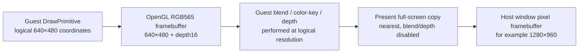

# RGB565 논리 렌더 대상 설계

# RGB565 Logical Render Target Design

## 배경 / Background

**확인됨:** 사용자가 직접 Music Select에 진입한 `20260905-112440-703` 실행에서 중앙 artwork와 선택 링은 `D3DFVF_TLVERTEX`, RGB565 texture, 선형 필터, source color key, additive blend를 사용한다. 같은 실행의 초기 Direct3D 상태에는 `D3DRENDERSTATE_DITHERENABLE=1`이 있다.

**확인됨:** EZ2DJ 4th가 요청한 primary/back render surface의 논리 크기는 640×480이고 색상 형식은 RGB565이다. 현재 SDL3/OpenGL backend는 이 논리 좌표를 사용하지만 native window의 실제 pixel viewport에 직접 draw한다. 따라서 host client가 1280×960이면 texture filtering과 blend는 1280×960 RGBA default framebuffer에서 수행된다.

**추정:** 원본과 다른 host-resolution filtering 및 RGB565 write quantization이 source-color-keyed additive layers의 밝기·경계 결과에 영향을 줄 수 있다. 이 설계는 그 가설을 검증하는 호환성 변경이며, 아직 단독 원인으로 확정하지 않는다.

* **Confirmed:** In the user-driven `20260905-112440-703` Music Select run, the center artwork and selection ring use `D3DFVF_TLVERTEX`, RGB565 textures, linear filtering, a source color key, and additive blending. The initial Direct3D state in that run includes `D3DRENDERSTATE_DITHERENABLE=1`.
* **Confirmed:** EZ2DJ 4th requests a 640×480 RGB565 primary/back render surface. The current SDL3/OpenGL backend uses those logical coordinates but draws directly into the native window's pixel viewport. A 1280×960 host client therefore performs texture filtering and blending in a 1280×960 RGBA default framebuffer.
* **Inferred:** Host-resolution filtering and the absence of RGB565 write quantization can affect the brightness and edges of source-color-keyed additive layers. This design is a compatibility experiment, not a claim that it is the sole cause.

## 목표와 비목표 / Goals And Non-Goals

- 모든 guest draw와 clear는 논리 640×480 RGB565 color attachment 및 16-bit depth attachment에 기록합니다.
- `Present`만 RGB565 결과를 host window pixel viewport로 확대합니다.
- presentation은 nearest sampling을 사용하고 blend/depth를 끈 full-screen copy여야 합니다. 따라서 host client 크기가 texture sampling 또는 guest blend 누적에 개입하지 않습니다.
- guest surface의 CPU RGB565 backing, Direct3D fixed-function state, draw 호출 순서는 바꾸지 않습니다.
- 관찰되지 않은 gamma-correct blend, fog, multisample, arbitrary color format은 이 작업 범위가 아닙니다.

* All guest draws and clears write to a logical 640×480 RGB565 color attachment with a 16-bit depth attachment.
* Only `Present` scales that RGB565 result into the host-window pixel viewport.
* Presentation uses nearest sampling and a blend/depth-disabled full-screen copy, so host-client dimensions cannot alter guest texture filtering or blend accumulation.
* Guest CPU RGB565 backing, Direct3D fixed-function state, and draw order remain unchanged.
* Gamma-correct blending, fog, multisampling, and arbitrary unobserved color formats are outside this task.

## 렌더 흐름 / Render Flow

## 구현 계약 / Implementation Contract

1. backend initialization must create a texture-backed framebuffer with an RGB565 color attachment and a 16-bit depth renderbuffer, both at the configured logical size.
2. Frame start binds that framebuffer, sets the logical viewport, and clears color/depth there.
3. `Draw` never uses the host pixel dimensions to set the guest-render viewport. Window resize affects only `Present`.
4. `Present` binds the default framebuffer, sets its current pixel viewport, disables blend/depth writes and tests, and copies the logical target with nearest sampling. Its presentation quad reverses V so the OpenGL framebuffer texture's lower-left origin preserves the guest screen's top-left orientation.
5. The framebuffer must be complete. Missing framebuffer support or an incomplete attachment is an explicit initialization error; no silent fallback to direct host-resolution rendering is allowed.
6. Destruction releases the target texture, depth renderbuffer, and framebuffer while its SDL/OpenGL context is current.

## 검증 / Verification

1. Build the Win32 SDL3 target and run unit tests and CTest.
2. Enter Music Select through the user’s I/O configuration and compare the center artwork/ring with the previous output at the same host window size.
3. Confirm a resize changes only presentation scale, not the logical Draw viewport or guest texture sampling.
4. If the visual discrepancy remains, record this change as eliminating host-resolution rasterization and RGB565 render-target precision as primary causes; do not infer a different Direct3D state without a trace.

*This design deliberately distinguishes confirmed runtime facts from the RGB565-target hypothesis. No original game assets are stored or copied by this work.*
