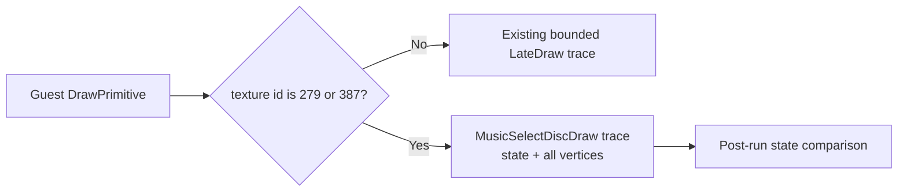

# Music Select 원판 상태 추적 설계

# Music Select Disc-State Trace Design

## 배경 / Background

**확인됨:** 사용자가 직접 Music Select에 진입한 최신 실행 `20260905-130129-865`에서 중앙 artwork는 `texture=387`, 선택 ring은 `texture=279`로 기록됩니다. 두 draw는 RGB565 texture, 선형 필터, source color key, `ONE/ONE` additive blend를 사용합니다.

**확인됨:** 원판 핵심 draw의 raw state에는 `D3DCULL_CCW(3)`이 기록됩니다. 현재 cull-state 미구현은 실제 Direct3D/OpenGL 상태 차이이며, 구현 후 동일 화면으로 비교할 수 있습니다.

일반 `LateDraw` trace는 frame 및 개수 상한 때문에 최신 실행의 실제 원판 draw가 상세 기록되기 전에 소진됩니다. backend가 아직 명시적으로 검증하지 않는 texture-coordinate transform과 정점별 diffuse modulation을 확인하려면, 확인된 두 texture identity에 한정한 별도 기록이 필요합니다.

* **Confirmed:** In the latest user-driven Music Select run `20260905-130129-865`, center artwork is `texture=387` and the selection ring is `texture=279`. Both use RGB565 textures, linear filtering, a source color key, and `ONE/ONE` additive blending.
* **Confirmed:** The raw state of the core disc draws records `D3DCULL_CCW(3)`. Missing cull-state support is an actual Direct3D/OpenGL state difference and can be compared after implementation.
* The ordinary `LateDraw` trace is exhausted before the live disc draws. A focused record is needed to verify per-vertex diffuse modulation and currently unvalidated texture-coordinate transform state.

## 목표 / Goals

- texture identity 279와 387의 draw만 별도 bounded trace로 남깁니다.
- 각 기록에 정점 위치, UV, ARGB, stage-0 `TEXCOORDINDEX`/`TEXTURETRANSFORMFLAGS`, texture-0 matrix, cull mode와 blend 상태를 포함합니다.
- trace의 대상 선정과 기록만 추가하며, fixed-function 변환 또는 OpenGL 렌더링 동작은 바꾸지 않습니다.

* Record only texture identities 279 and 387 in a separate bounded trace.
* Include vertex positions, UVs, ARGB values, stage-0 `TEXCOORDINDEX`/`TEXTURETRANSFORMFLAGS`, texture-0 matrix, cull mode, and blend state.
* Change only trace selection and recording; do not alter fixed-function conversion or OpenGL rendering.

## 기록 흐름 / Trace Flow

## 검증 / Verification

1. Win32 build, unit tests, CTest를 실행합니다.
2. 사용자가 Music Select에 진입하고 2초 이상 원판이 보이게 한 뒤 종료합니다.
3. 새 DDraw log에 `MusicSelectDiscDraw`가 있는지 확인하고, texture transform과 정점 diffuse가 기본 경로인지 판정합니다.

*This diagnostic stores only derived state in logs and does not store game assets.*
