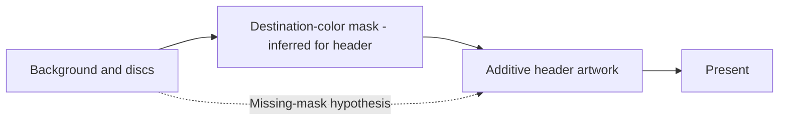

# 목적지 색상 블렌드와 누락된 마스크 draw
# Destination-Color Blending and Missing Mask Draws

## 근거 / Evidence

사용자가 culling 적용 후에도 상단 `select a music` 배경을 디스크와 광선이 투과한다고 확인했습니다. 실행 `20260905-174233-086`의 frame 1000은 배경 → 디스크 → 헤더(`texture=281`, ONE/ONE) 순서입니다. 헤더에 해당하는 목적지 곱셈 pass는 성공 draw 기록에 없고, 하단과 우측 패널에는 ZERO/SRCCOLOR 마스크와 ONE/ONE 그림 쌍이 있습니다. 같은 실행 초기에 SRCBLEND=9, DESTBLEND=6 요청이 `unsupported Direct3D3 alpha blend factor`로 거절됩니다. 실패 진단 64건을 texture 73/76이 소모하므로 이후 실패는 관측할 수 없습니다.

*The user confirms that discs and rays still show through the header after culling. Frame 1000 of run `20260905-174233-086` orders background, discs, then the ONE/ONE header (`texture=281`). Its destination-multiplication pass is absent from successful draw records, while bottom/right panels have ZERO/SRCCOLOR mask and ONE/ONE artwork pairs. Earlier SRCBLEND=9, DESTBLEND=6 requests are rejected as unsupported. Textures 73/76 exhaust all 64 failure diagnostics, hiding later failures.*

## 설계 / Design

1. 먼저 표면별 첫 실패를 공용 반복 실패 budget과 별도로 기록하고 draw 진단에 frame을 추가합니다. 변경 전 Music Select를 실행하여 빠진 헤더/디스크 마스크의 실제 blend 요청을 확인합니다.
2. 공용 `BlendFactor`와 D3D 변환, OpenGL 변환에 `DESTCOLOR`/`INVDESTCOLOR`를 전달합니다. `DESTCOLOR`는 화면에 이미 그려진 색을 source factor로 사용하며 `GL_DST_COLOR`에 대응합니다. source alpha가 1일 때 DESTCOLOR/INVSRCALPHA의 RGB 결과는 `source * destination`입니다.
3. 같은 입력 경로로 수정본을 실행하여 새로 성공한 마스크의 좌표, 순서, 상태와 헤더 가림 및 디스크 밝기를 비교합니다. 원본 게임의 draw 순서와 정점은 그대로 사용합니다.

*First record each surface's first failure independently of the repeated-failure budget and add frame attribution. Run Music Select before the blend fix to establish the missing mask requests. Then forward DESTCOLOR/INVDESTCOLOR through the shared enum, Direct3D conversion, and OpenGL mapping. DESTCOLOR maps to GL_DST_COLOR; with source alpha one, DESTCOLOR/INVSRCALPHA produces source times destination RGB. Repeat the same input path to verify newly successful mask coordinates, ordering, and visible occlusion using the original game's draws and vertices.*

## 검증 / Verification

Win32 build와 unit/CTest를 실행합니다. 실제 Music Select 진입은 화면으로 확인하며 성공 draw만으로 장면 진입을 주장하지 않습니다. 자동 UI 입력이 불가능하면 그 제한과 다음 사용자 비교 기준을 작업 로그에 남깁니다. mask가 다시 그려져도 원본 기기와 pixel 단위 일치는 별도 검증입니다.

*Run the Win32 build and unit/CTest checks. Confirm Music Select entry visually, not solely from successful draw records. If UI automation is unavailable, record the limitation and user comparison criteria. Restoring masks does not by itself establish pixel equality with original hardware.*

자동 UI 도구 연결 실패에 대비하여 원본 자산 없이 실제 SDL/OpenGL backend에서 배경 → 디스크 대용 사각형 → DESTCOLOR 마스크 → 가산 헤더를 그리는 회귀 probe를 추가합니다. `DecodeLegacyBlendFactor`를 facade와 probe가 공유하여 raw D3D factor부터 검증하고, RGB565 framebuffer를 readback하여 가림/유지 영역과 부분 알파를 검사합니다. GPU가 없는 CI의 기본 unit/CTest에는 등록하지 않습니다.

*Add an asset-free regression probe that draws background, synthetic disc geometry, a DESTCOLOR mask, and additive header through the real SDL/OpenGL backend. The facade and probe share `DecodeLegacyBlendFactor` to verify raw D3D factors; RGB565 readback checks occluded/preserved regions and partial alpha. Do not register this GPU-dependent probe in default unit/CTest runs.*

## 참고 / References

[Microsoft D3DBLEND](https://learn.microsoft.com/en-us/windows/win32/direct3d9/d3dblend)
