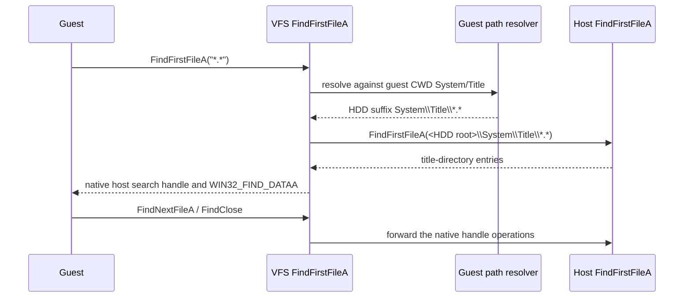

# 20260906-199 디렉터리 기반 VFS 열거 회귀 설계
# 20260906-199 Directory-Backed VFS Enumeration Regression Design

## 1. 배경 및 목적 (Background & Objectives)

`ez2dj1stse`가 실행 후 코인 입력 직후 종료되는 최신 실행에서, 그래픽 호출 실패보다 파일 열거 경로가 먼저 의심된다. `System\Title`로 게스트 현재 디렉터리를 성공적으로 바꾼 직후 `FindFirstFileA("*.*")`가 호출되지만, 현재 디렉터리 기반 HDD 경로에서는 이 요청이 호스트의 실제 작업 디렉터리인 `ez2dj`에 그대로 전달된다. 그 결과 게스트가 `System\Title`의 항목을 받아야 하는 지점에서 HDD 루트의 항목을 받고, 이어서 `SetCurrentDirectoryA("logs")`가 `System\Title\logs`를 찾다가 실패한다.

In the latest `ez2dj1stse` run, the first strong regression candidate after coin insertion is file enumeration rather than a graphics-call failure. The guest successfully changes its logical current directory to `System\Title`, then calls `FindFirstFileA("*.*")`. For a directory-backed HDD, the current implementation passes that request unchanged to the host, whose real working directory is `ez2dj`. The guest therefore receives entries from the HDD root instead of `System\Title`, and then attempts `SetCurrentDirectoryA("logs")`, which correctly fails for `System\Title\logs`.

## 2. 확인된 사실 (Confirmed Facts)

- 최신 로그 `logs/windows_x86_launcher_probe/ez2dj1stse/20260906-000419-856.vfs.log`에는 다음 순서가 있다.
  `SetCurrentDirectoryA("System\\Title")` 성공 → `find-first-fallback:name=*.*:success=1` → `SetCurrentDirectoryA("logs")` 실패.
- 런타임은 호스트 프로세스의 작업 디렉터리를 바꾸지 않고 `g_guest_directory_components`로 게스트 CWD를 추적한다.
- `Re2djVfsFindFirstFileA`의 현재 디렉터리 기반 경로는 CHD 열거가 실패한 뒤 원래 `name`을 Win32 `FindFirstFileA`에 넘긴다.
- 실제 HDD에는 `System\Title` 아래 제목 화면 자산과 루트의 별도 항목이 모두 존재하므로, 잘못된 루트 열거가 관측된 `logs` 전환 시도와 일치한다.
- 최신 DDraw 로그에는 해당 종료 직전까지 모든 `DrawPrimitive` 결과가 성공이며, `0x80004005`나 unsupported blend 기록이 없다. 이 작업에서는 그래픽 합성 동작을 변경하지 않는다.

The latest VFS trace confirms the sequence `SetCurrentDirectoryA("System\\Title")` success, `find-first-fallback:name=*.*:success=1`, and `SetCurrentDirectoryA("logs")` failure. The runtime intentionally keeps the host process working directory unchanged and tracks the guest CWD in `g_guest_directory_components`. The directory-backed branch of `Re2djVfsFindFirstFileA` currently falls through to the host API with the original search string after the CHD path is not used. The HDD contains both title-screen assets under `System\Title` and unrelated root entries, which matches the wrong-root enumeration. The latest DDraw trace contains successful `DrawPrimitive` results up to the stop and no unsupported blend or failure record, so this design does not change graphics composition.

## 3. 설계 (Design)

### 3.1 디렉터리 기반 HDD (Directory-backed HDD)

`FindFirstFileA`의 검색 패턴도 일반 파일 이름과 같은 게스트 경로 해석기를 사용한다. `ResolveGuestNativeSuffix`가 게스트 CWD와 경로 정규화를 적용한 뒤, `MapVfsPath(name, false, ...)`로 HDD 루트 아래의 호스트 검색 패턴을 만든다. 이 경로에는 wildcard가 포함될 수 있으므로 파일 존재 여부가 아니라 Win32 `FindFirstFileA`에 전달할 검색 패턴으로 사용한다.

The search pattern uses the same guest path resolver as ordinary file names. `ResolveGuestNativeSuffix` applies the guest CWD and path normalization, and `MapVfsPath(name, false, ...)` builds a host search pattern beneath the configured HDD root. The result may contain wildcards and is passed to Win32 `FindFirstFileA` as a search pattern rather than being checked as a regular file.

`FindNextFileA`와 `FindClose`는 기존처럼 native host handle을 전달한다. 이렇게 하면 directory-backed 검색은 Windows의 항목 순서, attribute, wildcard 동작을 보존하고 별도의 합성 handle 표를 추가하지 않는다.

`FindNextFileA` and `FindClose` continue to forward native host handles as they do today. This preserves Windows enumeration ordering, attributes, and wildcard behavior for directory-backed searches without adding a second synthetic handle table.

### 3.2 CHD와 실패 처리 (CHD and failure handling)

CHD가 설정된 경우 기존 FAT32 합성 열거 경로를 우선 유지한다. CHD 경로에 일치 항목이 없을 때의 호스트 fallback은 기존 동작을 보존하되, 이번 수정의 대상인 directory-backed HDD에는 적용하지 않는다. directory-backed 검색에서 매핑이 실패하면 기존 이름으로 호스트를 검색하지 않고 Win32 검색 결과와 오류를 그대로 반환한다.

When a CHD is configured, the existing synthetic FAT32 enumeration remains first. The existing host fallback after an empty CHD match is preserved for compatibility, but it is not used for the directory-backed HDD path addressed here. If directory-backed mapping fails, the wrapper does not search the host using the original guest string; it returns the mapped Win32 search result and its error.

### 3.3 Overlay 경계 (Overlay boundary)

이번 수정은 현재 읽기 파일 매핑과 동일하게 원본 HDD 검색 패턴을 사용한다. directory enumeration의 overlay와 원본 항목 병합은 현재 구현 범위를 넘으며, 이번 종료 회귀와 분리된 후속 과제로 남긴다. overlay 파일이 있는 경우에도 검색 결과 전체를 합성하지 않으며, 원본 디렉터리 구조와 게스트 CWD 의미를 먼저 복원한다.

This change uses the original HDD search pattern consistently with the current read-file mapping. Merging overlay and original directory entries remains outside this fix and is a separate follow-up. The fix restores guest-CWD semantics and the original directory tree without introducing synthetic merged enumeration.

## 4. 검증 계획 (Verification Plan)

1. Windows VFS runtime probe에 `System\Title` CWD에서 `*.*`를 검색하는 회귀 검사를 추가한다. 결과가 루트 항목이 아니라 title 디렉터리의 파일인지 확인하고 native handle을 `FindClose`로 닫는다.
2. Debug Win32 빌드와 기존 unit/CTest를 실행한다.
3. 최신과 같은 `ez2dj1stse` 명령으로 사용자가 코인을 입력한 뒤 종료 여부를 재확인한다.
4. 새 `.vfs.log`에서 `find-first-fallback:name=*.*` 대신 매핑된 `System\Title\*.*` 검색 기록이 남고, 잘못된 `SetCurrentDirectoryA("logs")` 실패가 사라지는지 확인한다.

The Windows VFS runtime probe will add a regression check that enumerates `*.*` from `System\Title`, verifies a title-directory entry rather than a root entry, and closes the native handle. Then run the Debug Win32 build and existing unit/CTest checks. The user should rerun the same `ez2dj1stse` command and insert a coin. The new VFS trace should show a mapped `System\Title\*.*` search instead of `find-first-fallback:name=*.*`, and the erroneous `SetCurrentDirectoryA("logs")` failure should disappear.

## 5. 비목표 및 미확정 사항 (Non-goals and Unresolved Items)

- 코인 입력, LPTDI 응답, 보호 루틴의 종료 조건을 이번 변경으로 추정하거나 수정하지 않는다.
- Direct3D Z, culling, blending 상태는 변경하지 않는다.
- 원본 HDD와 실행 파일은 수정하지 않는다.
- 이 수정 후에도 종료되면 다음 단계에서 새 VFS 종료 경계와 입력/장치 trace를 별도로 확인한다.

This change does not infer or modify coin input, LPTDI responses, or the protection routine's exit condition. It does not change Direct3D Z, culling, or blending state, and it never modifies the original HDD or executable. If the process still exits after this fix, the next step is a separate trace of the new VFS termination boundary and input/device behavior.
