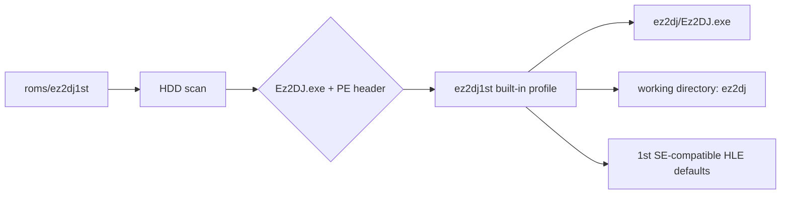

# ez2dj1st 타깃 프로파일 설계

## 목표

사용자가 제공한 `roms/ez2dj1st` 디렉터리를 `ez2dj1st` 프로파일 단축 경로로 실행할 수 있도록 한다. 실행 환경과 HLE 정책은 이미 동작이 확인된 `ez2dj1stse`를 기본으로 재사용하되, 사용자가 지정한 대표 실행 파일 경로를 반영한다.

## 확인된 대표 실행 파일

스캔 결과 `roms/ez2dj1st/ez2dj/Ez2DJ.exe`가 확인되었다. `re2dj_pe_analyzer`는 이를 32비트 x86 PE32, image base `0x00400000`, entry point RVA `0x0199b240`, `SizeOfImage 0x019b6000`, 보호 섹션 진입점으로 보고했다.

대표 실행 파일 외의 HDD 항목은 이 프로파일의 식별 근거로 사용하지 않는다. `System.ini`는 확인되지 않았으므로 게스트 드라이브와 게스트 경로도 확정하지 않는다. 호스트 VFS source root는 실행 파일의 실제 상위 디렉터리인 `ez2dj`로 설정한다.

## 프로파일 정책

| 항목 | 값 | 상태/근거 |
| --- | --- | --- |
| profile id | `ez2dj1st` | 사용자 요청 |
| 기본 HDD 경로 | `roms/ez2dj1st` | 사용자가 제공한 디렉터리 |
| 대표 실행 파일 | `ez2dj/Ez2DJ.exe` | 사용자가 지정한 대표 실행 파일 |
| fingerprint | `Ez2DJ.exe` + PE header | 대표 실행 파일의 이름, entry point RVA, SizeOfImage만 사용 |
| HLE 정책 | `ez2dj1stse`와 동일 | 사용자 요청 및 동일 계열 실행 경로 |
| VFS working directory | 실행 파일 상위 디렉터리 `ez2dj` | 실제 매칭 경로에서 자동 설정 |
| guest drive/directory | 미설정 | `System.ini` 부재 |

대표 실행 파일 선택은 사용자가 준비한 `Ez2DJ.exe`를 기본 선택하는 호스트 정책이다. 프로파일 식별은 이 실행 파일의 이름과 자체 PE header 값만 사용하며, 다른 HDD 항목을 근거로 삼지 않는다. PE header 조건은 대소문자 무시 파일명 비교에서 기존 `ez2dj.exe` 프로파일과 충돌하는 것을 막기 위한 것이다.

## 구현 방향

기존 target-profile 테이블에 directory-backed built-in entry를 추가한다. `MatchBuiltInTargetProfiles`가 실행 파일의 부모 디렉터리를 working directory로 채우므로 `ez2dj` 하위 디렉터리와 부모 경로 지정 모두 지원한다.

`ez2dj1stse`의 raw I/O RVA와 target-state를 포함한 실행 기본값은 요청대로 복제한다. 이 주소와 응답값이 새 바이너리에서도 원본과 동일하다는 것은 별도 실행으로 확인하지 않았으므로, 호환성 가정으로 기록한다.

## 검증 전략

1. target-profile unit test에 `ez2dj` 하위 루트와 `Ez2DJ.exe`를 포함한 synthetic layout을 추가한다.
2. 새 built-in profile이 `ez2dj1st`로 매칭되고 대표 경로가 `ez2dj/Ez2DJ.exe`인지 확인한다.
3. `ez2dj1stse`가 기존처럼 매칭되는지 확인한다.
4. Windows Debug build와 unit/CTest를 실행한다.
5. 실제 자산에서는 `re2dj.exe ez2dj1st --list-targets`로 shortcut, 선택 파일, working directory를 확인한다. 실제 실행과 coin/gameplay 검증은 별도 단계로 남긴다.

## Design: ez2dj1st Target Profile

### Goal

Make the user-provided `roms/ez2dj1st` directory available through an `ez2dj1st` profile shortcut. Reuse the execution and HLE policy already verified for `ez2dj1stse`, while reflecting the user-designated representative executable's nested path.

### Confirmed representative executable

The scan found `roms/ez2dj1st/ez2dj/Ez2DJ.exe`. `re2dj_pe_analyzer` reports a 32-bit x86 PE32 image with image base `0x00400000`, entry point RVA `0x0199b240`, `SizeOfImage 0x019b6000`, and an entry point in a protection section.

No other HDD entry is used as profile-identification evidence. No `System.ini` was found, so the guest drive and guest path remain unresolved. The host VFS source root is derived from the executable's parent directory, `ez2dj`.

### Policy

The profile id is `ez2dj1st`, its default repository-relative HDD path is `roms/ez2dj1st`, and its representative executable is the user-prepared `ez2dj/Ez2DJ.exe`. Its fingerprint uses only that executable's name and PE header values: `Ez2DJ.exe`, entry point RVA `0x0199b240`, and `SizeOfImage 0x019b6000`. The header constraints avoid a case-insensitive collision with the existing `ez2dj.exe` profile without consulting another HDD entry. Its run defaults copy `ez2dj1stse`, including the legacy-I/O RVA and target-state policy. Those values are recorded as a compatibility assumption until this binary is run independently.

### Verification

Add a nested synthetic layout test, run the Windows Debug build and unit/CTest checks, and inspect `re2dj.exe ez2dj1st --list-targets` against the real user-provided directory. Product execution and coin/gameplay validation remain separate follow-up work.
