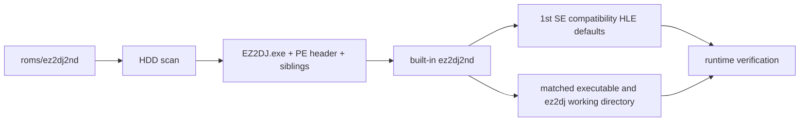

# ez2dj2nd 타깃 프로파일 설계

## 목표

사용자가 제공한 `roms/ez2dj2nd` 디렉터리를 EZ2DJ 2nd Trax의 내장 타깃 프로파일로 식별한다. 실행 파일과 원본 자산은 저장소에 복사하거나 수정하지 않고, 기존 디렉터리 기반 프로파일 경로와 동일한 HLE 실행 경계를 사용한다.

## 확인된 입력

다음 내용은 사용자 제공 HDD 디렉터리에서 읽기 전용으로 확인했다.

| 항목 | 확인된 값 |
| --- | --- |
| 대표 실행 파일 | `ez2dj/EZ2DJ.exe` |
| PE 형식 | PE32, i386, Windows GUI |
| ImageBase | `0x00400000` |
| EntryPoint RVA | `0x00079550` |
| SizeOfImage | `0x0047d000` |
| 섹션 수 | 5개, EntryPoint는 `.text` |
| 같은 디렉터리 항목 | `EZ2DJ.ini`, `bg`, `sound`, `system` |
| `System.ini` | 확인되지 않음 |

`System.ini`가 확인되지 않았으므로 게스트 드라이브 문자와 부트 디렉터리는 이 작업에서 확정하지 않는다. 또한 2nd 실행 파일의 Hardlock 요청 형식과 legacy I/O 주소는 독립적으로 추출하지 않았으므로 1st SE 값을 사실로 기록하지 않는다.

## 프로파일 정책

`ez2dj2nd`는 사용자의 요청에 따라 1st SE의 HLE·실행 기본값을 호환성 기준으로 복제한다. 다만 2nd의 원본 실행 계약으로 확인되지 않은 값은 프로파일 식별 근거가 아니라 임시 호환성 가정으로 문서에 표시한다.

| 속성 | 정책 |
| --- | --- |
| 프로파일 ID | `ez2dj2nd` |
| 표시 이름 | `EZ2DJ 2nd Trax` |
| 기본 HDD 경로 | `roms/ez2dj2nd` |
| HLE 프로파일 | `ez2dj2nd` |
| HLE 기본값 | `ez2dj1stse`와 동일한 command-line, Windows directory, VFS, D3D3, DirectSound 설정 |
| LPTDI 기본값 | 1st SE와 동일한 legacy I/O 및 `\\.\LPTDI` mock 설정을 호환성 기준으로 사용 |
| 게스트 경로 | 미확정. `guest_drive_letter`와 `guest_directory`는 비워 둠 |
| 식별 fingerprint | 실행 파일 이름, PE EntryPoint RVA, SizeOfImage, 4개 sibling 항목 |

프로파일은 실행 파일의 실제 상대 경로를 매칭 결과로 채우고, 실행 작업 디렉터리도 그 실행 파일이 포함된 `ez2dj` 디렉터리로 계산한다.

## 구현 범위

1. `src/target/target_profile.cpp`에 디렉터리 기반 내장 프로파일을 추가한다.
2. `tests/unit/target_profile_test.cpp`에 실제 2nd 대표 실행 파일의 식별값과 sibling 구성을 반영한 합성 테스트를 추가한다.
3. 2nd HDD 구조와 미확정 게스트 경로를 `docs/analysis/` 및 실행 파일 설계 문서에 누적한다.
4. 원본 `roms/ez2dj2nd` 파일은 변경하지 않는다.

## 검증 기준

- 프로젝트 Windows x86 빌드가 성공한다.
- 단위 테스트와 관련 CTest가 성공한다.
- `ez2dj2nd --list-targets`가 `ez2dj/EZ2DJ.exe`를 built-in으로 표시한다.
- 1st SE와 3rd 프로파일의 기존 매칭 결과가 변하지 않는다.

---

# ez2dj2nd Target Profile Design

## Goal

Recognize the user-provided `roms/ez2dj2nd` directory as the built-in EZ2DJ 2nd Trax target profile. The original executable and assets remain outside the repository and are not copied or modified; the profile uses the existing directory-backed HLE execution boundary.

## Confirmed input

The following facts were read-only observations from the user-provided HDD directory.

| Item | Confirmed value |
| --- | --- |
| Representative executable | `ez2dj/EZ2DJ.exe` |
| PE format | PE32, i386, Windows GUI |
| ImageBase | `0x00400000` |
| EntryPoint RVA | `0x00079550` |
| SizeOfImage | `0x0047d000` |
| Section count | 5; the entry point is in `.text` |
| Same-directory entries | `EZ2DJ.ini`, `bg`, `sound`, `system` |
| `System.ini` | Not found |

Because `System.ini` was not found, this task does not assert the guest drive letter or boot directory. The 2nd executable's Hardlock request format and legacy-I/O addresses were not independently extracted, so the 1st SE values are not recorded as facts.

## Profile policy

At the user's request, `ez2dj2nd` clones the 1st SE HLE and execution defaults as a compatibility baseline. Values not confirmed as part of the 2nd executable's original contract are explicitly treated as compatibility assumptions rather than identification evidence.

| Property | Policy |
| --- | --- |
| Profile ID | `ez2dj2nd` |
| Display name | `EZ2DJ 2nd Trax` |
| Default HDD path | `roms/ez2dj2nd` |
| HLE profile | `ez2dj2nd` |
| HLE defaults | Same command-line, Windows-directory, VFS, D3D3, and DirectSound settings as `ez2dj1stse` |
| LPTDI defaults | Same legacy-I/O and `\\.\LPTDI` mock settings as 1st SE, as a compatibility baseline |
| Guest path | Unresolved; `guest_drive_letter` and `guest_directory` remain empty |
| Identification fingerprint | Executable name, PE EntryPoint RVA, SizeOfImage, and four sibling entries |

The profile fills the actual executable-relative path from the match and derives the working directory from the `ez2dj` directory containing that executable.

## Implementation scope

1. Add the directory-backed built-in profile to `src/target/target_profile.cpp`.
2. Add a synthetic matching test using the confirmed 2nd representative PE values and sibling layout to `tests/unit/target_profile_test.cpp`.
3. Record the 2nd HDD layout and unresolved guest path in `docs/analysis/` and the executable-design documents.
4. Leave the original `roms/ez2dj2nd` files untouched.

## Verification criteria

- The Windows x86 project build succeeds.
- Unit tests and the relevant CTest pass.
- `ez2dj2nd --list-targets` reports `ez2dj/EZ2DJ.exe` as built-in.
- Existing 1st SE and 3rd profile matching remains unchanged.
