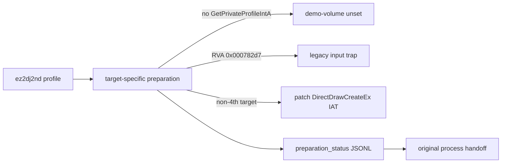

# ez2dj2nd 실행 경계 보정 설계

## 목표

`ez2dj2nd --run`이 프로파일 준비 단계에서 조용히 중단되지 않고, 원본 `EZ2DJ.exe`가 실제 실행 경계까지 도달하도록 2nd 전용 실행 조건을 반영합니다. 게임 로직과 원본 자산은 수정하지 않습니다.

## 확인된 근거

다음은 사용자가 제공한 `roms/ez2dj2nd`와 실행 로그에서 확인된 사실입니다.

- 2nd 실행 파일은 PE32/i386이며 entry point RVA는 `0x00079550`입니다.
- 2nd 정적 import에는 `KERNEL32!GetPrivateProfileIntA`가 없습니다. 따라서 1st SE용 `--demo-volume` 주입을 2nd에 적용하면 launcher handoff가 실패합니다.
- 2nd 실행 중 첫 privileged-instruction fault는 VA `0x004782d7`, RVA `0x000782d7`, `IN AL,DX`, port `0x0103`입니다.
- 2nd 정적 import에는 `DDRAW!DirectDrawCreateEx`가 있고, 현재 launcher는 4th의 packer 예외를 모든 타깃에 적용하여 이 IAT slot을 패치하지 않습니다.
- 기존 launcher 최종 오류는 선택적 IAT 조회가 앞서 기록한 오류를 지워 빈 메시지가 될 수 있습니다.

분석 문서에서는 원본에서 직접 확인된 값, 실행으로 추정된 값, 아직 확인되지 않은 값을 계속 구분합니다. 후속 실행에서 2nd의 `OUT` helper RVA `0x0007832b`도 확인했습니다.

## 정책

1. 2nd 프로파일의 `demo_volume`은 unset으로 둡니다. 사용자가 명시적으로 요청한 경우에만 launcher가 import 부재를 명확한 오류로 보고합니다.
2. 2nd 프로파일의 legacy input/output RVA를 각각 `0x000782d7`와 `0x0007832b`로 설정합니다. 두 값은 실행 중 privileged-instruction fault 주소에서 얻었습니다.
3. `DirectDrawCreateEx` IAT는 `ez2dj4th`일 때만 packer 보존을 위해 패치하지 않습니다. 그 외 타깃은 runtime의 HLE thunk 주소를 실제 IAT slot에 기록합니다.
4. handoff 직전에 각 준비 단계의 상태를 diagnostic JSONL에 기록하고, 오류 문자열이 비어 있으면 첫 실패한 준비 단계명을 fallback 오류로 사용합니다.

## 검증 계획

- `target_profile_test`에서 2nd demo-volume unset과 input RVA를 확인합니다.
- Windows x86 Debug build와 unit test를 실행합니다.
- 2nd launcher를 demo-volume 없이 실행하여 `runtime_detached` 또는 다음 실제 fault를 기록합니다.
- `DirectDrawCreateEx` HLE trace와 preparation status를 diagnostic log에서 확인합니다.

---

# ez2dj2nd Execution-Boundary Correction Design

## Goal

Apply the 2nd-specific execution conditions so `ez2dj2nd --run` reaches the original `EZ2DJ.exe` execution boundary instead of stopping silently during launcher preparation. The game logic and original assets remain unchanged.

## Evidence

The following facts were confirmed from the user-provided `roms/ez2dj2nd` and runtime logs.

- The 2nd executable is PE32/i386 with entry-point RVA `0x00079550`.
- Its static imports do not contain `KERNEL32!GetPrivateProfileIntA`; applying the 1st SE `--demo-volume` injection therefore fails launcher handoff.
- The first privileged-instruction fault during 2nd execution is VA `0x004782d7`, RVA `0x000782d7`, `IN AL,DX`, port `0x0103`.
- Its static imports contain `DDRAW!DirectDrawCreateEx`, while the launcher currently skips that IAT patch for every target because of the 4th packer exception.
- Optional IAT lookup can clear an earlier error, leaving the launcher with an empty final message.

The analysis documents continue to distinguish binary-confirmed values, runtime inferences, and unresolved values. A follow-up run also confirmed the 2nd `OUT` helper RVA as `0x0007832b`.

## Policy

1. Leave `demo_volume` unset in the 2nd profile. If explicitly requested, report the missing import as a clear launcher error.
2. Set the 2nd legacy input/output RVAs to `0x000782d7` and `0x0007832b`. Both values come from privileged-instruction fault addresses observed during execution.
3. Skip the `DirectDrawCreateEx` IAT patch only for `ez2dj4th` to preserve its packer data. Patch the real IAT slot to the runtime HLE thunk for other targets.
4. Record every preparation-stage status in diagnostic JSONL before handoff, and derive a named fallback error from the first failed stage when the error string is empty.

## Verification

- Assert the 2nd profile's unset demo-volume and input/output helper RVAs in `target_profile_test`.
- Build the Windows x86 Debug target and run unit tests.
- Run the 2nd launcher without demo-volume injection and record `runtime_detached` or the next real fault.
- Confirm the `DirectDrawCreateEx` HLE trace and preparation status in the diagnostic log.
