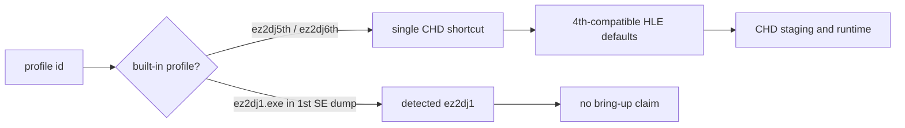

# ez2dj5th·ez2dj6th 프로파일 확장 설계

## 목표

사용자가 제공한 `roms/ez2dj5th`와 `roms/ez2dj6th` CHD shortcut을 내장 타깃 프로파일로 등록합니다. 두 프로파일의 Windows HLE·CHD 실행 기본값은 현재 확인된 `ez2dj4th` 프로파일을 기준으로 복사하되, 타깃 ID와 기본 이미지 경로는 버전별로 분리합니다. 개발용 `ez2dj1stse_unpacked` 내장 프로파일은 제거합니다.

## 확인된 입력

- `roms/ez2dj5th/ez2dj5.chd`는 단일 CHD 입력입니다. 현재 `Fat32Volume`은 이 이미지에서 유효한 FAT32 파티션을 찾지 못하므로 5th의 내부 실행 파일 경로와 파일시스템 종류는 미확정입니다.
- `roms/ez2dj6th/6th.chd`는 단일 CHD 입력이며 `EZ2DJ/EZ2DJ.EXE`, `EZ2DJ/EZ2DJ.INI`, `FONTKR.DAT`, `FONTEN.DAT`, `BG`, `SOUND`, `SYSTEM`이 있는 FAT32 구조로 확인되었습니다.
- 6th의 실행 파일은 PE32/i386이며 image base `0x00400000`, entry RVA `0x000153ff`입니다.

5th의 reader 미지원은 프로파일 등록을 막는 이유가 아니지만, 현재 CHD 실행 경계가 4th의 FAT32 reader에 의존하므로 5th를 실행 가능하다고 확정하지 않습니다.

## 정책

1. `ez2dj5th`와 `ez2dj6th`를 `HddInputKind::kMameChd` 내장 프로파일로 추가합니다.
2. 두 프로파일의 HLE, dynamic VFS, D3D3, DirectSound, legacy I/O, device mock, active-console, detached 기본값은 4th와 동일하게 둡니다.
3. 4th의 helper RVA와 Hardlock 값은 5th·6th에서 독립 검증되지 않았으므로, 이번에는 4th 기반 호환성 기준으로만 복사하고 프로파일 note에 미확정 상태를 남깁니다.
4. `ez2dj1stse_unpacked`는 `GetBuiltInTargetProfiles()`에서 삭제합니다. 실제 `ez2dj1.exe`가 스캔되면 `ez2dj1` detected 프로파일로 남지만, built-in 또는 bring-up target으로 주장하지 않습니다.
5. import observer와 original-process probe의 오래된 기본 target 참조를 detected `ez2dj1` 기준으로 갱신해 삭제된 ID를 실행 도구가 요구하지 않도록 합니다.

## 검증 계획

- unit test에서 5th·6th profile의 ID, CHD kind, 기본 이미지 경로와 4th 기반 실행 정책을 확인합니다.
- unit test에서 `ez2dj1stse_unpacked` built-in ID가 없고, 1st SE의 `ez2dj1.exe`는 detected `ez2dj1`로 남는지 확인합니다.
- Windows x86 Debug build와 전체 unit/product-loader probe를 실행합니다.
- 5th·6th CHD probe 결과는 분석 문서에 기록하되, 5th의 실제 실행 성공으로 간주하지 않습니다.

---

# ez2dj5th and ez2dj6th Profile Expansion Design

## Goal

Register the user-provided `roms/ez2dj5th` and `roms/ez2dj6th` CHD shortcuts as built-in target profiles. Their Windows HLE and CHD execution defaults are copied from the currently confirmed `ez2dj4th` baseline, while target IDs and default image paths remain version-specific. Remove the development-only `ez2dj1stse_unpacked` built-in profile.

## Observed inputs

- `roms/ez2dj5th/ez2dj5.chd` is a single CHD input. The current `Fat32Volume` reader cannot find an in-range FAT32 partition in it, so the 5th internal executable path and filesystem type remain unresolved.
- `roms/ez2dj6th/6th.chd` is a single CHD input with a FAT32 layout containing `EZ2DJ/EZ2DJ.EXE`, `EZ2DJ/EZ2DJ.INI`, `FONTKR.DAT`, `FONTEN.DAT`, `BG`, `SOUND`, and `SYSTEM`.
- The 6th executable is PE32/i386 with image base `0x00400000` and entry RVA `0x000153ff`.

The 5th reader limitation does not prevent profile registration, but the current CHD execution boundary depends on the 4th FAT32 reader, so 5th execution is not claimed as confirmed.

## Policy

1. Add `ez2dj5th` and `ez2dj6th` as `HddInputKind::kMameChd` built-in profiles.
2. Copy 4th's HLE, dynamic VFS, D3D3, DirectSound, legacy-I/O, device-mock, active-console, and detached defaults.
3. Treat 4th helper RVAs and Hardlock values as compatibility baselines only; they are not independently confirmed for 5th or 6th, and the profile notes must say so.
4. Remove `ez2dj1stse_unpacked` from `GetBuiltInTargetProfiles()`. If `ez2dj1.exe` is scanned in the real dump, it remains a detected `ez2dj1` profile without a built-in or bring-up claim.
5. Update the stale default target in the import observer and original-process probe to detected `ez2dj1`, so those tools do not request the removed ID.

## Verification plan

- Assert the 5th and 6th IDs, CHD kind, default image paths, and copied 4th execution policy in unit tests.
- Assert that the removed ID is absent and that `ez2dj1.exe` in a 1st SE dump remains detected as `ez2dj1`.
- Run the Windows x86 Debug build and the complete unit/product-loader probes.
- Record the 5th and 6th CHD probe results in analysis without treating 5th as a confirmed successful execution.
