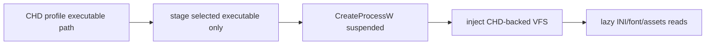

# CHD 프로파일 실행파일 선택과 최소 staging 설계

## 문제와 확인 결과

`ez2dj6th`는 실행 전 staging에서 `FAT32 file chain ended before the requested range`로 중단됩니다. 파일별 확인 결과 `EZ2DJ.EXE`, `EZ2DJ.INI`, `FONTEN.DAT`는 전체 읽기에 성공하고 `FONTKR.DAT`만 실패합니다.

6th BPB의 `ExtFlags`는 `0x0000`으로 FAT mirroring이 활성화되어 있으며 두 FAT 복사본의 관련 항목도 같습니다. 따라서 active FAT 선택 오류가 원인은 아닙니다. `FONTKR.DAT` directory entry는 75,200 bytes를 선언하지만 현재 FAT chain은 그 범위를 충족하지 못합니다.

이 파일은 실행에 앞서 필요한 파일이 아닙니다. CHD profile은 부모 CLI가 이미 확정하므로 INI와 font를 함께 복사하던 처리는 과거 launcher가 staging 디렉터리를 다시 scan해 fingerprint를 맞추던 경로의 잔재입니다.

최소 staging 적용 후 6th의 `EZ2DJ/EZ2DJ.EXE`는 실행되었지만 HLE import patch 단계에서 중단되었습니다. 실행 파일 문자열과 import를 별도로 확인한 결과 이 파일은 `.\\EZ2DJ6TH.EXE`를 `CreateProcessA`로 시작하는 bootstrap입니다. 같은 디렉터리의 `EZ2DJ/EZ2DJ6th.EXE`는 DirectDraw, DirectSound, DirectInput import를 가진 실제 게임 PE32입니다. 따라서 CHD 내부 실행파일 경로는 공통 상수가 아니라 프로파일별 확인 정보여야 합니다.

## 설계

1. CHD 프로파일의 `executable_relative_path`에 확인된 내부 실행파일 경로를 저장합니다. 4th는 `EZ2DJ/EZ2DJ.EXE`, 6th는 `EZ2DJ/EZ2DJ6th.EXE`를 사용합니다.
2. `CreateProcessW`에 native 경로가 반드시 필요한 선택된 원본 실행 파일만 임시 staging합니다.
3. INI, font, BG, SOUND, SYSTEM은 기존 CHD-backed VFS가 게스트 요청 시 읽거나 native path가 필요한 API에서 지연 materialize합니다.
4. staging root를 `ez2dj4th`로 고정하지 않고 선택된 profile ID별로 분리하며, 내부 실행파일의 상대 경로와 파일명을 보존합니다.
5. materialization 오류에는 실패한 CHD 내부 경로를 포함합니다.
6. FAT chain을 추측하거나 손상된 파일을 zero-fill하지 않습니다. 실제 게스트가 `FONTKR.DAT` 전체를 요청해 같은 불일치가 나타나면 해당 요청은 명시적으로 실패합니다.
7. 6th처럼 IAT가 읽기 전용 PE section에 있는 경우, 공용 32-bit IAT writer는 직접 쓰기 실패 시 해당 4-byte 범위만 임시 `PAGE_READWRITE`로 바꾸고 원래 보호 속성을 복원합니다. child는 이 준비 단계 동안 suspended 상태입니다.
8. 4th 전용 raw-I/O helper RVA는 6th 실행파일에서 확인되지 않았으므로 6th 프로파일에서는 비활성화합니다. 검증되지 않은 주소에 명령어 trap을 설치하지 않습니다.

## 검증

- 6th CHD에서 `EZ2DJ/EZ2DJ6th.EXE` staging이 완료되고 이전 `FONTKR.DAT` 오류와 bootstrap import patch 오류를 통과하는지 확인합니다.
- staging 경로가 `chd/ez2dj6th`로 분리되는지 launcher 로그에서 확인합니다.
- Windows x86 Debug 빌드, 단위 테스트, product-loader probe를 실행합니다.
- 읽기 전용 IAT를 가진 실제 6th 실행파일에서 HLE import 준비가 완료되는지 확인합니다.
- 실제 child 실행은 staging 이후 새로 드러나는 경계까지 확인하며, 6th 전용 HLE 계약이 확인됐다고 확대 해석하지 않습니다.

---

# CHD Profile Executable Selection and Minimal Staging Design

## Problem and findings

`ez2dj6th` stops before launch with `FAT32 file chain ended before the requested range`. Isolated reads show that `EZ2DJ.EXE`, `EZ2DJ.INI`, and `FONTEN.DAT` succeed, while only `FONTKR.DAT` fails.

The 6th BPB has `ExtFlags=0x0000`, FAT mirroring is enabled, and both FAT copies contain the same relevant entries. Active FAT selection is therefore not the cause. The `FONTKR.DAT` directory entry declares 75,200 bytes, but its current FAT chain does not cover that range.

This file is not required before process creation. The parent CLI has already selected the CHD profile. Eagerly copying the INI and fonts is a remnant of the older path that rescanned the staging directory to match a fingerprint.

After minimal staging, the 6th `EZ2DJ/EZ2DJ.EXE` started but stopped while HLE imports were being patched. Separate string and import inspection confirmed that this file is a bootstrap which launches `.\\EZ2DJ6TH.EXE` through `CreateProcessA`. `EZ2DJ/EZ2DJ6th.EXE` in the same directory is the actual PE32 game importing DirectDraw, DirectSound, and DirectInput. The internal CHD executable path must therefore be confirmed profile data rather than a shared constant.

## Design

1. Store the confirmed internal executable in each CHD profile's `executable_relative_path`: `EZ2DJ/EZ2DJ.EXE` for 4th and `EZ2DJ/EZ2DJ6th.EXE` for 6th.
2. Stage only the selected original executable, whose native path is required by `CreateProcessW`.
3. Leave INI, fonts, BG, SOUND, and SYSTEM to the existing CHD-backed VFS, which reads them on guest demand or materializes them lazily for APIs requiring native paths.
4. Isolate the staging root by selected profile ID and preserve the internal executable's relative path and file name.
5. Include the failed internal CHD path in materialization errors.
6. Do not guess a FAT chain or zero-fill a damaged file. If the guest later requests all of `FONTKR.DAT` and reaches the same inconsistency, that request fails explicitly.
7. When an IAT resides in a read-only PE section, as in 6th, the shared 32-bit IAT writer retries a failed direct write after making only the four-byte range temporarily `PAGE_READWRITE`, then restores the original protection. The child remains suspended during this preparation step.
8. Disable the 4th-specific raw-I/O helper RVAs in the 6th profile because they are not confirmed in the 6th executable. No instruction trap is installed at an unverified address.

## Verification

- Confirm that staging `EZ2DJ/EZ2DJ6th.EXE` passes both the previous `FONTKR.DAT` failure and the bootstrap import-patch failure.
- Confirm the launcher log uses a profile-specific `chd/ez2dj6th` staging path.
- Run the Windows x86 Debug build, unit tests, and product-loader probe.
- Confirm HLE import preparation against the actual 6th executable whose IAT is read-only.
- Observe the real child only through the next boundary after staging without claiming that 6th-specific HLE contracts are confirmed.
