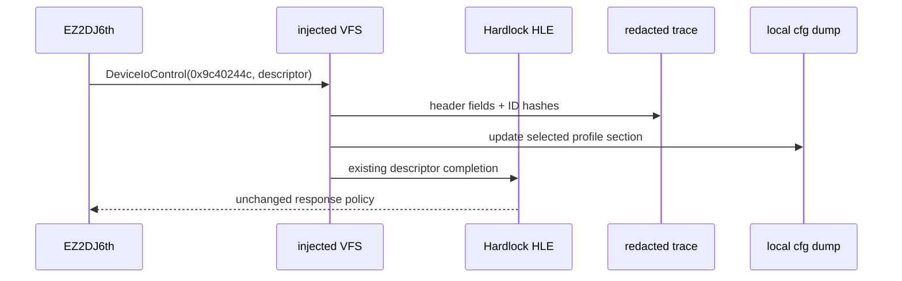

# ez2dj6th Hardlock descriptor 진단 설계

## 문제와 확인 결과

현재 6th는 올바른 `EZ2DJ/EZ2DJ6th.EXE`까지 실행하고 HLE import 준비도 완료하지만, Hardlock 응답 이후 주 진입 함수가 `-1`을 반환합니다. VFS 로그에는 IOCTL 종류와 크기만 있어 두 descriptor 요청의 `function`, `module_address`, 상태, ID 필드가 어떤 값이었는지 확인할 수 없습니다.

## 설계

1. `0x9c40244c` descriptor 요청을 받을 때 고정 헤더를 파싱해 `module_id`, `module_address`, `data_address`, `block_count`, `function`, `status`, `remote`, `port`, `speed`, `network_users`를 기록합니다.
2. `id_ref`와 `id_verify`는 원문을 기록하지 않고 64-bit FNV-1a 해시와 non-zero 여부만 기록합니다. 원본 Hardlock ID 바이트가 로그나 저장소에 남지 않아야 합니다.
3. 기존 응답 동작은 변경하지 않습니다. 이 작업은 관찰 경계를 추가하는 것이며, 6th 응답을 추측하거나 4th material을 자동 적용하지 않습니다.
4. 헤더 크기·버퍼가 맞지 않는 요청은 `header_valid=false`로 기록하고 기존 rejected-shape 흐름을 유지합니다.
5. 사용자가 명시적으로 참조를 요청한 확인값은 Git에서 무시되는 로컬 `cfg/hardlock-id.ini`에만 기록합니다. runtime 로그에는 원문을 남기지 않습니다.
6. 프로파일 제작 때 반복 사용할 수 있도록 launcher에 `--hardlock-descriptor-dump <path>` 옵션을 추가합니다. 옵션이 활성화되면 첫 번째 유효 descriptor의 원문 ID와 `module_address`를 지정한 로컬 파일의 해당 프로파일 section에 기록하고, 같은 파일의 다른 section은 보존하며, 일반 trace에는 계속 해시만 남깁니다.

## 검증

- 6th 진단 실행에서 두 descriptor의 헤더와 해시가 기록되는지 확인합니다.
- `id_ref`와 `id_verify` 원문이 로그에 나타나지 않는지 확인합니다.
- `--hardlock-descriptor-dump` 실행으로 프로파일 section과 `module_address`, 두 ID 필드가 로컬 cfg 파일에 생성되는지 확인합니다.
- 기존 Windows x86 빌드와 단위 테스트를 실행합니다.

---

# ez2dj6th Hardlock Descriptor Diagnostic Design

## Problem and findings

The 6th now reaches the correct `EZ2DJ/EZ2DJ6th.EXE` and completes HLE import preparation, but its main entry returns `-1` after the Hardlock responses. The VFS log currently records only IOCTL kind and size, so it cannot show which `function`, `module_address`, or ID fields the two descriptor requests carried.

## Design

1. Parse the fixed header of each `0x9c40244c` descriptor request and record `module_id`, `module_address`, `data_address`, `block_count`, `function`, `status`, `remote`, `port`, `speed`, and `network_users`.
2. Never record the raw `id_ref` or `id_verify` bytes. Record only a 64-bit FNV-1a digest and whether each field is non-zero.
3. Keep the existing response behavior unchanged. This is an observation boundary, not a guessed 6th response and not automatic reuse of 4th material.
4. Mark malformed or undersized requests as `header_valid=false` and preserve the existing rejected-shape path.
5. Values explicitly requested for user reference are stored only in the Git-ignored local `cfg/hardlock-id.ini`; runtime traces do not retain the raw bytes.
6. Add the reusable launcher option `--hardlock-descriptor-dump <path>`. When enabled, it updates the selected profile section with raw IDs and `module_address` from the first valid descriptor, preserves other sections in the explicitly selected local file, and keeps normal traces digest-only.

## Verification

- Run the 6th diagnostic and confirm both descriptor headers and digests are recorded.
- Confirm raw `id_ref` and `id_verify` bytes do not appear in the trace.
- Run `--hardlock-descriptor-dump` and confirm that a local cfg file is generated with the profile section, `module_address`, and both ID fields.
- Run the existing Windows x86 build and unit tests.
