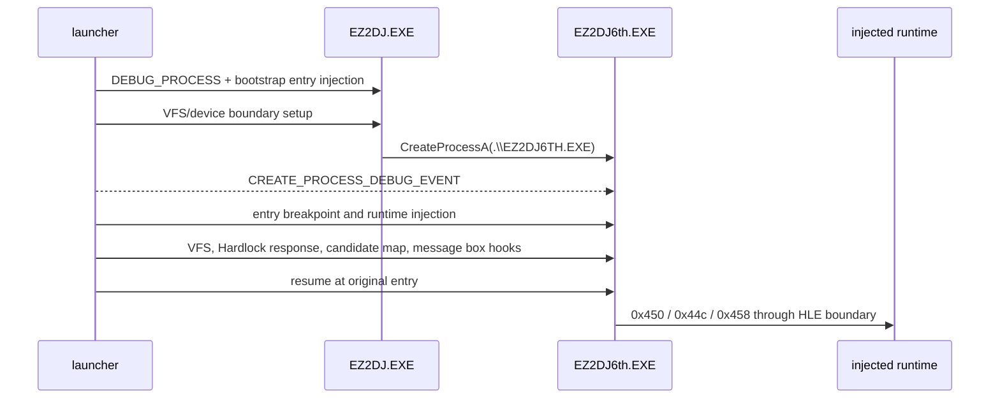

# EZ2DJ 6th bootstrap 자식 프로세스 추적 설계

## 목적

6th CHD의 `EZ2DJ/EZ2DJ.EXE`는 bootstrap이고, 실제 Hardlock 복호화 대상은
`EZ2DJ/EZ2DJ6th.EXE`입니다. 현재 Windows x86 launcher는
`DEBUG_ONLY_THIS_PROCESS`로 bootstrap만 추적하므로 자식 프로세스에 HLE runtime과
candidate response map을 주입하지 못합니다.

이번 설계는 bootstrap이 생성한 자식 프로세스를 디버그 이벤트로 발견하고, 자식의
초기 entry에서 동일한 runtime/HLE 준비를 수행하도록 launcher 경계를 확장합니다.

## 확인된 사실

- bootstrap PE에는 `CreateProcessA` import와 `.`\\`EZ2DJ6TH.EXE` 실행 문자열이 있습니다.
- 현재 launcher의 `DEBUG_ONLY_THIS_PROCESS` 플래그는 bootstrap의 자식 debug event를
  전달하지 않습니다.
- 직접 `EZ2DJ6TH.EXE`를 실행하면 launcher 계약 오류가 발생하므로 bootstrap을 통한
  process ancestry를 유지해야 합니다.
- Hardlock candidate map은 실제 게임 EXE의 `0x458` 호출에서만 사용됩니다.

## 설계

### 추적 모드

- 기존 단일 프로세스 실행은 `DEBUG_ONLY_THIS_PROCESS`를 유지합니다.
- `follow_child_process`가 활성화된 경우에만 `DEBUG_PROCESS`를 사용합니다.
- child `CREATE_PROCESS_DEBUG_EVENT`의 primary thread는 entry breakpoint를 설치할
  때까지 suspended 상태로 유지합니다.
- child runtime 준비가 완료되면 child를 resume하고, parent는 child가 종료될 때까지
  debug event를 계속 소비합니다.

### 주입 경계

자식 준비 코드는 현재 부모 준비와 같은 export/IAT 규칙을 사용합니다.

- injected runtime DLL 로드
- VFS 경로와 trace 경로 설정
- dynamic `GetProcAddress`와 device `DeviceIoControl` 연결
- `FEnteDev` mock, WTS console, `0x450`, `0x44c`, Hardlock device 설정
- candidate transform map 전달
- `CreateFileA` 계열 VFS wrapper 및 `MessageBoxA` boundary 연결
- 6th 실제 EXE에 존재하는 DirectDraw/DirectSound/DirectInput import 연결

부모 bootstrap은 자식 생성 전에 자체 protection check를 수행하므로 VFS/device/Hardlock
경계는 유지하고, graphics/audio HLE는 자식으로 넘깁니다. 부모와 자식의 trace는 서로
덮어쓰지 않도록 process id를 파일명에 포함한 보조 trace를 사용합니다. candidate 판정은
자식 trace의 `0x458` 호출과 후속 게임 자산 접근을 기준으로 합니다.

## 실패 처리

- 자식이 생성되지 않으면 bootstrap 종료 코드와 함께 `child_process_not_observed`를
  기록합니다.
- 자식 PE가 profile의 실제 실행파일과 일치하지 않으면 자식 준비를 중단합니다.
- 자식 runtime 준비 실패는 부모 bootstrap 성공과 분리하여 기록합니다.
- 기존 direct-executable 경로와 기존 profile은 변경하지 않습니다.

## 검증

1. launcher 단위 테스트에서 follow flag와 `DEBUG_PROCESS` 선택을 확인합니다.
2. 6th bootstrap 실행에서 child `CREATE_PROCESS_DEBUG_EVENT`와 child image path를
   JSONL에 기록합니다.
3. candidate 0 실행에서 child trace의 Hardlock request를 확인합니다.
4. 194개 candidate sweep에서 `0x458` transform 호출이 발생하는지 확인합니다.
5. 기존 unit test와 Windows x86 Debug build를 통과시킵니다.

기존 synthetic baseline을 명시한 진단 실행에서는 `child_process_created`,
`child_runtime_prepared`, child 종료 경계까지 확인했지만, 해당 baseline byte는
6th 프로파일 기본값으로 승격하지 않습니다.

---

# EZ2DJ 6th Bootstrap Child-Process Follow Design

## Purpose

The 6th CHD's `EZ2DJ/EZ2DJ.EXE` is a bootstrap, while the actual Hardlock-protected
game is `EZ2DJ/EZ2DJ6th.EXE`. The Windows x86 launcher currently uses
`DEBUG_ONLY_THIS_PROCESS`, so it cannot inject the HLE runtime or candidate response
map into the child process.

This design extends the launcher boundary to observe the bootstrap-created child and
prepare the same runtime/HLE boundary at the child's entry point.

## Confirmed facts

- The bootstrap PE imports `CreateProcessA` and contains the `.\\EZ2DJ6TH.EXE` launch string.
- The current `DEBUG_ONLY_THIS_PROCESS` flag does not deliver child debug events.
- Directly launching `EZ2DJ6th.EXE` produces the launcher-contract error, so the
  bootstrap process ancestry must be preserved.
- A Hardlock candidate map is consumed only when the actual game calls `0x458`.

## Design

The follow mode uses `DEBUG_PROCESS` only for the bootstrap profile. The bootstrap
keeps the VFS/device/Hardlock boundary because it must pass its own protection check
before creating the game child; graphics and audio HLE are deferred to the child.
The launcher observes the child creation event, injects the runtime while the child
primary thread is suspended, and passes the same VFS/device/Hardlock configuration
and candidate map to the child.

## Failure handling and verification

Parent and child outcomes are recorded separately. Existing direct-executable paths
remain unchanged. Verification covers the child debug event, child Hardlock trace,
candidate transform calls, the full unit suite, and the Windows x86 Debug build.
An explicit diagnostic run using the existing synthetic baseline reached
`child_process_created`, `child_runtime_prepared`, and the child exit boundary;
those baseline bytes are not promoted to the 6th profile configuration.
