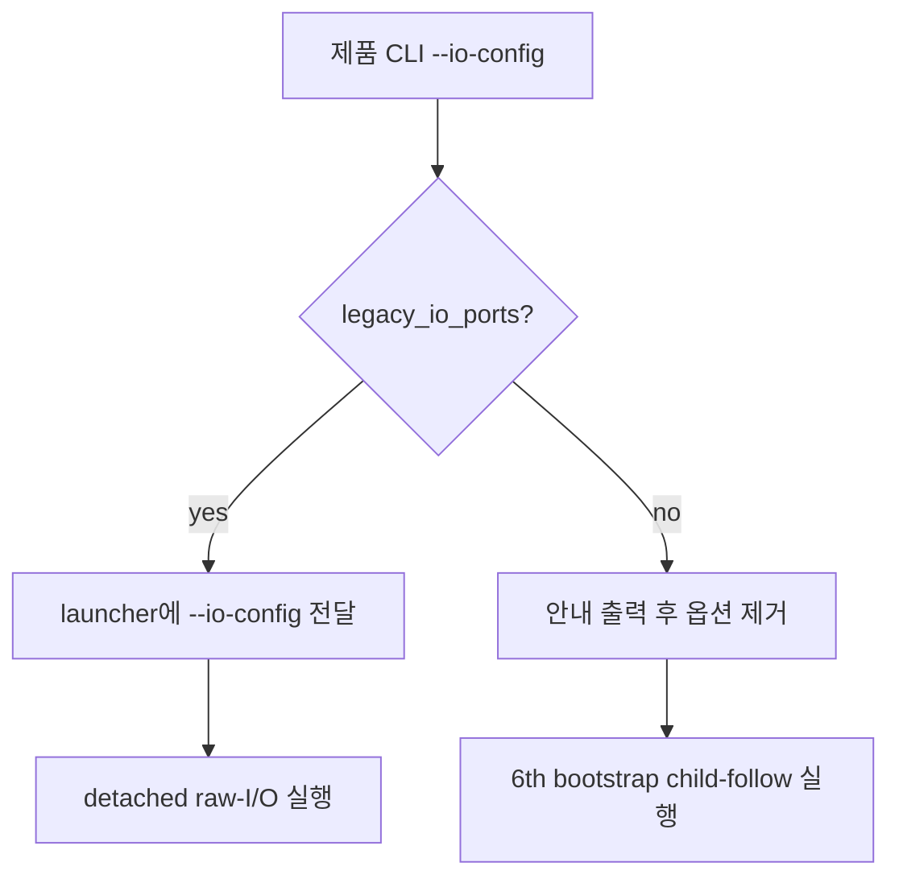

# ez2dj6th CHD 실행의 I/O 설정 전달 정책

## 목적

`ez2dj6th`는 `EZ2DJ/EZ2DJ.EXE` bootstrap을 추적하면서 자식 `EZ2DJ6th.EXE`에
HLE runtime을 주입한다. 이 경로는 현재 4th에서 확인한 raw I/O helper를 사용하지
않으므로 1st/4th용 `--io-config`를 launcher에 전달하면 안 된다.

기존 제품 CLI는 CHD 경로에서 이 옵션을 그대로 전달했고, child-follow launcher는
`--io-config`와 non-detached 실행을 함께 거부했다. 그 결과 6th 실행은 bootstrap을
시작하기 전에 launcher Usage만 출력하고 종료했다.

## 설계

`--io-config`의 유효 범위는 profile의 `lptdi.legacy_io_ports` capability로 결정한다.

* legacy I/O가 활성화된 profile은 기존처럼 설정 파일 경로를 launcher와 injected
  runtime에 전달한다.
* legacy I/O가 비활성화된 profile은 설정 파일을 실행 인자로 전달하지 않는다.
  사용자가 공통 실행 명령에 옵션을 남겨 둔 경우에는 stderr에 무시 사실을 안내하고
  나머지 실행은 계속한다.
* Windows process backend도 직접 호출자가 capability와 맞지 않는 `io_config`를
  넘기면 실행 인자를 만들지 않고 명확한 오류를 반환한다. 제품 CLI는 이 정책에
  따라 비활성 profile의 값을 먼저 비운다.

이 변경은 6th의 raw-I/O helper RVA나 Hardlock 응답을 확정하지 않는다. 6th에서
입력 경계가 확인되면 별도의 profile capability와 설정 전달 설계를 추가한다.

## 검증 전략

1. Windows x86 Debug 빌드가 성공하는지 확인한다.
2. unit test 전체가 통과하는지 확인한다.
3. 6th CHD에 기존 `--io-config`를 함께 지정해도 launcher Usage가 아니라 profile
   안내 후 child-follow 경로로 진입하는지 확인한다.
4. legacy I/O profile의 기존 인자 생성은 변경되지 않았는지 확인한다.

---

# ez2dj6th CHD I/O Configuration Forwarding Policy

## Purpose

`ez2dj6th` follows the `EZ2DJ/EZ2DJ.EXE` bootstrap and injects the HLE runtime into
the `EZ2DJ6th.EXE` child. This path does not currently use the raw-I/O helper
confirmed for 4th, so the 1st/4th `--io-config` option must not be forwarded to the
launcher.

The product CLI previously forwarded the option unchanged on the CHD path, while
the child-follow launcher rejected `--io-config` together with non-detached
execution. Therefore 6th exited with launcher Usage before the bootstrap ran.

## Design

The profile capability `lptdi.legacy_io_ports` determines whether `--io-config` is
valid.

* Profiles with legacy I/O enabled continue to pass the configuration path to the
  launcher and injected runtime.
* Profiles without legacy I/O do not pass the option. If a shared command still
  includes it, the CLI reports that it was ignored and continues execution.
* The Windows process backend also rejects a direct caller that supplies
  capability-incompatible `io_config` instead of constructing an invalid launcher
  command. The product CLI clears the value first for profiles where the option is
  not applicable.

This change does not confirm 6th raw-I/O helper RVAs or Hardlock responses. A
separate profile capability and configuration design is required once 6th input
behavior is confirmed.

## Verification Strategy

1. Confirm the Windows x86 Debug build succeeds.
2. Run the complete unit-test suite.
3. Confirm that a 6th CHD invocation with the existing `--io-config` reaches the
   child-follow path after the profile notice instead of printing launcher Usage.
4. Confirm legacy-I/O profile argument generation is unchanged.
