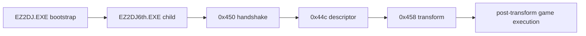

# ez2dj6th Hardlock 후보 검증 설계

## 목적

`ez2dj6th`의 reSoftlock 후보 map이 원본 bootstrap과 child 실행 경로에서 실제 복호화 요청에 소비되는지 검증합니다. 후보 seed나 response를 실행 전에 확정하지 않고, 원본 실행의 다음 경계가 열리는지로만 판정합니다.

*Purpose*

Verify whether the `ez2dj6th` reSoftlock candidate maps are consumed by the original bootstrap and child execution path. Do not promote a seed or response before execution evidence; judge only whether the original reaches the next decryption boundary.

## 실행 경계

후보 map은 `0x458`의 8-byte block response에만 적용됩니다. 따라서 `0x450` handshake와 `0x44c` descriptor 응답이 먼저 원본의 다음 분기를 통과해야 후보 map의 유효성을 판정할 수 있습니다.

*The candidate map applies only to the eight-byte block response at `0x458`. The `0x450` handshake and `0x44c` descriptor response must first pass the original's preceding branches before a candidate map can be judged.*

## 판정 기준

- 확인됨: bootstrap이 target child를 생성하고 child runtime handoff가 완료되는가.
- 확인됨: child가 `0x450` 및 `0x44c`를 호출하는가.
- 후보 판정 가능: `0x458` transform이 발생하고 map entry가 실제 block에 적용되는가.
- 통과 후보: transform 이후 원본 코드가 추가 Hardlock/configuration 실행으로 계속 진행하는가.
- 미확정: clean exit만으로는 성공으로 보지 않습니다. launcher의 clean exit는 보호 성공과 동일하지 않을 수 있습니다.

*Confirmed: whether bootstrap creates the target child and child runtime handoff completes.*
*Confirmed: whether the child calls `0x450` and `0x44c`.*
*Candidate-judgement ready: whether `0x458` occurs and map entries are applied to real blocks.*
*Passing candidate: whether original code continues into later Hardlock/configuration activity after transform.*
*Unresolved: a clean exit alone is not success; launcher clean exit is not equivalent to protection success.*

## 현재 판단

기존 4th 기반 branch-forcing diagnostic material은 6th의 실제 장치 응답으로 취급하지 않습니다. 6th 전용 `0x450` driver response와 Function 0 descriptor response가 확인되기 전에는 194개 후보 중 어느 것도 seed 또는 복호화 response로 승격하지 않습니다.

*Current judgement*

The existing 4th-based branch-forcing diagnostic material is not treated as the real 6th device response. Until a 6th-specific `0x450` driver response and Function-0 descriptor response are confirmed, none of the 194 candidates is promoted to a seed or decryption response.
