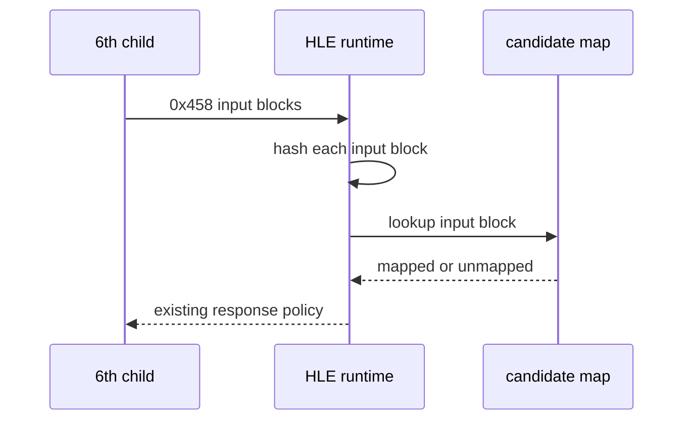

# ez2dj6th transform 입력 경계 진단 설계

## 목적

6th child가 `0x458`에 전달하는 8-byte block이 reSoftlock이 만든 candidate map의 challenge key와 같은지 확인합니다. raw block과 response는 저장하지 않고 각 입력 block의 FNV-1a 64-bit hash만 child VFS trace에 기록합니다.

*Purpose*

Determine whether the eight-byte blocks sent by the 6th child to `0x458` match the challenge keys in the reSoftlock candidate maps. Do not store raw blocks or responses; record only an FNV-1a 64-bit hash for each input block in the child VFS trace.

## 범위

- launcher에 `--hardlock-transform-inputs` 진단 옵션을 추가합니다.
- 부모와 child handoff 모두에서 동일한 runtime flag를 설정합니다.
- transform request 직전에 input block hash를 기록합니다.
- map의 response bytes와 seed는 로그에 기록하지 않습니다.
- Hardlock 응답 동작과 원본 실행 흐름은 변경하지 않습니다.

*Scope*

- Add the `--hardlock-transform-inputs` diagnostic option to the launcher.
- Set the same runtime flag in both the parent and child handoff.
- Record input block hashes immediately before a transform request.
- Do not record map response bytes or seeds.
- Do not change Hardlock response behavior or the original execution flow.

## 판정 흐름

hash 집합이 candidate key hash 집합과 겹치지 않으면 현재 candidate map은 이 실행 경계의 map이 아니며, seed 후보 판정 전에 challenge 생성 대상을 다시 확인해야 합니다.

*If the input hash set has no intersection with the candidate key hash set, the current candidate maps do not describe this execution boundary. The challenge-generation source must be rechecked before judging seeds.*
