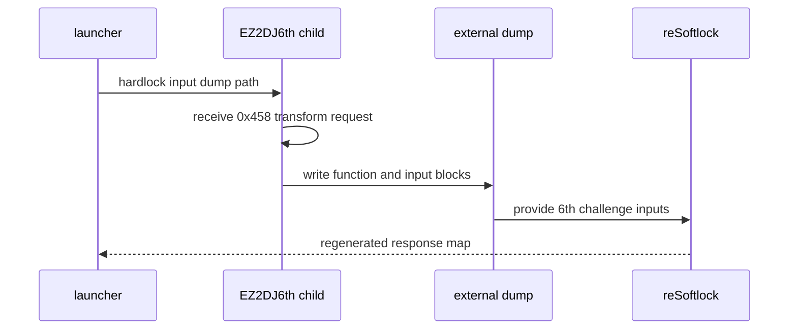

# EZ2DJ 6th Hardlock 변환 입력 덤프 설계

## 한국어

### 목적

`ez2dj6th`의 실제 Hardlock `0x458` 변환 요청에서 사용되는 입력 블록을 확인합니다. 기존 `cfg/ez2dj6th` 후보 맵은 다른 challenge 집합을 기준으로 만들어져 6th 실행의 7개 입력 블록과 매칭되지 않았습니다. 따라서 reSoftlock에서 6th 전용 response 후보를 계산할 수 있도록, 실행 중 수신한 입력 블록을 사용자가 지정한 외부 임시 파일에 기록합니다.

### 범위와 안전성

- `--hardlock-transform-input-dump <path>`를 명시한 실행에서만 활성화합니다.
- 출력은 저장소 바깥의 사용자가 지정한 경로에 기록합니다.
- 기본 로그에는 원시 블록을 기록하지 않고, 기존의 FNV-1a 요약 해시만 남깁니다.
- 덤프에는 변환 입력 블록만 포함하며 response, seed, 원본 실행 파일 또는 게임 자산은 저장소 문서에 기록하지 않습니다.
- 덤프는 reSoftlock 입력 생성에 사용한 뒤 사용자가 삭제할 수 있는 일회성 진단 산출물입니다.

### 실행 흐름

### 구현 경계

- 런타임은 `g_re2dj_hardlock_transform_input_dump` export를 통해 출력 경로를 받습니다.
- `RecordHardlockTransformInputHashes`가 이미 확인한 descriptor header와 block count를 재사용합니다.
- 부모 bootstrap과 child handoff 모두 동일한 export를 설정합니다.
- 입력 블록의 response 계산은 re2DJ에서 구현하지 않습니다. reSoftlock이 계산한 map만 런타임에 주입합니다.

### 검증 기준

1. Win32 빌드가 성공해야 합니다.
2. 단위 테스트가 통과해야 합니다.
3. CHD 실행에서 child VFS trace에 `function=0x0011`, `block_count=7`이 남아야 합니다.
4. 지정한 외부 임시 파일에 7개 입력 블록이 기록되어야 합니다.
5. 기존 실행 경로는 새 옵션 없이 변경되지 않아야 합니다.

## English

### Purpose

Capture the input blocks used by the real `0x458` Hardlock transform request in `ez2dj6th`. The existing `cfg/ez2dj6th` candidate maps were generated from a different challenge set and do not match the seven blocks observed during 6th execution. The captured blocks can be supplied to reSoftlock to calculate 6th-specific response candidates.

### Scope and safety

- Enable the feature only when `--hardlock-transform-input-dump <path>` is explicitly provided.
- Write the output to a user-selected path outside the repository.
- Keep raw blocks out of the normal trace; the existing FNV-1a summary hashes remain the default diagnostic.
- The dump contains transform input blocks only. Do not record responses, seeds, original executables, or game assets in tracked documentation.
- Treat the dump as a disposable diagnostic artifact and remove it after generating the reSoftlock input.

### Implementation boundary

- The runtime receives the output path through the `g_re2dj_hardlock_transform_input_dump` export.
- Reuse the descriptor header and block count already parsed by `RecordHardlockTransformInputHashes`.
- Configure the export for both the parent bootstrap and the followed child process.
- Do not implement the response algorithm in re2DJ; inject only maps produced by reSoftlock.

### Verification criteria

1. The Win32 build succeeds.
2. Unit tests pass.
3. A CHD run records `function=0x0011` and `block_count=7` in the child VFS trace.
4. The selected external temporary file contains seven transform input blocks.
5. The execution path remains unchanged when the new option is omitted.
