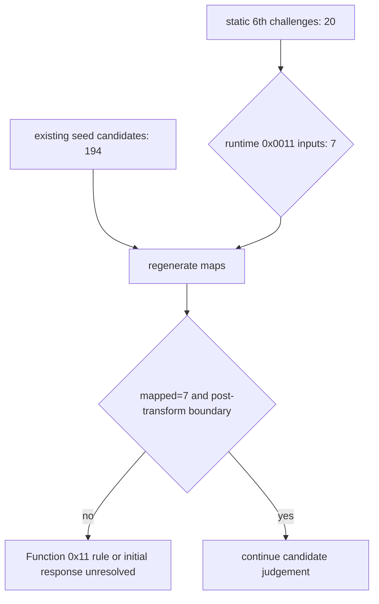

# EZ2DJ 6th Function 0x11 map 검증 설계

## 한국어

### 목적

실행 중 추출한 7개 입력으로 reSoftlock map을 다시 생성한 뒤, 6th의 Function `0x0011`이 3rd/4th의 Function `0x000e`와 동일한 response 규칙을 사용하는지 분리해서 확인합니다.

### 관찰된 경계

- 6th EXE 정적 challenge 추출 결과는 20개입니다.
- 실제 `0x458` 요청은 function `0x0011`, 8바이트 block 7개입니다.
- 정적 20개와 실행 중 7개의 교집합은 0개입니다.
- 실행 중 7개를 challenge 파일로 사용해 194개 map을 생성하면 모든 block이 map에 매칭됩니다.
- 그러나 194개 후보 모두 transform 직후 정상적인 후속 인증 경계를 열지 못합니다.
- map을 주입하지 않은 baseline은 transform 뒤 Function `0x0001` descriptor까지 도달하지만, 이것도 인증 성공의 증거는 아닙니다.

### 판정 정책

fault 주소나 예외 코드 하나만으로 후보를 선택하지 않습니다. 후보가 유효하다고 부르려면 transform 이후 원본이 추가 device/descriptor 경계와 게임 설정 파일 접근까지 재현해야 합니다.

### 다음 입력

Function `0x0011`의 실제 response 규칙을 확인할 수 있는 원본 device oracle, 알려진 input/output 쌍, 또는 6th 전용 Hardlock 구현 근거가 필요합니다. 초기 Function-0 descriptor의 tail/status 외 응답 내용도 독립적으로 확정되지 않았으므로, 현재의 4th 기반 synthetic descriptor response가 transform 이후 상태를 왜곡했을 가능성도 함께 유지합니다.

## English

### Purpose

Regenerate maps from the seven runtime inputs and determine whether 6th Function `0x0011` uses the same response rule as Function `0x000e` in 3rd/4th.

### Observed boundary

- Static extraction from the 6th executable yields 20 challenges.
- The real `0x458` request uses function `0x0011` and seven eight-byte blocks.
- The intersection between the static 20 and runtime seven is zero.
- Rebuilding 194 maps from the runtime seven makes every block map successfully.
- None of the 194 candidates opens a valid post-transform authentication boundary.
- The no-map baseline reaches a Function `0x0001` descriptor after transform, but that is not proof of authentication.

### Decision policy

Do not select a candidate from a fault address or exception code alone. A candidate is only meaningful if the original reaches later device/descriptor boundaries and reproduces the post-transform configuration-file access.

### Required next evidence

An original device oracle, a known Function `0x0011` input/output pair, or independent 6th-specific Hardlock implementation evidence is required. The initial Function-0 descriptor response is also not independently confirmed beyond its tail/status forcing, so the 4th-based synthetic descriptor response may be distorting the post-transform state.
