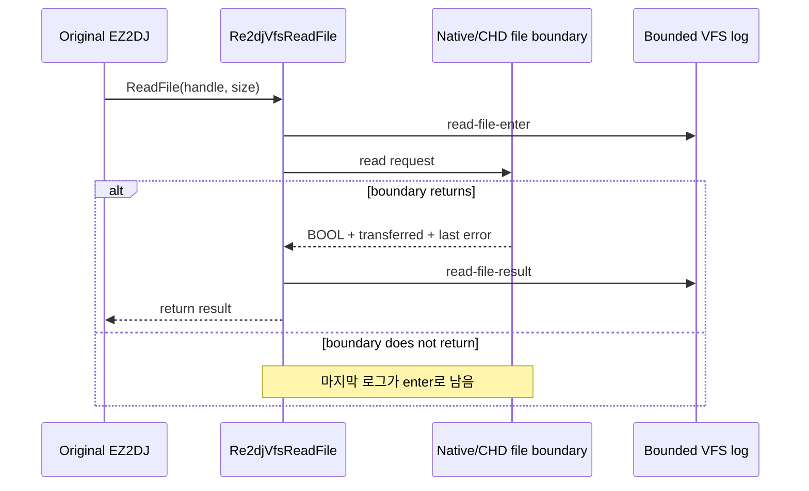

# EZ2DJ 3rd ReadFile 경계 진단 설계

## 한국어

### 목적

`ez2dj3rd`가 초기 파일을 연 뒤 화면에 도달하지 못하는 현상을, 파일 API 경계에서 관찰 가능한 사실로 좁힙니다. 특히 `ReadFile` 호출이 진입 후 반환되는지, 반환된다면 성공 여부와 전송 바이트 수가 무엇인지 확인합니다.

현재 로그에는 `CreateFileA` 결과만 있어 다음 세 경우를 구분하기 어렵습니다.

1. 파일을 연 뒤 `ReadFile` 내부에서 대기한다.
2. `ReadFile`은 반환하지만 실패하거나 0바이트를 반환한다.
3. 파일 읽기는 정상이고 그 이후의 다른 HLE 경계에서 대기한다.

### 설계 범위

`src/platform/windows/injected_runtime.cpp`의 VFS `ReadFile` 래퍼에 프로세스별 제한 계측을 추가합니다.

- `read-file-enter`: 핸들, 요청 크기, overlapped 여부를 기록합니다.
- `read-file-result`: 반환값, 전송 바이트 수, `GetLastError()`를 기록합니다.
- CHD synthetic handle과 native handle 모두 같은 형식으로 기록합니다.
- device mock 핸들은 실제 파일 읽기가 아니므로 별도 kind로 기록합니다.
- 로그에는 파일 내용, Hardlock challenge, response, seed를 기록하지 않습니다.
- 이벤트 수는 제한하여 attract loop나 반복 읽기가 로그를 무한히 키우지 않게 합니다.
- VFS trace path가 설정된 진단 실행에서만 파일 계측을 기록합니다.

`enter`와 `result`를 분리하는 것이 핵심입니다. 특정 `enter` 뒤에 대응하는 `result`가 없으면 래퍼 내부의 실제 Win32 `ReadFile` 또는 CHD 읽기에서 멈춘 것으로 분류할 수 있습니다.

### 흐름

### 성공 기준

진단 실행 로그에서 마지막 `read-file-enter`와 `read-file-result`의 대응을 확인하고, 다음 중 하나로 실행 지점을 분류할 수 있어야 합니다.

- 파일 읽기 내부 대기
- 파일 읽기 실패/단축 읽기
- 파일 읽기 이후 경계 대기

이 작업은 Hardlock 응답 맵, profile 기본값, 원본 실행 파일을 변경하지 않습니다.

### 후속 경계: 처리되지 않은 privileged-instruction 증거

legacy I/O handler가 처리하지 못한 첫 `EXCEPTION_PRIV_INSTRUCTION`도 같은 bounded VFS trace에 기록합니다. 이는 관찰 전용이며 legacy I/O를 활성화하거나 `EIP`를 진행시키거나 port 값을 합성하지 않습니다. 기존 crash-context 형식을 재사용하여 fault 주소, 명령 바이트, 레지스터 문맥을 descriptor/function 경계와 비교할 수 있게 합니다.

## English

### Purpose

Narrow the `ez2dj3rd` startup stall to observable facts at the file API boundary. In particular, determine whether a `ReadFile` call returns after entry and, if it returns, whether it succeeds and how many bytes it transfers.

The current trace records `CreateFileA` results but cannot distinguish three cases:

1. The process waits inside `ReadFile` after opening a file.
2. `ReadFile` returns but fails or transfers zero bytes.
3. File reads complete and the process waits at a later HLE boundary.

### Scope

Add bounded per-process instrumentation to the VFS `ReadFile` wrapper in `src/platform/windows/injected_runtime.cpp`.

- Record `read-file-enter` with the handle, requested size, and overlapped flag.
- Record `read-file-result` with the return value, transferred bytes, and `GetLastError()`.
- Use the same format for CHD synthetic handles and native handles.
- Mark device-mock handles separately because they are not file reads.
- Do not record file contents, Hardlock challenges, responses, or seeds.
- Bound the number of events so repeated attract-loop reads cannot grow the log without limit.
- Emit file events only when a VFS trace path is configured for the diagnostic run.

The essential property is the split between `enter` and `result`. If an `enter` has no matching `result`, the wait is inside the underlying Win32 `ReadFile` or CHD read boundary.

### Success criteria

The diagnostic run must make it possible to match the final `read-file-enter` and `read-file-result` records and classify the execution as a file-read wait, a file-read failure/short read, or a later-boundary wait.

This task does not change the Hardlock response map, profile defaults, or the original executable.

### Follow-up boundary: unhandled privileged-instruction evidence

The same bounded VFS trace also reports the first unhandled `EXCEPTION_PRIV_INSTRUCTION` when the legacy-I/O handler cannot claim it. This is observational only: it does not enable legacy I/O, advance `EIP`, or synthesize a port value. It reuses the existing crash-context format so the fault address, instruction bytes, and register context can be compared with the descriptor/function boundary.
