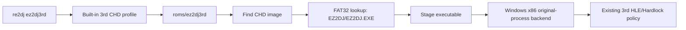

# ez2dj3rd CHD 프로파일 전환 설계

## 한국어

### 목적

`ez2dj3rd` shortcut이 추출 디렉터리의 `ez2dj/EZ2DJ.EXE`를 선택하지 않고, 사용자가 추가한 원본 CHD를 입력 HDD로 사용하도록 전환합니다.

### 확인된 CHD 구조

사용자 자산 `roms/ez2dj3rd/ez2dj3rd.chd`를 읽은 결과는 다음과 같습니다.

- CHD v5, logical bytes `10,262,568,960`, hunk `4096`, unit `512`
- FAT32 LBA partition, partition LBA `63`, data LBA `19641`
- sectors per cluster `16`, cluster count `1,250,838`, volume label `NO NAME`
- 내부 실행 파일 `EZ2DJ/EZ2DJ.EXE`, size `1,216,512`
- PE32/i386, image base `0x00400000`, entry RVA `0x00642240`, sections `6`

내부 실행 파일 경로·크기·PE 식별값은 현재 3rd 프로파일이 사용하던 추출본과 일치합니다. 이 작업에서는 전체 바이트 동일성이나 보호 계약의 완전한 동일성을 별도로 주장하지 않습니다.

### 변경 정책

- `hdd_input_kind`를 `kMameChd`로 설정합니다.
- shortcut 기본 입력 경로를 `roms/ez2dj3rd`로 설정하여 그 아래 CHD를 검색합니다.
- CHD 내부 실행 경로를 `EZ2DJ/EZ2DJ.EXE`로 설정합니다.
- 기존 3rd의 VFS, dynamic resolver, DirectSound, active-console, Hardlock cfg material, detached 실행 정책은 유지합니다.
- legacy I/O와 Hardlock 응답값은 변경하지 않습니다.
- 추출 디렉터리와 CHD 원본은 저장소에 추가하지 않습니다.

### 실행 흐름

### 성공 기준

- `re2dj ez2dj3rd`가 CHD image와 `EZ2DJ/EZ2DJ.EXE`를 출력합니다.
- `--run` 없이도 CHD FAT32 lookup과 PE 정보를 검증할 수 있습니다.
- Windows x86 build, target profile unit test, product loader probe가 통과합니다.
- 실행 정책 변경은 저장소 입력 형식으로 한정되며 Hardlock·graphics 동작은 바뀌지 않습니다.

## English

### Purpose

Make the `ez2dj3rd` shortcut use the user-supplied original CHD as its input HDD instead of selecting `ez2dj/EZ2DJ.EXE` from an extracted directory.

### Confirmed CHD structure

Reading `roms/ez2dj3rd/ez2dj3rd.chd` reports CHD v5 with 10,262,568,960 logical bytes, 4,096-byte hunks, and 512-byte units. Its FAT32-LBA partition starts at LBA 63 with data LBA 19,641, 16 sectors per cluster, 1,250,838 clusters, and volume label `NO NAME`. The internal executable is `EZ2DJ/EZ2DJ.EXE`, 1,216,512 bytes, PE32/i386, image base `0x00400000`, entry RVA `0x00642240`, with six sections.

The internal path, size, and PE identity match the extracted input used by the existing 3rd profile. This task does not claim complete byte identity or independently confirm an identical protection contract.

### Policy changes

- Set `hdd_input_kind` to `kMameChd`.
- Use `roms/ez2dj3rd` as the shortcut image-search path.
- Set the CHD executable path to `EZ2DJ/EZ2DJ.EXE`.
- Preserve the existing 3rd VFS, dynamic resolver, DirectSound, active-console, Hardlock-config, and detached-run policies.
- Do not change legacy I/O or Hardlock response values.
- Do not add the extracted directory or CHD asset to the repository.

### Success criteria

- `re2dj ez2dj3rd` prints the CHD image and `EZ2DJ/EZ2DJ.EXE`.
- CHD FAT32 lookup and PE metadata can be verified without `--run`.
- The Windows x86 build, target-profile unit test, and product-loader probe pass.
- The execution-policy change is limited to the storage input format; Hardlock and graphics behavior remain unchanged.
