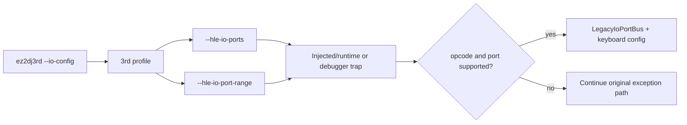

# ez2dj3rd I/O HLE 연결 설계

## 한국어

### 배경

`ez2dj3rd`는 CHD 기반 실행과 Hardlock device boundary는 활성화되어 있지만, `TargetLptdiPolicy::legacy_io_ports`가 꺼져 있어 `--io-config`가 무시됩니다. 3rd 실행 파일에서는 2nd·4th처럼 확정된 raw-I/O helper RVA를 아직 확인하지 못했습니다. 따라서 다른 버전의 helper 주소를 복사하는 것은 이 작업의 근거가 될 수 없습니다.

### 설계 정책

- 3rd 프로파일에서 `legacy_io_ports`와 `legacy_io_ports_default`를 활성화합니다.
- 3rd에는 `legacy_io_port_range_fallback`을 활성화하고, 개별 helper RVA는 0으로 유지합니다.
- fallback은 `LegacyIoPortBus`가 실제로 지원하는 포트 `0x100`–`0x106`에서만 동작합니다.
- opcode는 byte `IN AL,DX`(`0xec`)와 byte `OUT DX,AL`(`0xee`)만 허용합니다.
- 읽기는 `0x101`–`0x106`, 쓰기는 `0x100`–`0x103` 및 `0x106`만 bus가 수락합니다. 그 밖의 포트나 명령은 원본 예외 처리로 전달합니다.
- `--io-config`는 기존 Windows keyboard adapter를 초기화하고, 기존 1st SE와 동일한 공용 `LegacyIoPortBus`를 사용합니다.
- 정확한 3rd helper RVA나 실제 cabinet 배선 의미를 확인한 것으로 기록하지 않습니다. 이후 실행 로그에서 helper가 확인되면 fallback을 profile-specific RVA로 좁힐 수 있습니다.

### 실행 흐름

### 검증 범위

- 프로파일이 더 이상 `--io-config`를 무시하지 않고 I/O HLE 인자를 생성해야 합니다.
- product loader probe와 target profile unit test에서 3rd 인자 계약을 고정합니다.
- Windows x86 build와 focused CTest를 실행합니다.
- 실제 원본 실행에서는 raw-I/O trap 발생 여부, 미지원 접근의 원본 전달 여부, Hardlock 이후 진행 지점을 로그로 확인합니다.

## English

### Background

`ez2dj3rd` already has CHD-backed execution and the Hardlock device boundary, but `TargetLptdiPolicy::legacy_io_ports` is disabled, so `--io-config` is ignored. Unlike 2nd and 4th, the 3rd executable does not yet have a confirmed raw-I/O helper RVA. Copying another version's helper addresses would therefore be unsupported.

### Policy

- Enable `legacy_io_ports` and `legacy_io_ports_default` for the 3rd profile.
- Enable a 3rd-specific `legacy_io_port_range_fallback` while keeping the per-helper RVAs at zero.
- Limit fallback handling to ports `0x100` through `0x106`, which are the ports accepted by `LegacyIoPortBus`.
- Handle only byte `IN AL,DX` (`0xec`) and byte `OUT DX,AL` (`0xee`).
- The bus accepts reads from `0x101`–`0x106` and writes to `0x100`–`0x103` plus `0x106`; other ports or instructions continue through the original exception path.
- `--io-config` initializes the existing Windows keyboard adapter and uses the shared `LegacyIoPortBus`, as in 1st SE.
- Do not claim a confirmed 3rd helper RVA or physical cabinet wiring. If a helper is later confirmed by execution evidence, the fallback can be narrowed to profile-specific RVAs.

### Verification scope

- The profile must stop ignoring `--io-config` and emit the I/O HLE arguments.
- Pin the 3rd argument contract in the product-loader probe and target-profile unit test.
- Run the Windows x86 build and focused CTest.
- On an original run, inspect whether raw-I/O traps occur, whether unsupported accesses remain original exceptions, and how far execution proceeds after Hardlock.
