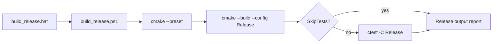

# 릴리즈 빌드 스크립트 설계

## 한국어

### 목표

Windows x86용 Release 빌드를 반복 가능한 한 명령으로 생성하고, 기본적으로 같은 Release 구성의 CTest까지 수행합니다. 기존 `build.ps1`과 `build_win32.bat`의 preset 기반 구조를 재사용하며, 원본 자산이나 실행 환경을 변경하지 않습니다.

### 정책

- 기본 configure preset은 `windows-x86-debug`를 사용하되 build configuration은 `Release`로 고정합니다. 현재 Visual Studio preset이 Debug라는 이름으로 Win32 generator와 공용 binary directory를 소유하고 있기 때문입니다.
- configure 단계에는 `RE2DJ_WARNINGS_AS_ERRORS=ON`을 전달합니다.
- build 이후 `build/<preset>`에서 `ctest -C Release --output-on-failure`를 실행합니다.
- `-SkipTests`를 지정하면 테스트만 생략하고 Release 빌드는 수행합니다.
- PowerShell을 기본 구현으로 두고, Windows command prompt에서 호출할 수 있는 `.bat` wrapper를 제공합니다.
- 출력 경로와 exit code를 명확히 보고하여 CI나 수동 릴리즈 준비에서 재사용할 수 있게 합니다.

### 흐름

### 검증

- `scripts/build_release.ps1`의 기본 실행을 Windows x86 환경에서 수행합니다.
- Release CTest 전체 결과를 확인합니다.
- `scripts/build_release.bat -SkipTests`가 PowerShell wrapper 인자를 전달하는지 확인합니다.
- 사용자 변경 파일은 staging하지 않습니다.

## English

### Goal

Provide a repeatable one-command Windows x86 Release build and, by default, run CTest for the same Release configuration. Reuse the existing preset-based structure of `build.ps1` and `build_win32.bat` without changing original assets or runtime environments.

### Policy

- Use `windows-x86-debug` as the default configure preset while fixing the build configuration to `Release`, because the current Visual Studio preset owns the Win32 generator and shared binary directory despite its Debug name.
- Pass `RE2DJ_WARNINGS_AS_ERRORS=ON` during configure.
- Run `ctest -C Release --output-on-failure` from `build/<preset>` after the build.
- `-SkipTests` skips only tests and still performs the Release build.
- Keep PowerShell as the implementation and provide a `.bat` wrapper for Windows command prompt users.
- Report the output path and preserve native exit codes for CI and manual release preparation.

### Verification

- Run the default `scripts/build_release.ps1` on the Windows x86 environment.
- Confirm the complete Release CTest result.
- Confirm `scripts/build_release.bat -SkipTests` forwards arguments to PowerShell.
- Do not stage user-modified files.
