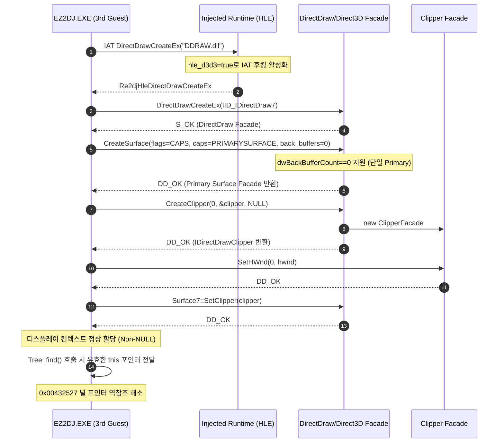

# ez2dj3rd DirectDraw/Direct3D HLE 연결 설계

## 한국어

### 배경

`ez2dj3rd.chd`의 Hardlock transform map 교체 이후 32회의 `Function 0x0e` 변환 요청이 모두 성공적으로 매핑(`mapped=1:unmapped=0`)되어 최초로 게임 코드 본체가 실행되었습니다. 게스트는 `\\.\FEnteDev` 재오픈 및 CHD 내부의 `EZ2DJ.ini` (512바이트)를 정상적으로 읽었습니다.

그러나 `EZ2DJ.ini`를 읽은 직후 `0x00432527`에서 `mov ecx, [eax+0x14]` (`EAX = 0x00000000`) 널 포인터 역참조(`0xc0000005`)가 발생했습니다. 이 함수(`0x00432506`)는 문자열 키를 인자로 받아 내부 트리를 순회하는 `Tree::find(const char* key)` 메서드이며, `this` 포인터(`ECX`)가 NULL로 전달되어 `this->root` 필드(`[eax+0x14]`)를 읽는 데 실패했습니다.

이 문제는 EZ2DJ 4th Trax(Task 164 & 165)에서 규명된 `0x00434137` 널 포인터 크래시와 동일한 원인입니다. `ez2dj3rd` 프로파일의 `hle_d3d3` 기본값이 `false`로 설정되어 있어 현대 64비트 Windows의 순정 `DDRAW.dll`을 호출하고 있었습니다.

`hle_d3d3`를 활성화한 후 런타임 진단 로그(`ddraw.log`)를 관찰한 결과:
1. `DirectDrawCreateEx` 인터셉션 및 디바이스 열거, 윈도우 생성이 정상적으로 진행되었으나, 게스트가 `CreateSurface`로 백버퍼 없는 단일 프라이머리 서피스(`flags=DDSD_CAPS, caps=DDSCAPS_PRIMARYSURFACE, dwBackBufferCount=0`)를 생성 요청했을 때 Direct3D HLE 파사드가 `dwBackBufferCount != 1` 조건을 이유로 `DDERR_UNSUPPORTED`(`0x80004001`, `E_NOTIMPL`)를 반환하며 실패했습니다.
2. 단일 프라이머리 서피스 생성을 수용한 후, 게스트는 윈도우 모드 렌더링을 위해 `IDirectDraw7::CreateClipper`를 호출했습니다. 그러나 파사드의 `Dd7CreateClipper`가 미구현 상태로 `*clipper = nullptr; return DDERR_UNSUPPORTED;`를 반환하여, 반환된 클리퍼 객체에 접근하는 과정에서 게스트가 크래시했습니다.
3. 또한 `windows_x86_launcher_probe`의 `break_exit_process` 검사에서 3rd 실행 파일의 보호 스텁(`.protect`) 특성상 `KERNEL32.dll!ExitProcess` IAT 슬롯이 정적으로 노출되지 않아 디버그 세션 준비가 거부되는 문제가 확인되었습니다.

### 변경 목표

1. `src/target/target_profile.cpp`의 `ez2dj3rd` 프로파일에 `entry.profile.run_defaults.hle_d3d3 = true;`를 활성화합니다.
2. `tests/unit/target_profile_test.cpp`의 3rd 프로파일 검증을 `hle_d3d3` 활성화 상태로 갱신합니다.
3. `src/tools/windows_product_loader_probe/main.cpp`의 3rd 프로파일 launcher 인자 검증(인자 목록 및 순서)을 갱신합니다.
4. `src/platform/windows/direct3d3_com_facade.cpp`의 `RootCreateSurface`에서 `dwBackBufferCount == 0`인 단일 프라이머리 서피스 생성을 지원하도록 허용합니다.
5. `src/platform/windows/directdraw7_com_facade.cpp`에 `IDirectDrawClipper` 인터페이스를 구현하는 `ClipperFacade`를 추가하고 `Dd7CreateClipper`에서 유효한 클리퍼 객체를 반환하도록 구현합니다.
6. `src/tools/windows_x86_launcher_probe/main.cpp`에서 `ez2dj3rd`가 4th와 마찬가지로 정적 `ExitProcess` IAT 슬롯 부재 시에도 디버그 세션을 계속 진행할 수 있도록 예외 처리를 추가합니다.
7. Windows x86 Debug/Release 빌드 및 CTest 단위 테스트를 통과시킵니다.
8. `ez2dj3rd`를 실행하여 DirectDraw HLE 연결, 단일 프라이머리 서피스 및 클리퍼 생성 성공, 크래시 해소를 검증합니다.

### 실행 흐름

---

## English

### Background

After updating the Hardlock transform map for `ez2dj3rd.chd`, all 32 `Function 0x0e` transform requests mapped successfully (`mapped=1:unmapped=0`), allowing the decrypted game executable to execute for the first time. The guest reopened `\\.\FEnteDev` and read `EZ2DJ.ini` (512 bytes) from the CHD image.

However, immediately after reading `EZ2DJ.ini`, a null pointer dereference (`0xc0000005`) occurred at `0x00432527` (`mov ecx, [eax+0x14]` with `EAX = 0x00000000`). This function (`0x00432506`) is a `Tree::find(const char* key)` dictionary lookup method, and `this` passed in `ECX` was NULL, failing when dereferencing `this->root` (`[eax+0x14]`).

This is identical in structure and cause to the `0x00434137` null pointer crash in EZ2DJ 4th Trax (Tasks 164 & 165). The `ez2dj3rd` profile defaulted to `hle_d3d3 = false`, falling back to the modern 64-bit Windows system `DDRAW.dll`.

After enabling `hle_d3d3`, the runtime diagnostic log (`ddraw.log`) revealed:
1. `DirectDrawCreateEx` interception, device enumeration, and window creation succeeded, but the guest invoked `CreateSurface` requesting a standalone primary surface without a flipping back buffer (`flags=DDSD_CAPS, caps=DDSCAPS_PRIMARYSURFACE, dwBackBufferCount=0`). The Direct3D facade rejected this with `DDERR_UNSUPPORTED` (`0x80004001`, `E_NOTIMPL`) because it strictly enforced `dwBackBufferCount == 1`.
2. After allowing standalone primary surface creation, the guest called `IDirectDraw7::CreateClipper` for windowed rendering. The facade's `Dd7CreateClipper` was unimplemented, returning `*clipper = nullptr; return DDERR_UNSUPPORTED;`, causing the guest to crash when attempting to invoke methods on the null clipper pointer.
3. In `windows_x86_launcher_probe`, the `break_exit_process` probe refused to attach because `ez2dj3rd`'s protection stub (`.protect`) does not expose a static `KERNEL32.dll!ExitProcess` IAT slot.

### Objectives

1. Enable `entry.profile.run_defaults.hle_d3d3 = true;` in the `ez2dj3rd` profile in `src/target/target_profile.cpp`.
2. Update target-profile unit tests in `tests/unit/target_profile_test.cpp` to expect `hle_d3d3 = true`.
3. Update launcher argument verification in `src/tools/windows_product_loader_probe/main.cpp` for the updated argument count and order.
4. Support standalone primary surface creation with `dwBackBufferCount == 0` in `RootCreateSurface` in `src/platform/windows/direct3d3_com_facade.cpp`.
5. Implement `ClipperFacade` for `IDirectDrawClipper` in `src/platform/windows/directdraw7_com_facade.cpp` and return a valid clipper from `Dd7CreateClipper`.
6. Update `windows_x86_launcher_probe` to permit `ez2dj3rd` to run without a static `ExitProcess` import.
7. Pass the Windows x86 Debug/Release builds and CTest unit tests.
8. Execute `ez2dj3rd` to verify DirectDraw HLE routing, surface and clipper creation, and crash resolution.
