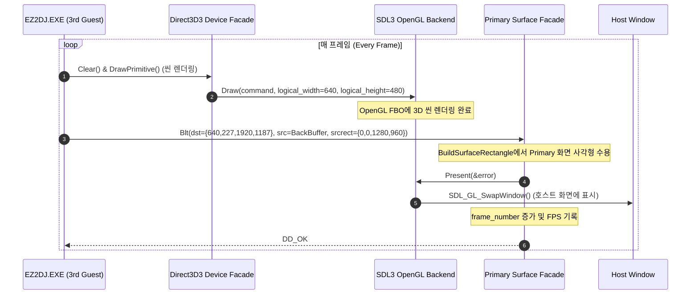
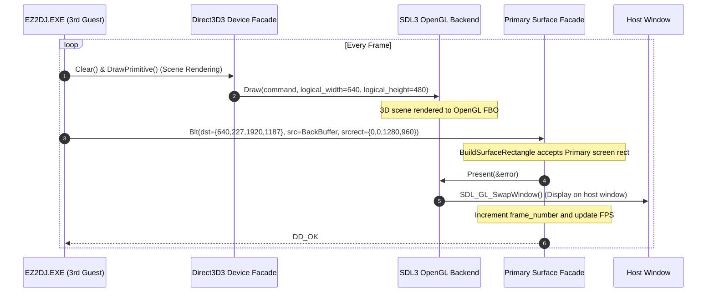

# ez2dj3rd 윈도우 모드 프라이머리 서피스 Blt 프레임 프리젠테이션 설계

## 한국어

### 배경

Task 216에서 `ez2dj3rd`의 DirectDraw/Direct3D HLE 연결 및 단일 프라이머리 서피스(`dwBackBufferCount == 0`), `IDirectDrawClipper` 파사드가 구현되어 `0x00432527` 널 포인터 크래시가 해소되었습니다. 게임은 정상적으로 루프에 진입하여 BGM과 효과음이 지속적으로 재생되는 상태에 도달했습니다.

그러나 화면에는 아무런 게임 영상이 표시되지 않고 검은 화면 상태가 지속되었습니다. 런타임 진단 로그(`logs/windows_x86_launcher_probe/ez2dj3rd/20260906-223730-504.ddraw.log`)를 정밀 분석한 결과 다음과 같은 원인이 규명되었습니다:

1. **프레임 프리젠테이션 `Blt` 실패 (`DDERR_INVALIDRECT`, `0x88760096`)**:
   EZ2DJ 3rd Trax는 풀스크린 플립 모드(`dwBackBufferCount = 1`, `Flip`)를 사용하는 4th Trax와 달리 윈도우 모드(`DDSCL_NORMAL`, `dwBackBufferCount = 0`)로 동작합니다. DirectDraw 표준 사양상 윈도우 모드에서는 `Flip`이 지원되지 않으며, 백버퍼(오프스크린 서피스 id=2, `1280x960`)에 렌더링된 내용을 프라이머리 서피스(id=1)로 `Blt`하는 방식으로 화면을 갱신합니다.
   게스트는 매 프레임 `GetClientRect`와 `ClientToScreen`을 통해 데스크톱 화면 좌표계 기준의 윈도우 영역(`dstrect = {640, 227, 1920, 1187}`)을 `PrimarySurface->Blt(...)`의 대상 사각형으로 전달합니다.
   그러나 `src/platform/windows/direct3d3_com_facade.cpp`의 `BuildSurfaceRectangle`은 `surface.width`(640)와 `surface.height`(480)를 기준으로 사각형 경계를 검사하므로, `dstrect.right`(1920) > 640 조건에 걸려 모든 256회의 `Blt` 호출이 `DDERR_INVALIDRECT`로 즉시 거부되었습니다.

2. **HLE 렌더링 백엔드 프리젠테이션(`Present`) 누락**:
   `ez2dj3rd`의 Direct3D3 장치는 오프스크린 서피스(id=2)를 렌더 타깃으로 지정하여 생성되었으며, 매 프레임 수천 개의 3D 프리미티브(`DrawPrimitive`)를 OpenGL FBO에 성공적으로 렌더링하고 있었습니다.
   그러나 `re2dj`에서 호스트 창으로 최종 스왑/표시를 수행하는 `render_backend->Present(...)` 호출은 오직 `SurfaceFlip` 내부에만 존재했습니다. 윈도우 모드인 3rd Trax는 `Flip`을 전혀 호출하지 않으므로, OpenGL FBO에 그려진 완성된 프레임이 호스트 SDL 윈도우로 스왑 버퍼되지 못했습니다.

### 변경 목표

1. `src/platform/windows/direct3d3_com_facade.cpp`의 `BuildSurfaceRectangle`에서 `DDSCAPS_PRIMARYSURFACE` 서피스에 대해 데스크톱/화면 좌표계로 전달된 유효 사각형(`right > left`, `bottom > top`)을 수용하도록 허용하고, 상대 좌표 크기(`width = right - left`, `height = bottom - top`)를 올바르게 계산합니다.
2. `SurfaceBlt`에서 대상 서피스가 `DDSCAPS_PRIMARYSURFACE`인 경우 윈도우 프레임 프리젠테이션으로 인식하고:
   - `surface->root->render_backend->Present(&error)`를 호출하여 렌더링된 FBO 영상을 호스트 윈도우로 표시합니다.
   - `Re2djExitIfWindowClosed(surface->root->window)`를 호출하여 창 닫기 이벤트를 반영합니다.
   - `++surface->root->frame_number;`를 증가시키고 `RecordPresentedFrame(surface->root);`를 호출하여 프레임 카운트 및 FPS 계산을 정상 갱신합니다.
   - `DD_OK`(`0x00000000`)를 반환합니다.
3. Windows x86 Release 빌드 및 CTest 단위 테스트를 통과시킵니다.
4. `ez2dj3rd`를 실행하여 윈도우 모드에서 화면 그래픽이 사운드와 함께 정상 출력되는지 검증합니다.

### 실행 흐름

---

## English

### Background

In Task 216, DirectDraw/Direct3D HLE integration, standalone primary surface allocation (`dwBackBufferCount == 0`), and `IDirectDrawClipper` facade support for `ez2dj3rd` were implemented, resolving the `0x00432527` null pointer crash. The game entered its main loop properly with continuous BGM and sound effect playback.

However, the display window remained entirely black. Detailed analysis of runtime diagnostic logs (`logs/windows_x86_launcher_probe/ez2dj3rd/20260906-223730-504.ddraw.log`) identified the following root causes:

1. **Frame Presentation `Blt` Failure (`DDERR_INVALIDRECT`, `0x88760096`)**:
   Unlike EZ2DJ 4th Trax, which operates in fullscreen page-flipping mode (`dwBackBufferCount = 1`, `Flip`), EZ2DJ 3rd Trax runs in windowed mode (`DDSCL_NORMAL`, `dwBackBufferCount = 0`). In the DirectDraw specification, page flipping is unsupported in windowed mode; windowed games present by blitting from their offscreen backbuffer (surface id=2, `1280x960`) to the primary surface (id=1).
   Every frame, the guest invokes `GetClientRect` and `ClientToScreen` to determine the window client bounds in desktop screen coordinates (`dstrect = {640, 227, 1920, 1187}`) and passes them to `PrimarySurface->Blt(...)`.
   However, `BuildSurfaceRectangle` in `src/platform/windows/direct3d3_com_facade.cpp` validates bounds strictly against `surface.width` (640) and `surface.height` (480). Because `dstrect.right` (1920) > 640, all 256 `Blt` invocations failed immediately with `DDERR_INVALIDRECT`.

2. **Missing HLE Render Backend Presentation (`Present`)**:
   The Direct3D3 device for `ez2dj3rd` was created with offscreen surface id=2 as its render target, successfully issuing thousands of 3D primitives (`DrawPrimitive`) to the OpenGL FBO every frame.
   However, the `render_backend->Present(...)` call that performs buffer swapping to the host window was only invoked inside `SurfaceFlip`. Because 3rd Trax runs in windowed mode and never calls `Flip`, the completed frames rendered in the OpenGL FBO were never presented/swapped to the host SDL window.

### Objectives

1. Update `BuildSurfaceRectangle` in `src/platform/windows/direct3d3_com_facade.cpp` to accept valid desktop screen coordinates (`right > left`, `bottom > top`) when the target surface has `DDSCAPS_PRIMARYSURFACE`, correctly computing normalized dimensions (`width = right - left`, `height = bottom - top`).
2. Recognize blits targeting `DDSCAPS_PRIMARYSURFACE` in `SurfaceBlt` as windowed frame presentations:
   - Call `surface->root->render_backend->Present(&error)` to swap the rendered FBO to the host window.
   - Call `Re2djExitIfWindowClosed(surface->root->window)` to handle host window close events.
   - Increment `++surface->root->frame_number;` and call `RecordPresentedFrame(surface->root);` to advance frame counting and FPS tracking.
   - Return `DD_OK` (`0x00000000`).
3. Pass Windows x86 Release build and all CTest unit tests.
4. Run `ez2dj3rd` to verify that game graphics are rendered and presented alongside working sound in windowed mode.

### Execution Flow

