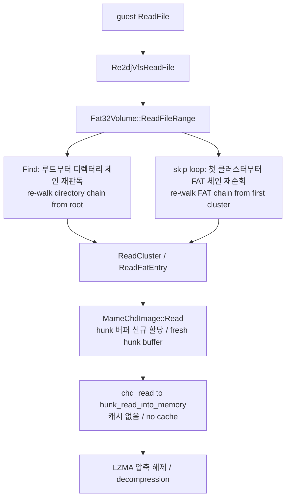
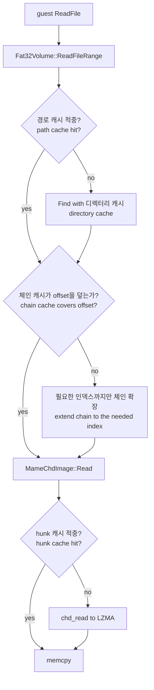
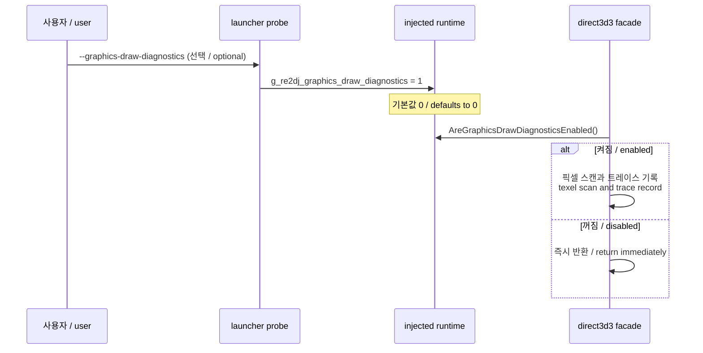

# 20260907-219 런타임 핫 경로 성능 설계 / Runtime Hot-Path Performance Design

## 배경

`ez2dj4th` 프로파일 실행에서 성능 저하가 관찰되었다. 코드 조사 결과 저장소 판독 경계, OpenGL draw 경계, draw 경로 진단 코드 세 곳에서 호출당 비용이 구조적으로 누적되고 있음을 확인했다. 이 문서는 그 세 경계의 설계 변경을 정리한다.

이 작업은 **성능 특성만** 바꾸고 게스트가 관찰하는 바이트, 픽셀, 상태는 바꾸지 않는 것을 전제로 한다. 원본 게임 로직과 HLE 경계의 의미는 그대로 유지한다.

## Background

Running the `ez2dj4th` profile showed degraded performance. Code inspection confirmed that per-call cost accumulates structurally at three boundaries: the storage read path, the OpenGL draw path, and the diagnostics embedded in the draw path. This document records the design change for those three boundaries.

The work changes **performance characteristics only**. The bytes, pixels, and state the guest observes must stay identical, and the meaning of the original game logic and the HLE boundary is preserved.

---

## 확인된 사실 / Confirmed Facts

아래는 코드와 실행으로 확인한 내용이다.

* `re2dj_chd_probe roms/ez2dj4th/ez2dj4th.chd` 결과: CHD v5, hunk 4,096바이트, unit 512바이트, 코덱 `lzma,zlib,huff,flac`.
* 이 저장소의 `libchdr`는 `chd_read`가 곧바로 `hunk_read_into_memory`로 진입하며 hunk 캐시가 없다. 같은 hunk를 반복 요청하면 매번 다시 압축을 푼다.
* `MameChdImage::Read`는 호출마다 hunk 크기 버퍼를 새로 할당한다.
* `Fat32Volume::ReadFileRange`는 호출마다 `Find()`로 경로를 다시 해석하고, `offset`에 도달할 때까지 FAT 체인을 첫 클러스터부터 다시 걷는다.
* `Sdl3OpenGlBackend::Draw`는 draw 1회마다 `SDL_GL_MakeCurrent` 1회, `glGetUniformLocation` 5회, `std::vector<GlVertex>` 힙 할당 1회, `glGetError` 1회를 수행한다.
* `ReportLateDrawDiagnostic`은 서피스가 dirty 상태일 때 텍스처 전 픽셀을 스캔하며, 이 함수는 draw 경로에서 예산 소진 전까지 호출된다.
* Windows 실행 파일은 현재 Debug 구성만 빌드되어 있다. 이 항목은 이번 작업 범위에 포함하지 않는다.

*Confirmed by code inspection and by running the tools: the 4th CHD is v5 with 4,096-byte hunks, 512-byte units, and LZMA in its codec set; this repository's `libchdr` has no hunk cache, so `chd_read` decompresses on every call; `MameChdImage::Read` allocates a hunk-sized buffer per call; `Fat32Volume::ReadFileRange` re-resolves the path and re-walks the FAT chain from the first cluster on every call; `Sdl3OpenGlBackend::Draw` performs one `SDL_GL_MakeCurrent`, five `glGetUniformLocation` calls, one vector allocation, and one `glGetError` per draw; `ReportLateDrawDiagnostic` scans every texel of a dirty surface from inside the draw path. Only Debug configurations are currently built for Windows, which is out of scope here.*

---

## 현재 판독 경로 / Current Read Path

읽기 오프셋이 커질수록 E 단계의 홉 수가 선형으로 늘고, 각 홉이 I 단계를 한 번씩 유발하므로 파일 하나를 순차로 읽는 총 비용이 제곱으로 증가한다.

*As the read offset grows, the number of hops in step E grows linearly and each hop triggers one decompression in step I, so the total cost of reading one file sequentially grows quadratically.*

---

## 변경 1: CHD hunk 캐시 / Change 1: CHD Hunk Cache

`ChdHunkCache`를 플랫폼 공용 저장소 계층의 독립 구성요소로 새로 만든다. 책임이 분리되므로 전용 header/source에 둔다.

* 위치: `include/re2dj/storage/chd_hunk_cache.h`, `src/storage/chd_hunk_cache.cpp`
* 정책: LRU. 총 바이트 예산으로 항목 수를 정하고, hunk 크기로 나눈 값을 용량으로 쓴다.
* 기본 예산: 32 MiB. 4,096바이트 hunk 기준 8,192개 항목이다.
* 캐시는 **읽기 전용 이미지**를 전제로 한다. 원본 CHD는 절대 변경되지 않으므로 무효화 정책이 필요 없다.
* `MameChdImage::Read`는 hunk 번호를 캐시에 먼저 묻고, 없을 때만 `chd_read`를 호출한 뒤 결과를 캐시에 넣는다. 호출당 버퍼 할당은 사라진다.

FAT 항목 하나는 4바이트이므로 4,096바이트 hunk 하나에 1,024개가 들어간다. 체인을 순차로 걷는 동안 같은 hunk를 계속 다시 쓰게 되므로 캐시 적중률이 매우 높다.

*A new `ChdHunkCache` component is added to the platform-neutral storage layer in its own header and source, since it is an independently named responsibility. It is an LRU keyed by hunk number, sized from a total byte budget (32 MiB by default, which is 8,192 entries for 4,096-byte hunks). The cache assumes a read-only image — the original CHD is never modified — so no invalidation policy is needed. `MameChdImage::Read` consults the cache first and calls `chd_read` only on a miss, which also removes the per-call buffer allocation. One 4,096-byte hunk holds 1,024 four-byte FAT entries, so walking a chain sequentially reuses the same hunk repeatedly and the hit rate is high.*

### 스레드 안전성 / Thread Safety

게스트는 여러 스레드에서 파일 API를 호출할 수 있다. 현재 `MameChdImage`와 `Fat32Volume`에는 잠금이 없고, `libchdr`의 내부 압축 해제 버퍼도 공유 상태다. 캐시를 도입하면서 두 클래스에 `std::mutex`를 함께 넣어 판독 경로 전체를 직렬화한다. LZMA 해제 비용에 비하면 잠금 비용은 무시할 수 있고, 기존에 존재하던 경합 위험도 함께 제거된다.

*The guest can call the file APIs from several threads. Neither class locks today, and libchdr's internal decompression buffers are shared state. A `std::mutex` is added to both classes alongside the cache so the whole read path is serialized. The lock cost is negligible next to LZMA decompression, and it also removes a race that already existed.*

---

## 변경 2: FAT32 조회 캐시 / Change 2: FAT32 Lookup Caches

`Fat32Volume`에 세 가지 캐시를 추가한다. 볼륨이 읽기 전용이므로 세 캐시 모두 무효화가 필요 없다.

| 캐시 | 키 | 값 | 제거하는 비용 |
| --- | --- | --- | --- |
| 디렉터리 캐시 | 디렉터리 첫 클러스터 | `Fat32Entry` 목록 | 디렉터리 체인 재판독과 LFN 재파싱 |
| 경로 캐시 | 소문자 정규화 경로 | `Fat32Entry` | `Find()`의 구성요소별 디렉터리 순회 |
| 클러스터 체인 캐시 | 파일 첫 클러스터 | 클러스터 번호 배열 | `offset` 도달까지의 FAT 체인 재순회 |

클러스터 체인 캐시는 필요한 인덱스까지만 지연 확장한다. 파일 전체 체인을 미리 걷지 않는다.

`ReadFileRange`는 중간 클러스터 버퍼를 없애고 `MameChdImage::Read`로 목적지 버퍼에 직접 판독한다.

*Three caches are added to `Fat32Volume`: a directory cache keyed by the directory's first cluster holding its entry list, a path cache keyed by the lowercased normalized path holding the resolved entry, and a cluster-chain cache keyed by the file's first cluster holding the chain as an array. The volume is read-only, so none of them need invalidation. The chain cache is extended lazily only as far as the requested index, never pre-walking the whole file. `ReadFileRange` also drops its intermediate cluster buffer and reads straight into the caller's destination through `MameChdImage::Read`.*

### 변경 후 판독 경로 / Read Path After the Change

---

## 변경 3: OpenGL draw 경계 / Change 3: OpenGL Draw Boundary

`Sdl3OpenGlBackend`의 draw 1회당 고정 비용을 제거한다. 그려지는 결과는 바뀌지 않는다.

* **uniform location 캐시.** 프로그램 링크 직후 위치를 한 번 조회해 `Impl`에 보관한다. draw마다 문자열로 다시 묻지 않는다.
* **정점 변환 버퍼 재사용.** `Impl`이 `std::vector<GlVertex>` 스크래치를 소유하고 draw마다 `clear()` 후 재사용한다. 힙 할당이 사라진다.
* **컨텍스트 현재화 생략.** 컨텍스트가 이미 현재 상태이면 `SDL_GL_MakeCurrent`를 건너뛴다. 이 프로세스에서 GL 컨텍스트를 쓰는 주체는 이 backend뿐이므로 플래그 추적으로 충분하다.
* **정점 속성 배열 상시 활성화.** 초기화 시 한 번 활성화하고 draw마다 활성/비활성을 반복하지 않는다.
* **텍스처 파라미터 변경 시에만 설정.** 캐시된 텍스처마다 마지막으로 설정한 필터와 주소 모드를 기억하고, 값이 바뀔 때만 `glTexParameteri`를 호출한다.
* **`glGetError` 조건부화.** 초기 draw 일정 횟수까지는 그대로 검사하고, 그 이후에는 진단이 켜졌을 때만 draw마다 검사한다. `Present`는 프레임마다 항상 검사한다.

`glGetError`를 매 draw에서 부르지 않게 되는 대신 프레임 단위 검사와 초기 draw 검사가 남으므로, 지속적인 GL 실패는 여전히 검출된다. 특정 draw 하나만 실패하는 경우의 즉시성은 낮아진다. 이 절충은 의도된 것이며 진단 플래그로 원래 동작을 복구할 수 있다.

*The per-draw fixed cost in `Sdl3OpenGlBackend` is removed without changing what is drawn: uniform locations are resolved once after link and stored in `Impl`; a scratch `std::vector<GlVertex>` owned by `Impl` is cleared and reused instead of allocated per draw; `SDL_GL_MakeCurrent` is skipped when the context is already current, which is sufficient because this backend is the only GL consumer in the process; vertex attribute arrays are enabled once at initialization instead of toggled per draw; texture parameters are set only when the cached per-texture filter or address mode actually changes; and `glGetError` is checked per draw only for an initial number of draws or while diagnostics are enabled, while `Present` always checks once per frame. Persistent GL failure is therefore still detected through the per-frame check and the initial draw checks; only the immediacy of a single failing draw is reduced, which is a deliberate trade-off that the diagnostic flag restores.*

---

## 변경 4: draw 경로 진단 게이트 / Change 4: Gating Draw-Path Diagnostics

draw 경로 안의 진단 세 개는 예산 상한이 있지만 상한 자체가 크고, 상한에 도달하기 전까지 프레임 비용을 크게 늘린다. 특히 `ReportLateDrawDiagnostic`은 dirty 서피스마다 텍스처 전 픽셀을 두 번 스캔한다.

새 스위치를 도입해 제품 실행 경로에서는 이 셋을 끈다.

* 주입 런타임에 `g_re2dj_graphics_draw_diagnostics` export를 추가한다. 기본값 0이다.
* launcher probe에 `--graphics-draw-diagnostics` 옵션을 추가하고, 지정되었을 때만 원격 프로세스의 그 변수에 1을 쓴다.
* `ReportDrawDiagnostic`, `ReportLateDrawDiagnostic`, `ReportTransformDiagnostic`은 이 값이 0이면 즉시 반환한다.
* 초기화와 일회성 진단(`CreateSurface`, cooperative level, render state 변화 등)은 그대로 둔다. 이들은 이미 소량이고 부팅 문제 조사에 필요하다.
* 제품 경로인 `re2dj <profile> --run`은 이 옵션을 전달하지 않으므로 기본적으로 꺼진다.

기존 그래픽 트레이스 경로 변수 `g_re2dj_graphics_trace_path`는 launcher가 항상 채우므로 스위치로 쓸 수 없다. 그래서 별도 변수를 둔다.

*The three diagnostics inside the draw path are budgeted, but the budgets are large and the cost before they are exhausted is significant — `ReportLateDrawDiagnostic` in particular scans every texel of a dirty surface twice. A new switch turns those three off on the product path: the injected runtime exports `g_re2dj_graphics_draw_diagnostics` defaulting to 0, the launcher probe gains a `--graphics-draw-diagnostics` option that writes 1 into it in the remote process, and `ReportDrawDiagnostic`, `ReportLateDrawDiagnostic`, and `ReportTransformDiagnostic` return immediately when it is 0. Initialization and one-shot diagnostics stay on because they are already small and are needed for boot investigations. The product path `re2dj <profile> --run` does not pass the option, so it is off by default. The existing `g_re2dj_graphics_trace_path` cannot serve as the switch because the launcher always fills it.*

### 진단 스위치 경로 / Diagnostic Switch Path

---

## 범위 밖 / Out of Scope

다음은 이번 작업에서 다루지 않는다.

* Windows Release 빌드 구성 도입.
* 주입 런타임의 파일 API 진입부에 있는 무조건 `OutputDebugStringA` 제거.
* 서피스 Lock/Unlock 시 발생하는 RGB565 to RGBA8 전체 변환 재업로드의 부분 갱신화.

*Not covered here: introducing a Windows Release build configuration, removing the unconditional `OutputDebugStringA` at the injected runtime file API entry points, and converting the full RGB565-to-RGBA8 re-upload after a surface Lock/Unlock into a partial update.*

---

## 검증 전략 / Verification Strategy

* 새 `ChdHunkCache`에 대한 단위 테스트를 추가한다. 적중, 미적중, 제거 순서, 용량 경계를 확인한다.
* 기존 `fat32_chd_test`, `mame_chd_test`, `target_profile_test`가 계속 통과해야 한다.
* 원본 자산 없이도 저장소가 빌드되고 단위 테스트가 통과해야 한다는 규칙을 유지한다.
* 사용자 제공 CHD가 있는 환경에서는 `re2dj_chd_probe`로 동일한 FAT32 값과 PE 헤더가 나오는지 확인한다. 판독 결과가 변하면 안 된다.
* OpenGL 경계는 단위 테스트 대상이 아니므로 빌드 검증과 실행 관찰로 확인하고, 관찰 결과를 작업 로그에 남긴다.

*A unit test is added for `ChdHunkCache` covering hits, misses, eviction order, and the capacity boundary. The existing `fat32_chd_test`, `mame_chd_test`, and `target_profile_test` must keep passing, and the repository must still build and pass unit tests with no original assets present. Where a user-supplied CHD is available, `re2dj_chd_probe` must report the same FAT32 values and PE header as before, since read results must not change. The OpenGL boundary is not unit-testable here, so it is verified by build and runtime observation recorded in the work log.*

---

## 관련 문서 / Related Documents

* [docs/analysis/ez2dj4th-chd-filesystem.md](../analysis/ez2dj4th-chd-filesystem.md)
* [docs/analysis/ez2dj4th-graphics-path.md](../analysis/ez2dj4th-graphics-path.md)
* [docs/analysis/ez2dj-asset-loading-path.md](../analysis/ez2dj-asset-loading-path.md)
