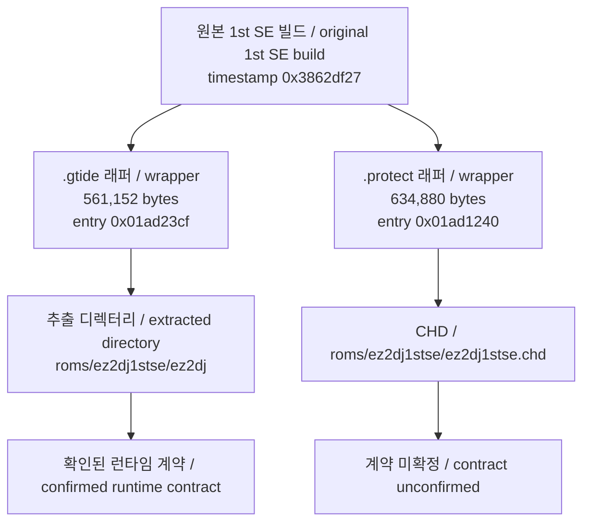
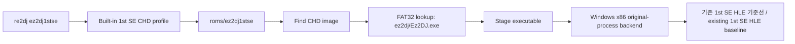

# ez2dj1stse CHD 프로파일 전환 설계

## 한국어

### 목적

`ez2dj1stse` shortcut이 추출 디렉터리 `roms/ez2dj1stse/ez2dj/ez2dj.exe`를 선택하지 않고, 사용자가 추가한 원본 CHD `roms/ez2dj1stse/ez2dj1stse.chd`를 입력 HDD로 사용하도록 전환합니다. [ez2dj3rd CHD 프로파일 전환](20260906-213-ez2dj3rd-chd-profile.md)과 같은 형태를 따릅니다.

### 확인된 CHD 구조

전체 관측값은 [ez2dj1stse CHD 파일시스템 분석](../analysis/ez2dj1stse-chd-filesystem.md)에 있습니다. 설계 판단에 직접 쓰이는 값만 옮기면 다음과 같습니다.

- CHD v5, logical bytes `4,310,433,792`, hunk `4096`, unit `512`
- FAT32 partition LBA `63`, data LBA `16505`, cluster count `1,050,194`, volume label `EZ2DJ_SE`
- 내부 실행 파일 `ez2dj/Ez2DJ.exe`, size `634,880`
- PE32/i386, image base `0x00400000`, entry RVA `0x01ad1240`, sections `6`, 진입점은 `.protect`
- 게스트 부팅 경로는 StartUp 바로 가기의 `C:\ez2dj\Ez2DJ.exe`

### 3rd 전환과 다른 점

3rd 전환에서는 CHD 내부 실행 파일이 추출본과 경로·크기·PE 식별값까지 일치했습니다. 1st SE는 **일치하지 않습니다.**

- CHD 쪽은 `.protect` RWX 보호본(entry `0x01ad1240`, 6 sections, `.text` 암호화)
- 추출본은 `.gtide`/`.gdata`/`.gidata` 보호본(entry `0x01ad23cf`, 8 sections, `.text` 평문)
- 두 파일은 PE timestamp가 같고 앞 5개 섹션 배치가 같으며 `.idata` raw 바이트가 동일

지금까지 확인된 1st SE 런타임 계약(LPTDI mock, target state `0900000000000000`, coin flow, legacy I/O helper RVA)은 모두 `.gtide` 빌드에서 얻은 것입니다. 이 설계는 그 계약이 `.protect` 빌드에서도 성립한다고 주장하지 않습니다.

### 변경 정책

- `hdd_input_kind`를 `kMameChd`로 설정합니다.
- `default_hdd_image_relative_path`를 `roms/ez2dj1stse`로 두어 그 아래 CHD를 검색합니다.
- `default_hdd_directory_relative_path`는 3rd와 같이 `roms/ez2dj1stse`로 유지합니다.
- `executable_relative_path`를 `ez2dj/Ez2DJ.exe`로 설정합니다.
- `guest_drive_letter`를 `D`에서 `C`로 바꿉니다. CHD의 StartUp 바로 가기와 `ez2dj/SYSTEM.INI`가 모두 `C`를 가리키므로, 기존 `D` 값은 이 입력에 대해 틀린 값입니다.
- 기존 1st SE HLE 정책(command line, Windows directory, VFS, D3D3, DirectSound, LPTDI mock, demo volume `3`, detached 실행, legacy I/O helper RVA)은 호환성 기준선으로 그대로 유지합니다.
- profile note에 실행 파일이 다른 보호 계열이라는 확인된 사실과, 그 결과 실행 계약이 미확정이라는 점을 명시합니다.
- Hardlock 응답값, legacy I/O helper RVA, graphics 정책은 이 작업에서 바꾸지 않습니다.
- 원본 CHD와 추출 실행 파일은 저장소에 추가하지 않습니다.

### 추출 디렉터리 처리

`MatchBuiltInTargetProfiles`는 `hdd_input_kind != kDirectory`인 built-in을 건너뜁니다. 따라서 전환 후 `re2dj --hdd roms/ez2dj1stse/ez2dj`는 built-in `ez2dj1stse` 대신 generic detected profile `ez2dj`를 제시합니다. 3rd 전환과 동일한 결과이며, 사용자 확인을 거친 선택입니다. 별도 디렉터리 전용 profile은 추가하지 않습니다.

### 실행 흐름

### 성공 기준

- `re2dj ez2dj1stse`가 CHD image 경로와 `ez2dj/Ez2DJ.exe`를 출력합니다.
- `--run` 없이도 CHD FAT32 lookup과 PE 정보를 검증할 수 있습니다.
- target profile unit test가 CHD 입력 정책과 추출 디렉터리 fallback을 고정합니다.
- Windows x86 build와 unit test가 통과합니다.
- 변경 범위가 저장소 입력 형식과 게스트 경로 값에 한정되고, Hardlock·graphics 동작은 바뀌지 않습니다.

## English

### Purpose

Make the `ez2dj1stse` shortcut use the user-supplied original CHD `roms/ez2dj1stse/ez2dj1stse.chd` as its input HDD instead of selecting `roms/ez2dj1stse/ez2dj/ez2dj.exe` from an extracted directory, following the same shape as the [ez2dj3rd CHD profile conversion](20260906-213-ez2dj3rd-chd-profile.md).

### Confirmed CHD structure

The complete observations live in the [ez2dj1stse CHD filesystem analysis](../analysis/ez2dj1stse-chd-filesystem.md). The values this design depends on are: CHD v5 with 4,310,433,792 logical bytes, 4,096-byte hunks, and 512-byte units; a FAT32 partition at LBA 63 with data LBA 16,505, 1,050,194 clusters, and volume label `EZ2DJ_SE`; the internal executable `ez2dj/Ez2DJ.exe` at 634,880 bytes; PE32/i386 with image base `0x00400000`, entry RVA `0x01ad1240` inside `.protect`, and six sections; and a guest boot path of `C:\ez2dj\Ez2DJ.exe` taken from the StartUp shortcut.

### How this differs from the 3rd conversion

In the 3rd conversion the CHD's internal executable matched the extracted one in path, size, and PE identity. For 1st SE it **does not match**. The CHD holds a `.protect` RWX-protected build (entry `0x01ad1240`, six sections, encrypted `.text`), while the extracted dump holds a `.gtide`/`.gdata`/`.gidata` build (entry `0x01ad23cf`, eight sections, plaintext `.text`). The two share a PE timestamp, the placement of their first five sections, and byte-identical raw `.idata`.

Every 1st SE runtime contract confirmed so far — the LPTDI mock, target state `0900000000000000`, the coin flow, and the legacy-I/O helper RVAs — was established on the `.gtide` build. This design does not claim those hold for the `.protect` build.

### Policy changes

- Set `hdd_input_kind` to `kMameChd`.
- Use `roms/ez2dj1stse` as the shortcut image-search path.
- Keep `default_hdd_directory_relative_path` at `roms/ez2dj1stse`, as the 3rd profile does.
- Set the CHD executable path to `ez2dj/Ez2DJ.exe`.
- Change `guest_drive_letter` from `D` to `C`, because the CHD's StartUp shortcut and `ez2dj/SYSTEM.INI` both name `C`, making the previous `D` wrong for this input.
- Preserve the existing 1st SE HLE policy — command line, Windows directory, VFS, D3D3, DirectSound, LPTDI mock, demo volume `3`, detached execution, and the legacy-I/O helper RVAs — as a compatibility baseline.
- State in the profile note, as confirmed fact, that the executable belongs to a different protection family and that its execution contract is therefore unconfirmed.
- Do not change Hardlock responses, legacy-I/O helper RVAs, or graphics policy in this task.
- Do not add the original CHD or extracted executables to the repository.

### Handling of the extracted directory

`MatchBuiltInTargetProfiles` skips built-ins whose `hdd_input_kind` is not `kDirectory`. After the conversion, `re2dj --hdd roms/ez2dj1stse/ez2dj` therefore offers the generic detected profile `ez2dj` rather than the built-in `ez2dj1stse`. That matches the 3rd conversion's outcome and was confirmed with the user. No separate directory-only profile is added.

### Success criteria

- `re2dj ez2dj1stse` prints the CHD image path and `ez2dj/Ez2DJ.exe`.
- CHD FAT32 lookup and PE metadata can be verified without `--run`.
- The target-profile unit test pins both the CHD input policy and the extracted-directory fallback.
- The Windows x86 build and unit tests pass.
- The change stays limited to the storage input format and the guest path values; Hardlock and graphics behavior remain unchanged.
