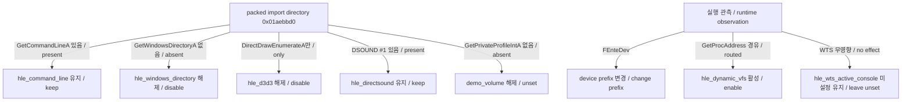
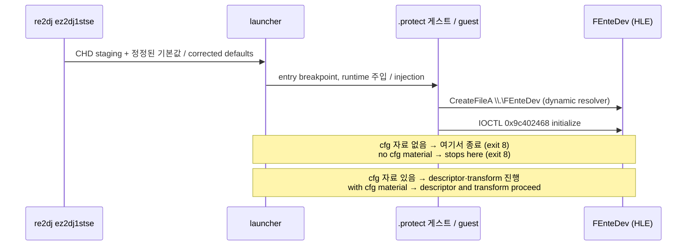

# ez2dj1stse CHD 프로파일 실행 정책 정정 설계

## 한국어

### 목적

[CHD 프로파일 전환](20260908-222-ez2dj1stse-chd-profile.md)에서 호환성 기준선으로 유지했던 1st SE 실행 기본값을, CHD `.protect` 빌드에서 실제로 관측한 사실에 맞게 정정합니다.

전환 당시에는 이 빌드의 실행 계약이 미확정이어서 `.gtide` 빌드의 값을 그대로 두었습니다. 이후 [Hardlock descriptor 추출 실행](../analysis/ez2dj1stse-chd-filesystem.md)과 packed import directory 파싱으로 각 항목의 성립 여부가 확정되었습니다.

### 확정 근거

#### 1. Packed import directory — 확인됨

CHD 실행 파일의 import data directory는 RVA `0x01aebbd0`(`.protect` 범위 안)이며, 원본 `.idata`(RVA `0x01aba000`)는 더 이상 PE header가 가리키지 않습니다. 정적으로 보이는 import는 다음이 전부입니다.

| 모듈 | 항목 |
| --- | --- |
| `KERNEL32.dll` | `CloseHandle`, `LocalAlloc`, `GetEnvironmentVariableA`, `LocalFree`, `Sleep`, `GetProcAddress`, `LoadLibraryA`, `GetVersion`, `CreateFileA`, `GetCurrentProcessId`, `SetErrorMode`, `GetModuleHandleA`, `FreeLibrary`, `GetCommandLineA`, `RtlUnwind` |
| `USER32.dll` | `MessageBoxA`, `wsprintfA` |
| `GDI32.dll` | `GetStockObject` |
| `ADVAPI32.dll` | `RegFlushKey` |
| `DSOUND.dll` | ordinal `#1` |
| `WINMM.dll` | `mixerGetControlDetailsA` |
| `DDRAW.dll` | `DirectDrawEnumerateA` |

launcher의 HLE 준비는 모두 이 표에서 IAT 슬롯을 찾습니다. 따라서 준비 성공/실패가 이 표 하나로 전부 설명됩니다.

- `GetCommandLineA` 있음 → `hle_command_line` 성립
- `GetWindowsDirectoryA` 없음 → `hle_windows_directory` 실패
- `DirectDrawCreate`·`DirectDrawCreateEx` 없음(`DirectDrawEnumerateA`만 있음) → `hle_d3d3` 실패
- `DSOUND.dll` ordinal `#1` 있음 → `hle_directsound` 성립
- `GetPrivateProfileIntA` 없음 → `demo_volume` 주입 실패

#### 2. 실행 관측 — 확인됨

- 이 빌드는 `\\.\NTICE`(실패) 뒤 `\\.\FEnteDev`를 엽니다. `\\.\LPTDI`는 열지 않습니다.
- `CreateFileA`, `DeviceIoControl`, `CloseHandle`은 `GetProcAddress`로 해석되어 호출되므로 dynamic resolver가 필요합니다.
- `--hle-command-line`만 켜고 `--hle-windows-directory`를 끈 실행에서 `handoff_prepared=true`, `iat_verified=true`입니다.
- `--device-mock-wts-console-session`의 유무는 IOCTL 진행에 영향이 없었습니다. 두 실행 모두 initialize 2회, handshake 2회, descriptor 18회, transform 17회로 동일합니다.

### 변경 정책

| 항목 | 현재 | 변경 후 | 근거 |
| --- | --- | --- | --- |
| `hle_command_line` | `true` | `true` (유지) | import 존재, `handoff_prepared=true` |
| `hle_windows_directory` | `true` | `false` | import 없음 |
| `hle_d3d3` | `true` | `false` | Create/CreateEx import 없음 |
| `hle_directsound` | `true` | `true` (유지) | ordinal `#1` 존재 |
| `hle_dynamic_vfs` | 미설정 | `true` | 장치 API가 `GetProcAddress` 경유 |
| `demo_volume` | `3` | 해제 | `GetPrivateProfileIntA` 없음 |
| `device_mock_path_prefix` | `\\.\LPTDI` | `\\.\FEnteDev` | 실제로 여는 장치 |
| `device_mock_target_state_hex` | `0900000000000000` | 해제 | LPTDI 전용 값, 이 빌드는 LPTDI를 열지 않음 |
| `hardlock_cfg_material_default` | 미설정 | `true` | 3rd·4th·6th와 같은 Hardlock 계열, 로컬 자료 소비 경로 필요 |
| `hle_wts_active_console` | 미설정 | 미설정 (유지) | 실험에서 차이 없음, 근거 없이 켜지 않음 |
| `legacy_io_ports` + helper RVA | 유지 | 유지 | `io_port_runtime` 준비는 성공, 실행 도달은 **미확정** |

`hardlock_cfg_material_default`는 `cfg/hardlock.ini`의 프로파일 section과 `cfg/hardlock-ez2dj1stse.map`이 있을 때만 재생값을 적용합니다. 저장소는 그 자료를 만들지 않으며, 없어도 오류가 아니라 더 이른 경계에서 멈춥니다.

### 비목표

- Hardlock transform 응답값 확정
- 이 빌드용 graphics HLE 경로 신설(packer-owned import 예외 추가)
- legacy I/O helper RVA 변경
- launcher·injected runtime 코드 변경

### 실행 흐름

### 성공 기준

- `re2dj ez2dj1stse --run`이 preparation 단계에서 실패하지 않고 게스트를 실제로 실행합니다.
- `handoff_prepared`, `d3d3_prepared`, `directsound_prepared`, `demo_volume_prepared`, `vfs_prepared`, `io_runtime_prepared`가 모두 true입니다.
- 게스트가 `\\.\FEnteDev`를 열고 Hardlock initialize까지 도달합니다.
- target profile unit test와 product loader probe가 정정된 값을 고정합니다.
- Windows x86 build와 unit test가 통과합니다.

## English

### Purpose

Correct the 1st SE execution defaults that the [CHD profile conversion](20260908-222-ez2dj1stse-chd-profile.md) kept as a compatibility baseline, bringing them in line with what was actually observed on the CHD `.protect` build.

At conversion time this build's execution contract was unresolved, so the `.gtide` build's values were left in place. The [Hardlock descriptor extraction run](../analysis/ez2dj1stse-chd-filesystem.md) and a parse of the packed import directory have since settled each item.

### Established evidence

#### 1. Packed import directory — confirmed

The CHD executable's import data directory sits at RVA `0x01aebbd0` inside `.protect`; the PE header no longer points at the original `.idata` at RVA `0x01aba000`. The complete set of statically visible imports is `KERNEL32.dll` (`CloseHandle`, `LocalAlloc`, `GetEnvironmentVariableA`, `LocalFree`, `Sleep`, `GetProcAddress`, `LoadLibraryA`, `GetVersion`, `CreateFileA`, `GetCurrentProcessId`, `SetErrorMode`, `GetModuleHandleA`, `FreeLibrary`, `GetCommandLineA`, `RtlUnwind`), `USER32.dll` (`MessageBoxA`, `wsprintfA`), `GDI32.dll` (`GetStockObject`), `ADVAPI32.dll` (`RegFlushKey`), `DSOUND.dll` (ordinal `#1`), `WINMM.dll` (`mixerGetControlDetailsA`), and `DDRAW.dll` (`DirectDrawEnumerateA`).

Every launcher HLE preparation step locates its IAT slot in that directory, so this one table explains every success and failure: `GetCommandLineA` is present so `hle_command_line` works; `GetWindowsDirectoryA` is absent so `hle_windows_directory` fails; neither `DirectDrawCreate` nor `DirectDrawCreateEx` is present, only `DirectDrawEnumerateA`, so `hle_d3d3` fails; `DSOUND.dll` ordinal `#1` is present so `hle_directsound` works; and `GetPrivateProfileIntA` is absent so the `demo_volume` injection fails.

#### 2. Runtime observation — confirmed

The build opens `\\.\NTICE` (fails) and then `\\.\FEnteDev`; it never opens `\\.\LPTDI`. `CreateFileA`, `DeviceIoControl`, and `CloseHandle` are called through `GetProcAddress`-resolved pointers, so the dynamic resolver is required. A run with `--hle-command-line` and without `--hle-windows-directory` reported `handoff_prepared=true` and `iat_verified=true`. Adding or removing `--device-mock-wts-console-session` made no difference to IOCTL progression: both runs recorded two initialize, two handshake, eighteen descriptor, and seventeen transform requests.

### Policy changes

| Item | Current | New | Evidence |
| --- | --- | --- | --- |
| `hle_command_line` | `true` | `true` (kept) | import present, `handoff_prepared=true` |
| `hle_windows_directory` | `true` | `false` | import absent |
| `hle_d3d3` | `true` | `false` | no Create/CreateEx import |
| `hle_directsound` | `true` | `true` (kept) | ordinal `#1` present |
| `hle_dynamic_vfs` | unset | `true` | device APIs routed through `GetProcAddress` |
| `demo_volume` | `3` | unset | `GetPrivateProfileIntA` absent |
| `device_mock_path_prefix` | `\\.\LPTDI` | `\\.\FEnteDev` | the device actually opened |
| `device_mock_target_state_hex` | `0900000000000000` | cleared | an LPTDI-only value; this build never opens LPTDI |
| `hardlock_cfg_material_default` | unset | `true` | same Hardlock family as 3rd, 4th, and 6th; needs the local-material path |
| `hle_wts_active_console` | unset | unset (kept) | no observed difference, so it is not enabled without evidence |
| `legacy_io_ports` and helper RVAs | kept | kept | `io_port_runtime` preparation succeeds, but execution reaching them is **unresolved** |

`hardlock_cfg_material_default` applies replay values only when both a profile section in `cfg/hardlock.ini` and `cfg/hardlock-ez2dj1stse.map` exist. The repository does not produce that material, and its absence is not an error — the run simply stops at an earlier boundary.

### Non-goals

- Establishing the Hardlock transform response
- Adding a graphics HLE path for packer-owned imports on this build
- Changing the legacy-I/O helper RVAs
- Changing launcher or injected-runtime code

### Success criteria

- `re2dj ez2dj1stse --run` no longer fails during preparation and actually executes the guest.
- `handoff_prepared`, `d3d3_prepared`, `directsound_prepared`, `demo_volume_prepared`, `vfs_prepared`, and `io_runtime_prepared` are all true.
- The guest opens `\\.\FEnteDev` and reaches the Hardlock initialize request.
- The target-profile unit test and the product-loader probe pin the corrected values.
- The Windows x86 build and unit tests pass.
