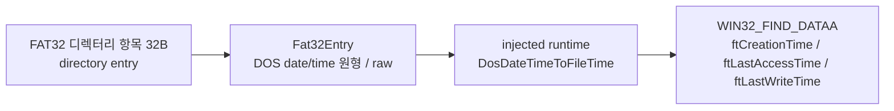

# FAT32 항목 타임스탬프와 열거 결과 설계

## 한국어

### 목적

[작업 227](../work-logs/20260908-227-ez2dj1stse-sprite-load-boundary.md)에서 1st SE 게스트가 스프라이트 비트맵의 존재만 확인하고 픽셀을 읽지 않는 것을 확인했습니다. 그 판단의 입력 후보 중 첫 번째를 검증합니다.

`PopulateFindData`는 `WIN32_FIND_DATAA`의 속성·크기·이름만 채우고 `ftCreationTime`, `ftLastAccessTime`, `ftLastWriteTime` 세 필드를 `memset`으로 0에 둡니다. Win32에서 이 세 필드는 실제 파일 시간을 담으며, 0은 1601-01-01을 뜻하는 유효하지 않은 값입니다.

### 현재 상태 — 확인됨

`Fat32Entry`는 `name`, `directory`, `attributes`, `first_cluster`, `size`만 담습니다. FAT32 디렉터리 항목은 32바이트 안에 DOS 형식 시간을 함께 담고 있는데 reader가 읽지 않습니다.

| 오프셋 | 필드 |
| --- | --- |
| `0x0E`–`0x0F` | 생성 시각 |
| `0x10`–`0x11` | 생성 날짜 |
| `0x12`–`0x13` | 마지막 접근 날짜 |
| `0x16`–`0x17` | 마지막 쓰기 시각 |
| `0x18`–`0x19` | 마지막 쓰기 날짜 |

### 설계

reader가 이 값들을 **DOS 원형 그대로** `Fat32Entry`에 싣습니다. 변환하지 않는 이유는 계층 규칙입니다. `src/storage`는 플랫폼 공용 코어이므로 `FILETIME`이나 Win32 변환 함수를 쓸 수 없습니다. Windows 주입 런타임이 `DosDateTimeToFileTime`으로 변환해 `WIN32_FIND_DATAA`를 채웁니다.

마지막 접근은 날짜만 있으므로 시각은 0으로 변환합니다. 값이 0인 항목은 변환하지 않고 0으로 남깁니다. 실제로 시간이 없는 항목과 우리가 채우지 못한 항목을 구분할 필요가 없고, `DosDateTimeToFileTime`에 0을 넣으면 실패하기 때문입니다.

### 이 설계가 검증하는 것

게스트가 열거 결과의 시간 필드로 스프라이트 적재 여부를 판단한다면, 이 변경만으로 화면에 원본 아트워크가 나타납니다. 나타나지 않으면 후보 1이 배제되고 남은 두 후보로 좁혀집니다. 어느 쪽이든 결과가 명확합니다.

동시에 이 변경은 그 가설과 무관하게 옳습니다. `FindFirstFileA`가 돌려주는 시간이 0인 것은 원본 이미지의 사실과 다르며, 시간을 보는 다른 게스트 코드도 같은 영향을 받습니다.

### 성공 기준

- CHD 열거가 원본 FAT32 항목의 생성·접근·쓰기 시간을 돌려줍니다.
- 단위 시험이 DOS 값 적재와 `WIN32_FIND_DATAA` 변환을 고정합니다.
- 3rd·4th 실행에 회귀가 없습니다.
- 1st SE 실행에서 스프라이트 적재 동작이 바뀌는지 관측하고 결과를 기록합니다.

## English

### Purpose

[Task 227](../work-logs/20260908-227-ez2dj1stse-sprite-load-boundary.md) established that the 1st SE guest checks only that each sprite bitmap exists and never reads its pixels. This design tests the first of the three candidate inputs for that decision.

`PopulateFindData` fills only the attributes, size, and name of `WIN32_FIND_DATAA`, leaving `ftCreationTime`, `ftLastAccessTime`, and `ftLastWriteTime` zeroed by its `memset`. Win32 carries real file times in those fields, and zero means 1601-01-01, which is not a valid file time.

### Current state — confirmed

`Fat32Entry` carries only `name`, `directory`, `attributes`, `first_cluster`, and `size`. A FAT32 directory entry also holds DOS-format times within its 32 bytes — creation time at `0x0E`, creation date at `0x10`, last-access date at `0x12`, write time at `0x16`, and write date at `0x18` — which the reader does not read.

### Design

The reader carries those values into `Fat32Entry` **in their raw DOS form**. They are not converted there because of the layering rule: `src/storage` is platform-neutral core and cannot use `FILETIME` or Win32 conversion functions. The Windows injected runtime converts them with `DosDateTimeToFileTime` when filling `WIN32_FIND_DATAA`.

Last access has a date but no time, so its time converts as zero. An entry whose stored value is zero is left as zero rather than converted, since `DosDateTimeToFileTime` fails on zero and there is no need to distinguish an entry that genuinely has no time from one we could not fill.

### What this design tests

If the guest decides whether to load a sprite from the time fields of the enumeration result, this change alone makes the original artwork appear. If it does not, candidate one is eliminated and the remaining two are narrowed. Either outcome is unambiguous.

The change is also correct independently of that hypothesis: returning zero times from `FindFirstFileA` misreports the original image, and any other guest code that reads file times is affected the same way.

### Success criteria

- CHD enumeration returns the creation, access, and write times of the original FAT32 entry.
- Unit tests pin both the DOS value loading and the `WIN32_FIND_DATAA` conversion.
- 3rd and 4th show no regression.
- The 1st SE run is observed for a change in sprite-loading behavior and the result is recorded.
