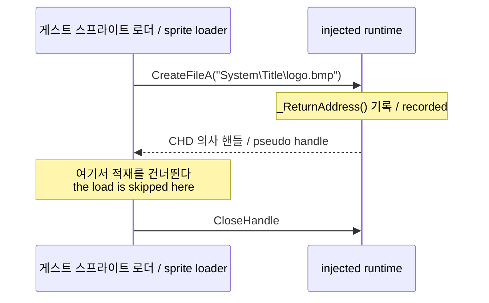

# 자산 열기 호출 지점과 코드 창 설계

## 한국어

### 목적

[작업 227](../work-logs/20260908-227-ez2dj1stse-sprite-load-boundary.md)–[229](../work-logs/20260908-229-title-str-record-scan.md)에서 1st SE 게스트가 스프라이트 비트맵을 열고 읽지 않는 것을 확인했고, 그 판단의 입력 후보 중 열거 타임스탬프와 `.str` 기대값 두 가지를 배제했습니다. 남은 것은 게스트 코드 자체의 분기이며, 자산 쪽 관측으로는 더 좁힐 수 없습니다.

이 설계는 존재 확인 직후 구간을 볼 수 있도록 **자산 열기의 호출 지점과 그 지점의 실행 시점 코드**를 기록합니다.

### 기존 수단이 맞지 않는 이유

launcher의 `--code-window`는 디버그 이벤트 루프 안에서 한 번만 캡처하며 detached 실행에는 적용되지 않습니다. 1st SE는 `run_detached` 프로파일이라 launcher가 디버거를 떼고 나갑니다.

`.protect` 빌드는 실행 시점에 `.text`를 복호화하므로 원본 파일의 바이트를 정적으로 읽어도 암호문입니다. 코드를 보려면 **프로세스 안에서** 읽어야 합니다.

주입 런타임은 게스트 프로세스 안에서 돌고, 이미 crash 보고에서 `ReadProcessMemory(GetCurrentProcess(), ...)`로 코드 창을 뜨는 패턴을 씁니다. 같은 수단을 자산 열기 경로에 붙이는 것이 가장 짧습니다.

### 설계

`Re2djVfsCreateFileA`가 `_ReturnAddress()`로 호출 지점을 얻어 자산 열기 trace에 함께 기록합니다. image base를 빼서 RVA도 같이 남기면 실행마다 달라지는 주소에 의존하지 않고 비교할 수 있습니다.

첫 번째 `.bmp` 열기에서만 그 반환 주소 주변 코드 창을 한 번 기록합니다. 호출 직후의 분기를 보는 것이 목적이므로 창은 반환 주소 앞 32바이트부터 뒤 96바이트까지로 잡습니다. 앞쪽은 호출 자체를, 뒤쪽은 반환값 검사와 분기를 담습니다.

한 번만 기록하는 이유는 같은 로더가 61회 도는 동안 같은 창을 61번 쓰면 로그만 커지기 때문입니다. `.bmp` 확장자로 한정하는 것은 `.wav`와 `.str`은 실제로 읽히므로 문제 구간이 아니기 때문입니다.

### 판별 기준

기록된 창에서 `CreateFileA` 호출 직후의 반환값 검사와 분기를 읽습니다. 다음 중 어느 쪽인지 갈립니다.

- 반환 핸들만 검사하고 곧바로 닫는다면, 이 호출은 설계상 존재 확인이고 적재는 다른 경로다.
- 반환값 외의 값을 함께 검사한다면, 그 값이 남은 후보 3을 구체화한다.

### 성공 기준

- 자산 열기 trace에 호출 지점 주소와 RVA가 남습니다.
- 첫 `.bmp` 열기의 코드 창이 한 번 기록됩니다.
- 기록된 바이트로 호출 직후 분기를 읽을 수 있습니다.
- 다른 프로파일 실행에 회귀가 없습니다.

## English

### Purpose

Tasks [227](../work-logs/20260908-227-ez2dj1stse-sprite-load-boundary.md) through [229](../work-logs/20260908-229-title-str-record-scan.md) established that the 1st SE guest opens its sprite bitmaps without reading them, and eliminated two of the three candidate inputs for that decision — the enumeration timestamps and an expected value in the `.str` record. What remains is a branch in the guest's own code, which asset-side observation cannot narrow further.

This design records **where the asset open is called from and what the code at that site looks like while running**, so the stretch right after the existence check can be read.

### Why the existing tools do not fit

The launcher's `--code-window` captures once inside the debug event loop and does not apply to a detached run, and 1st SE is a `run_detached` profile where the launcher detaches and leaves.

The `.protect` build decrypts `.text` at run time, so reading the original file statically yields ciphertext. Seeing the code requires reading it **inside the process**.

The injected runtime already runs inside the guest and already uses `ReadProcessMemory(GetCurrentProcess(), ...)` to capture a code window in its crash report. Attaching the same means to the asset-open path is the shortest route.

### Design

`Re2djVfsCreateFileA` takes its call site from `_ReturnAddress()` and records it on the asset-open trace, together with the RVA obtained by subtracting the image base so the value can be compared across runs whose addresses differ.

On the first `.bmp` open only, a code window around that return address is recorded once. Since the point is to see the branch immediately after the call, the window runs from 32 bytes before the return address to 96 bytes after it: the earlier part holds the call itself and the later part the return-value test and branch.

Recording once avoids writing the same window 61 times as the loader iterates, and limiting it to `.bmp` reflects that `.wav` and `.str` are actually read and are not the problem.

### How this decides

Reading the return-value test and branch immediately after the `CreateFileA` call separates two cases: if only the returned handle is tested before it is closed, this call is an existence check by design and loading happens on another path; if something else is tested alongside it, that value gives the remaining third candidate a concrete shape.

### Success criteria

- The asset-open trace carries the call-site address and RVA.
- One code window is recorded for the first `.bmp` open.
- The recorded bytes allow the branch after the call to be read.
- Other profiles show no regression.
