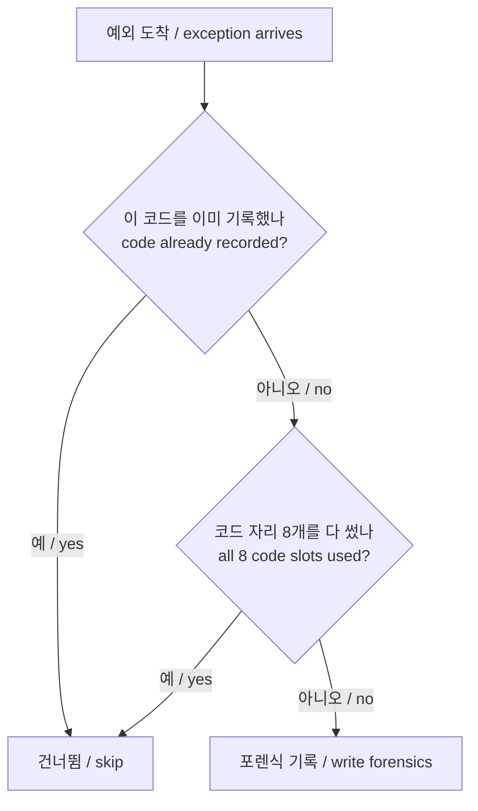

# 예외 코드별 크래시 포렌식 설계

## 한국어

### 목적

`re2dj ez2dj1stse`에서 StreetMix 진입 시 게스트가 `0xC0000094`(`STATUS_INTEGER_DIVIDE_BY_ZERO`)로 종료합니다. [4th StyleSelect 진단 설계](20260905-190-ez2dj4th-styleselect-divzero.md)가 도입한 VEH 포렌식 로깅이 이미 있지만, 1st SE에서는 그 기록이 남지 않습니다.

### 원인 — 확인됨

`ReportCrashException`은 실행 전체에서 **첫 예외 하나만** 기록합니다.

```cpp
static volatile LONG s_crash_reported = 0;
if (InterlockedCompareExchange(&s_crash_reported, 1, 0) != 0)
{
    return;
}
```

1st SE의 `.protect` 보호 계층은 진입 직후 anti-debug 목적으로 `0xC0000005`를 한 번 일으키고 자체 SEH로 처리한 뒤 정상 진행합니다. 그 무해한 예외가 유일한 기록 자리를 소모하므로, 실제로 프로세스를 끝내는 `0xC0000094`는 기록되지 않습니다.

관측된 로그가 이를 그대로 보여 줍니다. `.vfs.log` 첫 줄에 `crash-exception:code=0xc0000005:address=0x01ee5fa5`가 있고, 그 뒤 `runtime_detached_exit`는 `0xc0000094`인데 그에 대응하는 `crash-exception` 줄은 없습니다.

### 설계

기록 자리를 **예외 코드별로** 하나씩 둡니다. 처음 보는 코드는 기록하고, 이미 기록한 코드는 건너뜁니다. 서로 다른 코드는 최대 8개까지 받습니다.



전체 한도를 하나 더 두지 않는 이유는, 코드별 한 번이 이미 상한을 8건으로 묶기 때문입니다. 원래 의도였던 "로그를 예외로 채우지 않는다"는 그대로 유지됩니다. 보호 계층이 같은 코드를 반복해서 일으켜도 기록은 한 번뿐입니다.

기존 동작과의 차이는 **서로 다른 코드의 두 번째 예외가 더는 가려지지 않는다**는 점 하나입니다.

### 이 설계가 답하지 않는 것

이 변경은 `0xC0000094`의 위치와 레지스터를 보이게 할 뿐, 0 제수의 출처를 고치지 않습니다. 근본 원인 수정은 포렌식 기록을 읽은 뒤 별도로 판단합니다.

### 성공 기준

- StreetMix 진입 실행에서 `crash-exception:code=0xc0000094` 줄이 남습니다.
- 그 줄에 fault 주소, RVA, 레지스터, EIP 코드 바이트, 스택 상위 워드가 포함됩니다.
- 진입부의 `0xC0000005` 기록도 그대로 남습니다.
- 다른 프로파일 실행에 회귀가 없습니다.

## English

### Purpose

`re2dj ez2dj1stse` exits with `0xC0000094` (`STATUS_INTEGER_DIVIDE_BY_ZERO`) on entering StreetMix. The VEH forensic logging introduced by the [4th StyleSelect diagnostic design](20260905-190-ez2dj4th-styleselect-divzero.md) already exists, but it records nothing for 1st SE.

### Cause — confirmed

`ReportCrashException` records only the **first** exception of the whole run, guarded by a single `InterlockedCompareExchange` on `s_crash_reported`.

1st SE's `.protect` layer raises one `0xC0000005` right after entry as an anti-debug trick, handles it in its own SEH, and continues. That harmless exception consumes the only recording slot, so the `0xC0000094` that actually ends the process is never written.

The observed log shows exactly this: the first line of the `.vfs.log` is `crash-exception:code=0xc0000005:address=0x01ee5fa5`, and although `runtime_detached_exit` reports `0xc0000094`, no `crash-exception` line corresponds to it.

### Design

Give the recording slot a **per-exception-code** identity: record a code the first time it is seen, skip it afterwards, and accept at most eight distinct codes.

No separate overall limit is added, because one report per code already caps the total at eight and preserves the original intent of not filling the log with exceptions. A protection layer that raises the same code repeatedly is still recorded once.

The only behavioral difference from today is that a second exception **with a different code** is no longer masked.

### What this design does not answer

The change only makes the `0xC0000094` location and registers visible; it does not fix the source of the zero divisor. That root-cause fix is decided separately after reading the forensic record.

### Success criteria

- A run that enters StreetMix leaves a `crash-exception:code=0xc0000094` line.
- That line carries the fault address, RVA, registers, code bytes at EIP, and top stack words.
- The entry-time `0xC0000005` record still appears.
- Other profiles show no regression.
