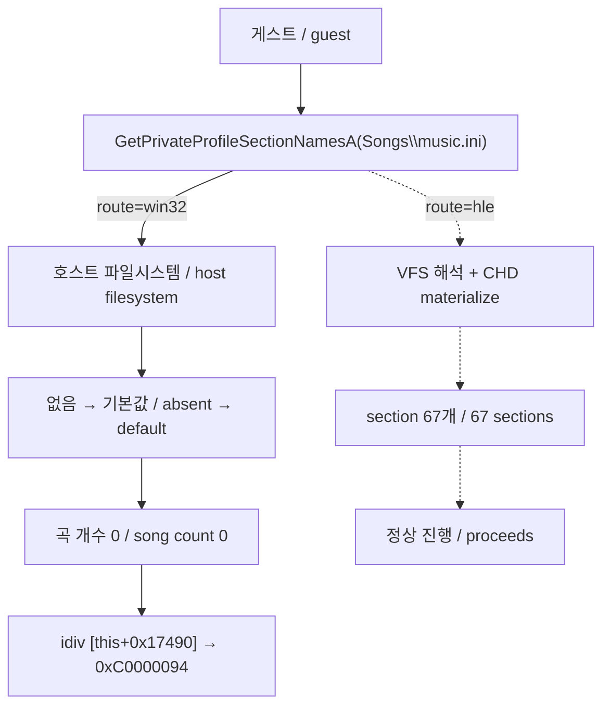

# 프로파일 API VFS 경계 설계

## 한국어

### 목적

`re2dj ez2dj1stse`에서 StreetMix 진입 시 게스트가 `0xC0000094`(정수 0 나누기)로 종료하고, 그 직전 화면이 검게 남습니다. 사용자가 보고한 두 번째·세 번째 문제입니다.

### 확인된 원인

[작업 232](../work-logs/20260908-232-crash-forensics-per-code.md)에서 확보한 포렌식이 충돌 지점을 지목했습니다. RVA `0x0002d1f9`의 `idiv dword ptr [ecx+0x17490]`이고, 제수는 `[this]`를 3으로 클램프한 값입니다. 크래시 시점 `[this]`부터 32바이트가 모두 0이었습니다.

이 `[this]`는 곡 개수입니다. CHD의 `ez2dj/Songs/music.ini`가 67개 곡 section을 담은 색인이고, 게스트는 이를 `GetPrivateProfileSectionNamesA`로 열거한 뒤 `GetPrivateProfileStringA`·`GetPrivateProfileIntA`로 각 필드를 읽습니다.

그런데 dynamic resolver 기록에서 세 API가 모두 `route=win32`입니다. 실제 Win32 프로파일 API는 VFS도 CHD도 모르므로 호스트 파일시스템에서 이름을 찾고, 찾지 못하면 **오류 없이 호출자의 기본값을 돌려줍니다.** 그래서 section 열거가 비고, 곡 개수가 0이 되어 0으로 나눕니다.

증거로, 크래시가 나던 실행의 VFS 추적에는 `Songs\` 요청이 **0건**입니다. 프로파일 API는 내부적으로 파일을 열기 때문에 후킹된 `CreateFileA`를 거치지 않아 추적에도 남지 않았습니다.

### 설계

`GetPrivateProfileIntA`, `GetPrivateProfileStringA`, `GetPrivateProfileSectionNamesA`, `GetPrivateProfileSectionA` 네 개를 dynamic resolver가 HLE로 답합니다. 각 wrapper는 파일 이름을 VFS로 해석해 필요하면 CHD에서 staging으로 materialize한 뒤, 해석된 경로로 실제 API를 호출합니다.

파싱을 다시 구현하지 않고 경로만 바꾸는 이유는, INI 문법·주석·인용·중복 키 처리에서 원본과 어긋날 위험을 만들지 않기 위해서입니다. 파일 내용은 원본 그대로이므로 실제 API가 원본 그대로 해석합니다.

`GetPrivateProfileSectionA`는 이번 실행에서 관측되지 않았지만 같은 계열이고 같은 실패 방식을 가지므로 함께 넣습니다.

기존 `Re2djHleGetPrivateProfileIntA`의 DemoVolume 우선 처리는 그대로 통과시킵니다.

### 왜 정적 IAT 패치로는 안 되는가

`.protect` packer가 unpack 시 원본 import를 스스로 해석하며 정적 슬롯을 덮어씁니다. [작업 231](../work-logs/20260908-231-loadimagea-dynamic-resolver.md)의 `LoadImageA`와 같은 이유로, packed build에서는 dynamic resolver가 유일한 연결 지점입니다.

### 이 설계가 다루지 않는 것

- 프로파일 쓰기(`WritePrivateProfileStringA`). 게스트가 통계를 기록하지만 이번 문제와 무관하고 overlay 정책을 함께 정해야 합니다.
- overlay와 CHD 중 어느 INI가 우선인지의 정책. 현재 `MapVfsPath`의 기존 우선순위를 그대로 따릅니다.
- 보고된 첫 번째 문제인 Warning→로고 깜빡임.

### 성공 기준

- 세 프로파일 API가 `route=hle`로 해석됩니다.
- `Songs\music.ini` 읽기가 추적에 남습니다.
- StreetMix 진입에서 `0xC0000094`가 발생하지 않고 게임플레이 화면에 도달합니다.
- 3rd·4th에 회귀가 없습니다.

## English

### Purpose

`re2dj ez2dj1stse` ends with `0xC0000094`, integer divide by zero, when StreetMix is entered, leaving a black screen — the user's second and third reported problems.

### Confirmed cause

The forensics obtained in [task 232](../work-logs/20260908-232-crash-forensics-per-code.md) locate the fault at RVA `0x0002d1f9`, `idiv dword ptr [ecx+0x17490]`, whose divisor is `[this]` clamped to at most 3. At the fault the first 32 bytes from `[this]` were all zero.

`[this]` is the song count. The CHD's `ez2dj/Songs/music.ini` is the index, holding 67 song sections, and the guest enumerates it with `GetPrivateProfileSectionNamesA` and then reads fields with `GetPrivateProfileStringA` and `GetPrivateProfileIntA`.

The dynamic-resolver record shows all three at `route=win32`. The real Win32 profile APIs know nothing of the VFS or the CHD, so they look the name up on the host filesystem and, finding nothing, **return the caller's default without an error**. The enumeration comes back empty, the song count is zero, and the divide faults.

The crashing run's VFS trace corroborates this: it contains **zero** `Songs\` requests, because the profile APIs open the file internally rather than through the hooked `CreateFileA`.

### Design

The dynamic resolver answers `GetPrivateProfileIntA`, `GetPrivateProfileStringA`, `GetPrivateProfileSectionNamesA`, and `GetPrivateProfileSectionA` with HLE wrappers. Each resolves the file name through the VFS, materialising it from the CHD into the staging tree when needed, and then calls the real API with the resolved path.

Only the path is redirected; the parsing is not reimplemented. Re-writing INI parsing would risk diverging from the original on comment, quoting, and duplicate-key handling, and the file content is the original either way, so the real API interprets it exactly as the guest expects.

`GetPrivateProfileSectionA` was not observed in this run but belongs to the same family with the same failure mode, so it is included. The existing `Re2djHleGetPrivateProfileIntA` DemoVolume override still applies.

### Why a static IAT patch is not enough

The `.protect` packer resolves the original imports itself at unpack time and overwrites the static slots. For the same reason as `LoadImageA` in [task 231](../work-logs/20260908-231-loadimagea-dynamic-resolver.md), the dynamic resolver is the only connection point on a packed build.

### What this design does not cover

Profile writes such as `WritePrivateProfileStringA` are out of scope: the guest does record statistics, but that is unrelated here and needs an overlay policy decided with it. Which copy of an INI wins between the overlay and the CHD is likewise left to `MapVfsPath`'s existing precedence. The first reported problem, the Warning-to-logo flicker, is separate.

### Success criteria

- The profile APIs resolve at `route=hle`.
- Reads of `Songs\music.ini` appear in the trace.
- Entering StreetMix no longer raises `0xC0000094` and reaches the gameplay screen.
- 3rd and 4th show no regression.
