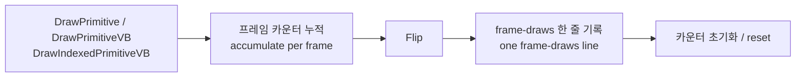

# 프레임별 draw 요약 진단 설계

## 한국어

### 목적

사용자가 보고한 첫 번째 문제, Warning에서 로고로 넘어갈 때의 깜빡임을 판별합니다.

### 관측된 사실

burst 캡처로 t≈5초 구간의 프레임 밝기를 측정했습니다. `14`가 27프레임 유지된 뒤 `0`으로 떨어지고 `2,4,6,8,10,11,14`로 올라갔다가 다시 `0`으로 떨어집니다. 램프 중간 프레임은 Warning 전문이 온전히 표시된 상태이므로, 다른 화면으로 전환된 것이 아니라 같은 화면이 다시 페이드됩니다.

ddraw 진단 상한을 임시로 올려 9초간 연산을 세었습니다.

| 연산 | 횟수 |
| --- | --- |
| Flip | 346 |
| Blt | 8 |
| GetDC / ReleaseDC | 9쌍 |
| CreateSurface | 10 |
| RenderState | 26 |

게스트는 640×480 off-screen surface에 GDI로 Warning을 한 번 그리고 프레임 0~3에서 Blt 8회를 한 뒤 346프레임을 present합니다. `Present`는 매번 렌더 타깃을 다시 그리므로 이 조합만으로는 밝기 변화가 설명되지 않습니다.

**추정.** 2D 합성이 Direct3D draw 경로로 가고 있습니다. 현재 추적에는 draw 호출 항목이 없어 보이지 않습니다.

### 설계

프레임당 draw 호출을 요약해 present 시점에 한 줄로 기록합니다. draw마다 한 줄을 쓰면 초당 수천 줄이 되므로 요약만 남깁니다.

기록 항목은 프레임 번호, draw 호출 수, 정점 수, 텍스처가 묶인 draw 수입니다. 텍스처 유무를 나누는 이유는 색만 칠하는 draw와 이미지를 올리는 draw를 구분해야 페이드의 주체를 알 수 있기 때문입니다.

예산은 별도로 둡니다. Flip 진단 예산 8은 부팅 구간을 담지 못하고, 이 요약은 프레임당 한 줄이므로 자체 상한이 필요합니다. 부팅 10초를 담도록 잡습니다.

### 이 설계가 답하는 것

- 페이드 구간에 draw가 매 프레임 있으면 게스트가 실제로 다시 그리는 것이고, 깜빡임은 게스트 입력(타이밍 등)의 문제입니다.
- 페이드 구간에 draw가 없는데 화면이 바뀌면 우리 표시 경로가 원인입니다.
- 두 번째 페이드 구간의 draw 수가 첫 번째와 같으면 게스트가 같은 장면을 두 번 그리는 것입니다.

### 이 설계가 다루지 않는 것

- 깜빡임의 수정. 이 작업은 판별 근거만 만듭니다.
- draw별 정점 좌표나 텍스처 내용 기록.
- 게임플레이 배경 렌더링 문제.

### 성공 기준

- 부팅 구간의 프레임마다 `frame-draws` 한 줄이 남습니다.
- 페이드 구간에서 draw 호출 유무가 판별됩니다.
- 다른 프로파일 실행에 회귀가 없습니다.

## English

### Purpose

Decide the cause of the user's first reported problem, the flicker on the Warning-to-logo transition.

### Observed facts

Burst captures measured frame brightness around t≈5 s: a steady `14` for 27 frames, then `0`, then a ramp `2, 4, 6, 8, 10, 11, 14`, then `0` again. A mid-ramp frame shows the complete Warning text, so the screen is not changing scene — the same screen fades again.

Raising the ddraw diagnostic budgets temporarily counted the operations over nine seconds: 346 Flips against 8 Blts, 9 GetDC/ReleaseDC pairs, 10 CreateSurface calls, and 26 RenderState calls. The guest draws the Warning once with GDI into a 640×480 off-screen surface, Blts eight times in frames 0 to 3, and then presents 346 frames. `Present` redraws the render target every time, so that combination does not explain the brightness change.

**Inferred.** The 2D composition goes through the Direct3D draw path, which the trace does not record at all.

### Design

Summarise draw calls per frame and write one line at present time; a line per draw would be thousands per second. The line carries the frame number, the draw-call count, the vertex count, and how many draws had a texture bound — the texture split matters because separating colour-only draws from image draws is what identifies who performs the fade.

The summary gets its own budget. The Flip diagnostic budget of 8 does not cover the boot sequence, and this is one line per frame, so it needs a limit sized for about ten seconds of boot.

### What this design decides

If draws occur every frame through the fade, the guest is genuinely redrawing and the flicker comes from its input, such as timing. If the screen changes while no draws occur, our presentation path is responsible. If the second fade shows the same draw counts as the first, the guest is drawing the same scene twice.

### What this design does not cover

Fixing the flicker — this task only produces the evidence. Recording per-draw vertex coordinates or texture content. The gameplay background rendering question.

### Success criteria

- One `frame-draws` line per frame across the boot sequence.
- The presence or absence of draw calls through the fade is decided.
- Other profiles show no regression.
