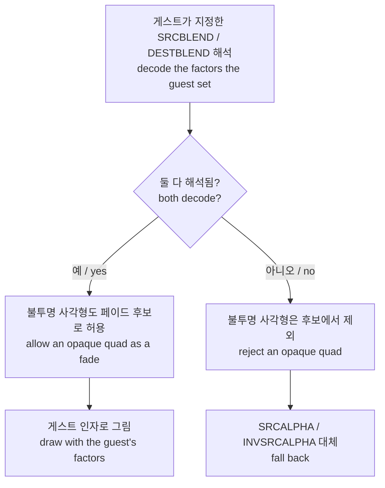

# 페이드 블렌드 인자 보존 설계

## 한국어

### 목적

사용자가 보고한 첫 번째 문제, Warning에서 로고로 넘어갈 때의 비정상적인 깜빡임을 고칩니다.

### 배경 — 기존 호환 처리

`DeviceDrawPrimitive`에는 전체 화면 검은 사각형을 페이드로 간주하는 호환 경로가 있습니다. 게스트가 `ALPHABLENDENABLE`을 켜지 않은 채 화면 전체를 덮는 검은 사각형을 그리면, 블렌딩을 강제로 켜고 `SRCALPHA / INVSRCALPHA`로 그립니다. 블렌딩 없이 그리면 화면이 통째로 검게 덮이기 때문입니다.

### 관측된 사실

[작업 234](../work-logs/20260908-234-frame-draw-summary.md)의 프레임별 기록으로 확인했습니다.

| 항목 | 값 |
| --- | --- |
| `SRCBLEND`(state 19) | 프레임 0에 `0x01` = `ZERO` |
| `DESTBLEND`(state 20) | 프레임 0에 `0x05` = `SRCALPHA` |
| `ALPHABLENDENABLE`(state 27) | 프레임 201 이전에 호출 없음 |
| 프레임 180–200 오버레이 alpha | `0xff`에서 `0x0c`씩 감소해 `0x0f` |

**확인됨.** 게스트가 요청한 블렌드는 `dst × srcAlpha`입니다. 즉 프레임 버퍼를 사각형의 alpha로 곱해 어둡게 만드는 페이드 아웃입니다.

### 결함 1 — 인자를 덮어써 페이드가 반전됨

호환 경로가 게스트의 인자를 무시하고 `SRCALPHA / INVSRCALPHA`로 덮어씁니다. 그 결과는 `dst × (1 − a)`이고, 게스트가 요청한 `dst × a`와 정확히 반대입니다. alpha가 `0xff`에서 `0x0f`로 내려가는 동안 화면이 어두워지는 대신 밝아집니다.

### 결함 2 — 페이드 첫 단계가 검은 프레임이 됨

후보 판정 `IsFullScreenBlackFadeCandidate`가 alpha `0xff`를 배제합니다. 그래서 페이드의 첫 단계인 프레임 180이 호환 경로를 타지 못하고 블렌딩 없이 그려집니다. 불투명한 검은 사각형이 화면 전체를 덮어 **한 프레임이 완전히 검게** 나옵니다.

alpha `0xff`를 배제한 이유는 불투명한 검은 사각형이 화면을 지우려는 정상적인 draw일 수 있기 때문입니다. 이 판단은 우리가 블렌드를 지어내는 경우에만 맞습니다. 게스트가 인자를 직접 지정했다면 `ZERO / SRCALPHA`에서 alpha `0xff`는 `dst × 1.0`, 즉 화면을 그대로 두라는 뜻입니다.

### 설계

게스트가 인자를 지정했는지를 먼저 판정하고, 그 결과를 후보 판정에 넘깁니다. 지정했다면 그 인자를 그대로 쓰고 불투명 사각형도 허용합니다. 지정하지 않았다면 기존 대체 인자와 기존 배제를 유지합니다.

### 이 설계가 다루지 않는 것

- 프레임 201에서 오버레이 없이 전체 밝기로 그려지는 draw 한 프레임. 게스트 자신의 draw이며 원본 하드웨어에서의 거동을 확인하지 못했습니다.
- 게임플레이 배경 렌더링 문제.
- `ALPHABLENDENABLE`을 켜지 않는 게스트를 위한 더 일반적인 정책.

### 성공 기준

- Warning이 밝아졌다가 어두워지는 순서로 페이드합니다.
- 페이드 시작 지점에 검은 프레임이 없습니다.
- 3rd·4th에 회귀가 없습니다.

## English

### Purpose

Fix the user's first reported problem, the abnormal flicker on the Warning-to-logo transition.

### Background — the existing compatibility path

`DeviceDrawPrimitive` treats a full-screen black quad as a fade. When the guest draws one covering the whole screen without having enabled `ALPHABLENDENABLE`, the path force-enables blending and draws with `SRCALPHA / INVSRCALPHA`, because drawing it unblended would cover the screen entirely.

### Observed facts

Established from the per-frame records of [task 234](../work-logs/20260908-234-frame-draw-summary.md): `SRCBLEND` (state 19) is set at frame 0 to `0x01` = `ZERO`, `DESTBLEND` (state 20) at frame 0 to `0x05` = `SRCALPHA`, `ALPHABLENDENABLE` (state 27) is never called before frame 201, and the overlay alpha over frames 180 to 200 steps down from `0xff` to `0x0f` in decrements of `0x0c`.

**Confirmed.** The blend the guest asked for is `dst × srcAlpha` — scaling the framebuffer by the quad's alpha, a fade-out.

### Defect 1 — overriding the factors inverts the fade

The compatibility path ignores the guest's factors and substitutes `SRCALPHA / INVSRCALPHA`, producing `dst × (1 − a)`, exactly the opposite of the requested `dst × a`. As alpha falls from `0xff` to `0x0f` the screen brightens instead of darkening.

### Defect 2 — the fade's first step becomes a black frame

`IsFullScreenBlackFadeCandidate` rejects an alpha of `0xff`, so frame 180, the fade's first step, misses the compatibility path and is drawn unblended. An opaque black quad covers the screen and **one frame comes out fully black**.

That exclusion exists because an opaque black quad may be a legitimate draw meant to clear the screen. The judgement only holds when we would be inventing a blend. When the guest named the factors itself, an alpha of `0xff` under `ZERO / SRCALPHA` means `dst × 1.0` — leave the screen alone.

### Design

Decide first whether the guest named blend factors we can decode, and pass that into the candidate test. If it did, use those factors and accept an opaque quad as a fade. If it did not, keep the existing fallback pair and the existing exclusion.

### What this design does not cover

- The single frame at 201 drawn at full brightness with no overlay. It is the guest's own draw and its behaviour on original hardware has not been established.
- The gameplay background rendering question.
- A more general policy for a guest that never enables `ALPHABLENDENABLE`.

### Success criteria

- The Warning fades in and then out, in that order.
- No black frame at the start of a fade.
- No regression for 3rd and 4th.
