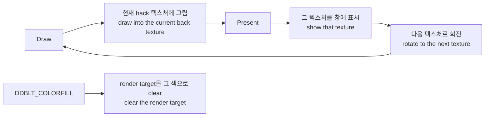

# 플립 체인 버퍼 유지 설계

## 한국어

### 목적

사용자가 보고한 StreetMix 로딩 화면 문제를 고칩니다. eyecatch 이미지가 잠깐 나왔다가 사라지고, 자산을 로딩하는 동안 검은 화면이 남습니다. 원본은 로딩이 끝날 때까지 이미지를 유지한 뒤 다음 화면으로 넘어갑니다.

### 관측된 사실

`--graphics-draw-diagnostics`를 켜고 StreetMix 진입까지 실행해 프레임별 draw와 프레임 표시 시간을 기록했습니다.

| 구간 | 프레임 | 내용 |
| --- | --- | --- |
| LEVEL SELECT | ~1266까지 | `draws=150` |
| eyecatch | 1267–1291 | `draws=5`, 25프레임, 합계 397 ms |
| 로딩 | 1292–1293 | `draws=4` |
| MUSIC SELECT | 1294~ | `draws=33` 이상 |

프레임 1294의 기록이 `ms=1033.76`입니다. **직전 프레임 1293의 내용이 1.03초 동안 화면에 남았다는 뜻입니다.**

eyecatch 프레임의 draw 5개는 다음과 같습니다.

| draw | 텍스처 | 크기 | 화면 위치 | 블렌드 |
| --- | --- | --- | --- | --- |
| 1–4 | 59, 60, 61, 62 | 128×64 ~ 103×103 | 좌하단 (y 410–479) | 알파 |
| 5 | 116 | 640×480 | 전체 (0,0)–(645,480) | `ONE / ZERO` 불투명 |

프레임 1292–1293은 `draws=4`, 즉 **좌하단 sprite 4개만 그리고 640×480 배경은 그리지 않습니다.**

주 표면은 다음과 같이 만들어집니다.

```
CreateSurface:flags=0x00000021:caps=0x00002218:back_buffers=1
```

`caps 0x2218`은 `PRIMARYSURFACE | FLIP | COMPLEX | VIDEOMEMORY`이고 `back_buffers=1`입니다. **게스트는 버퍼 2개짜리 플립 체인을 만들었고, 로딩 중에는 sprite만 다시 그린 뒤 flip합니다. 배경은 체인에 남아 있어야 합니다.**

원본 화면 캡처가 아트워크 위에 `1player`가 얹힌 모습인 것이 이 해석과 일치합니다.

### 결함

우리 백엔드는 프레임의 첫 draw에서 render target을 검게 clear합니다.

```
if (!impl_->frame_started) { ... clear_color(0,0,0,1); clear(COLOR|DEPTH); }
```

그래서 프레임 1292–1293은 검은 바탕에 sprite 4개만 남고, 그 화면이 1.03초 동안 표시됩니다. **확인됨.**

게스트가 clear를 요청한 적은 없습니다. 게스트는 `DDBLT_COLORFILL`로 back buffer를 채우며, 부팅 프레임 0–3에서 8회 호출합니다. 현재 이 호출은 표면의 시스템 메모리 사본에만 쓰이고 render target에는 닿지 않습니다. 즉 지금은 게스트가 지운 적 없는 화면을 우리가 매 프레임 지우고, 게스트가 지우려는 화면은 지우지 않습니다.

### 설계



1. render target은 색 텍스처 하나를 유지하고, 프레임 시작의 암묵적 색 clear를 게스트의 표시 방식에 따라 켜고 끕니다.
2. 게스트가 flip으로 표시하면 색을 지우지 않습니다. 표면 전체 복사로 표시하면 지웁니다.
3. 깊이 버퍼는 어느 쪽이든 프레임마다 지웁니다. 깊이는 프레임을 넘어 읽히지 않는 임시 버퍼이고, 이 제품은 모든 draw에서 `ZENABLE=0`입니다.
4. `DDBLT_COLORFILL`이 render target 표면을 대상으로 하면 백엔드 clear를 함께 호출합니다.
5. 텍스처는 생성 시 한 번 검게 지웁니다. `glTexImage2D`에 널을 주면 내용이 정의되지 않기 때문입니다.

버퍼를 `back_buffers + 1`개 두고 회전시키는 방식은 시도했다가 되돌렸습니다. 실제 back buffer의 내용 나이는 재현되지만, 게스트가 화면 일부만 다시 그리는 프레임에서 두 버퍼가 서로 다른 이미지를 담게 되어 30 Hz로 교대합니다. StreetMix eyecatch 전환에서 프레임 평균 밝기가 `47 3 50 15 60 49`처럼 튀었고, 사용자가 깜빡임으로 보고했습니다. 원본에는 없는 증상이므로 버퍼 하나를 유지하는 쪽을 택했습니다.

### 표시 방식이 다른 제품 — 3rd Trax

3rd Trax는 다른 방식으로 표시합니다.

| 항목 | 값 |
| --- | --- |
| 주 표면 | `caps=0x00000200`(`PRIMARYSURFACE`), `back_buffers=0`, `DDSCAPS_FLIP` 없음 |
| 표시 | 1280×960 offscreen 표면(`caps=0x2040`)을 주 표면으로 `Blt` |
| `Flip` | 0회 |
| colour fill | 0회 |

**표면 전체를 화면에 복사하는 것은 화면을 통째로 덮는 일입니다.** 따라서 이 제품에는 프레임을 넘어 이월되는 내용이 없습니다. 처음 구현에서 버퍼 개수 기본값을 2로 두어 이 제품에도 버퍼를 회전시켰더니, title 화면 배경이 이전 프레임 위에 누적되어 흰 줄무늬로 번졌습니다. 사용자가 회귀로 보고한 증상입니다.

그래서 두 가지를 구분합니다.

| 표시 방식 | 프레임 시작 |
| --- | --- |
| 게스트가 flip으로 표시 | 깊이만 지움. 색은 유지 |
| 표면 전체 복사로 표시 | 깊이와 색을 지움 |

판정은 주 표면의 `DDSCAPS_FLIP` 유무로 합니다.

### 이 설계가 다루지 않는 것

- Warning 페이드 첫 프레임이 224 ms 표시되는 문제. 별개의 관측이며 이 설계로 바뀌지 않습니다.
- 게임플레이 배경 렌더링 문제.
- `Blt`로 표면 사이를 복사하는 경로. 이미 동작합니다.

### 성공 기준

- eyecatch가 로딩이 끝날 때까지 화면에 남습니다.
- 로딩 중 화면이 아트워크 위 `1player`가 됩니다.
- 3rd·4th에 회귀가 없습니다.

## English

### Purpose

Fix the StreetMix loading screen the user reported: the eyecatch image appears briefly and then vanishes, leaving a black screen while assets load. The original keeps the image up until loading finishes and then moves to the next screen.

### Observed facts

Running to StreetMix with `--graphics-draw-diagnostics` recorded the draws and the on-screen time of every frame. LEVEL SELECT runs at `draws=150` up to frame 1266; the eyecatch occupies frames 1267 to 1291 at `draws=5`, twenty-five frames totalling 397 ms; frames 1292 and 1293 drop to `draws=4`; MUSIC SELECT starts at frame 1294.

Frame 1294's record reads `ms=1033.76`, meaning **the content of frame 1293 stayed on screen for 1.03 seconds**.

The eyecatch frame's five draws are four small alpha-blended quads at the bottom left — the `1player` sprite, textures 59 to 62, between 128×64 and 103×103, spanning y 410 to 479 — followed by texture 116, a 640×480 quad covering the screen with `ONE / ZERO`, opaque. Frames 1292 and 1293 issue only the first four: **the sprite is redrawn and the 640×480 background is not.**

The primary surface is created as `caps=0x00002218` with `back_buffers=1`. Those caps are `PRIMARYSURFACE | FLIP | COMPLEX | VIDEOMEMORY`, so **the guest made a two-buffer flip chain and, while loading, redraws only the sprite before flipping. The background is expected to still be in the chain.** The user's capture of the original — the artwork with `1player` on top of it — matches that reading.

### Defect

Our backend clears the render target to black at the first draw of every frame, so frames 1292 and 1293 come out as four sprites on black, and that screen is displayed for 1.03 seconds. **Confirmed.**

The guest never asked for that clear. It clears its back buffer with `DDBLT_COLORFILL`, eight times over boot frames 0 to 3, and today those calls write only the surface's system-memory copy and never reach the render target. So we clear a screen the guest wanted kept, and do not clear the one it asked to clear.

### Design

Keep one colour texture for the render target and make the implicit colour clear at frame start depend on how the guest presents: no colour clear when it presents by flipping, a colour clear when it presents by copying a whole surface. Depth is cleared per frame either way — it is scratch that is never read across frames, and every draw in this title runs with `ZENABLE=0`. A `DDBLT_COLORFILL` whose destination is the render-target surface also clears the backend target to that colour. The texture is cleared to black once at creation, because `glTexImage2D` with a null pointer leaves the contents undefined.

Giving the target `back_buffers + 1` textures and rotating them was tried and withdrawn. It reproduces the age of a real back buffer's contents, but in a frame where the guest redraws only part of the screen the two buffers then hold different images and alternate at 30 Hz. Mean frame brightness across the StreetMix eyecatch transition came out as `47 3 50 15 60 49`, and the user reported the flicker. The original does not do that, so a single retained buffer is what ships.

### A product that presents differently — 3rd Trax

3rd Trax presents another way. Its primary is `caps=0x00000200`, `PRIMARYSURFACE` alone, with `back_buffers=0` and no `DDSCAPS_FLIP`; it presents by `Blt`ing a 1280×960 offscreen surface onto that primary, never calls `Flip`, and issues no colour fills at all.

**Copying a whole surface onto the screen overwrites the screen**, so nothing carries over between frames for this product. A first implementation that defaulted the buffer count to 2 rotated buffers under it as well, and its title-screen background accumulated onto the previous frame as white streaks — the regression the user reported.

So the two cases are separated: a guest that presents by flipping starts a frame by clearing depth only and keeps colour; one that presents by copying a whole surface starts by clearing both. The primary surface's `DDSCAPS_FLIP` decides which.

### What this design does not cover

- The 224 ms first frame of the Warning fade, a separate observation this design does not change.
- The gameplay background rendering question.
- The surface-to-surface `Blt` path, which already works.

### Success criteria

- The eyecatch stays on screen until loading finishes.
- During loading the screen shows the artwork with `1player` over it.
- No regression for 3rd and 4th.
