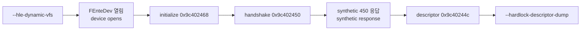

# ez2dj1st·ez2dj5th Hardlock descriptor 확보 설계

## 한국어

### 목적

`ez2dj1st`와 `ez2dj5th`의 `module_address`, `id_ref`, `id_verify`를 원본 실행의 descriptor 관측으로 확보하고, 관측이 뒤집은 실행 기본값을 정정합니다.

### 출발점

두 target은 이미 built-in profile 표에 있습니다.

| target | 입력 | 실행 파일 | 기준으로 삼은 프로파일 |
| --- | --- | --- | --- |
| `ez2dj1st` | 디렉터리 `roms/ez2dj1st` | `ez2dj/Ez2DJ.exe` | 정정 이전의 1st SE |
| `ez2dj5th` | CHD `roms/ez2dj5th/ez2dj5.chd` | `EZ2DJ/EZ2DJ.EXE` | 4th |

`ez2dj5th`는 4th 호환 기준을 그대로 쓰므로 그 자체로 관측과 어긋나지 않습니다. `ez2dj1st`는 1st SE가 [작업 223](../work-logs/20260908-223-ez2dj1stse-chd-profile-correction.md)에서 정정되기 전의 값을 물려받았으므로, 그 값들이 이 실행 파일에서도 맞는지 확인해야 합니다.

`cfg/ez2dj1st`와 `cfg/ez2dj5th`에는 challenge와 설정 파일이 준비되어 있지만 descriptor 세 값이 비어 있어 seed 탐색을 시작할 수 없습니다. 이 작업이 그 세 값을 채웁니다.

### PE 배치

| 항목 | `ez2dj1st` | `ez2dj5th` |
| --- | --- | --- |
| section | 6개 | 6개 |
| entry RVA | `0x0199b240` | `0x0070d240` |
| `.protect` | `0x0199b000` | `0x0070d000` |
| import directory | `0x019b5620` | `0x007458e0` |
| 원본 `.idata` | `0x01985000` | `0x006fe000` |
| timestamp | `0x3862fd9d` | `0x3f53377b` |

**확인됨.** 두 실행 파일 모두 1st SE의 CHD 빌드, 3rd, 4th와 같은 `.protect` 계열입니다. import directory가 `.protect` 안에 있고 원본 `.idata`는 파일에 남아 있습니다.

### descriptor에 도달하는 경로

[Hardlock descriptor ID 추출 절차](../guides/hardlock-descriptor-extraction.md)를 그대로 쓰면 두 실행 모두 descriptor에 도달하지 못합니다. 이 설계는 그 절차에 두 가지를 더합니다.

첫째, 동적 해석입니다. 절차의 기본 옵션만으로 실행하면 `CreateFileA`가 `route=win32`로 해석되어 게스트가 호스트의 실제 장치를 열려 하고 곧 `ExitProcess`합니다. `.protect` packer가 unpack 시 원본 import를 스스로 해석하므로 정적 IAT 패치가 무효가 되기 때문이며, `--hle-dynamic-vfs`가 필요합니다. 1st SE에서 확인된 것과 같은 이유입니다.

둘째, handshake 응답입니다. 동적 해석을 켜면 게스트가 `\\.\FEnteDev`를 열고 `0x9c402468` initialize와 `0x9c402450` handshake까지 갑니다. 그러나 handshake 응답을 판정해 통과하지 못하면 `0x9c40244c` descriptor를 요청하지 않고 종료합니다. `cfg/hardlock.ini`에는 두 프로파일의 `response450`이 없습니다.

[작업 109](../work-logs/20260901-109-ez2dj3rd-hardlock-450-response.md)가 3rd에서 확인한 helper 동작을 씁니다. marker word가 `0xFAFA`가 아니면 helper가 0을 반환하고, 같으면 세 번째 word를 반환합니다. 그때 쓰인 synthetic oracle `01 00 FA FA 00 10`을 `--device-mock-hardlock-450-response`로 재생하면 descriptor 도달 인과성만 만들 수 있습니다. **이 바이트열은 실제 dongle 응답이 아니며, descriptor를 관측하기 위한 수단으로만 씁니다.**

### 기록 정책

`module_address`는 저장소 문서에 남깁니다. `id_ref`와 `id_verify`의 원문은 남기지 않고, 존재 여부만 적으며 값은 Git이 무시하는 `cfg/hardlock-id.ini`의 해당 section에만 둡니다. 1st SE와 6th에서 쓴 것과 같은 정책입니다.

### 이 설계가 다루지 않는 것

- seed 탐색과 transform map 생성. 이 작업은 그 입력만 만듭니다.
- 실제 `response450`과 `tail44c` 확보.
- 두 제품의 raw I/O helper RVA 확인.
- 두 제품의 end-to-end 실행. handshake 응답이 없으면 게스트는 descriptor 뒤에서 멈춥니다.

### 성공 기준

- 두 프로파일 모두 `header_valid=1`인 descriptor를 관측합니다.
- `cfg/hardlock-id.ini`에 두 section이 생기고 기존 section이 보존됩니다.
- 관측과 어긋나는 실행 기본값이 정정됩니다.
- unit test와 product loader probe가 통과합니다.

## English

### Purpose

Obtain `module_address`, `id_ref`, and `id_verify` for `ez2dj1st` and `ez2dj5th` by observing the original executable's Hardlock descriptor, and correct the execution defaults the observation contradicts.

### Starting point

Both targets are already in the built-in profile table. `ez2dj1st` takes a directory at `roms/ez2dj1st` and runs `ez2dj/Ez2DJ.exe`; `ez2dj5th` takes the CHD at `roms/ez2dj5th/ez2dj5.chd` and runs `EZ2DJ/EZ2DJ.EXE`.

`ez2dj5th` uses the 4th compatibility baseline and so does not contradict observation on its own. `ez2dj1st` inherited the 1st SE values from before [task 223](../work-logs/20260908-223-ez2dj1stse-chd-profile-correction.md) corrected them, so whether they hold for this executable has to be checked.

`cfg/ez2dj1st` and `cfg/ez2dj5th` hold prepared challenges and configuration files, but the three descriptor values are empty and seed recovery cannot start without them. This task fills them.

### PE layout

`ez2dj1st` has six sections with its entry at RVA `0x0199b240`, `.protect` at `0x0199b000`, the import directory at `0x019b5620`, the original `.idata` surviving at `0x01985000`, and timestamp `0x3862fd9d`. `ez2dj5th` has six sections with its entry at `0x0070d240`, `.protect` at `0x0070d000`, the import directory at `0x007458e0`, the original `.idata` at `0x006fe000`, and timestamp `0x3f53377b`.

**Confirmed.** Both are the same `.protect` family as the 1st SE CHD build, 3rd, and 4th: the import directory sits inside `.protect` while the original `.idata` survives in the file.

### Reaching the descriptor

Following the [descriptor extraction procedure](../guides/hardlock-descriptor-extraction.md) as written reaches no descriptor for either executable. This design adds two things to it.

The first is dynamic resolution. With the procedure's options alone, `CreateFileA` resolves at `route=win32`, the guest tries to open the host's real device and calls `ExitProcess` shortly after. The `.protect` packer resolves the original imports itself at unpack time, which voids a static IAT patch, so `--hle-dynamic-vfs` is required — the same reason established for 1st SE.

The second is a handshake response. With dynamic resolution the guest opens `\\.\FEnteDev` and reaches the `0x9c402468` initialize and `0x9c402450` handshake requests, but it judges the handshake response and, failing it, exits without ever requesting the `0x9c40244c` descriptor. `cfg/hardlock.ini` carries no `response450` for either profile.

[Task 109](../work-logs/20260901-109-ez2dj3rd-hardlock-450-response.md) established the helper's behaviour on 3rd: a marker word other than `0xFAFA` makes the helper return zero, and a matching one makes it return the third word. Replaying the synthetic oracle `01 00 FA FA 00 10` from that task through `--device-mock-hardlock-450-response` establishes reachability of the descriptor and nothing more. **Those bytes are not a real dongle response and are used only as a means of observing the descriptor.**

### Recording policy

`module_address` is recorded in repository documents. The raw `id_ref` and `id_verify` are not: only their presence is noted, and the values stay in the Git-ignored `cfg/hardlock-id.ini` section for the profile. This is the policy already used for 1st SE and 6th.

### What this design does not cover

Seed recovery and transform-map generation — this task only produces their input. Obtaining the real `response450` and `tail44c`. Confirming either product's raw-I/O helper RVAs. End-to-end runs of either product, which stop after the descriptor without a real handshake response.

### Success criteria

- A descriptor with `header_valid=1` is observed for both profiles.
- `cfg/hardlock-id.ini` gains both sections while the existing ones are preserved.
- Execution defaults contradicted by observation are corrected.
- The unit tests and the product-loader probe pass.
